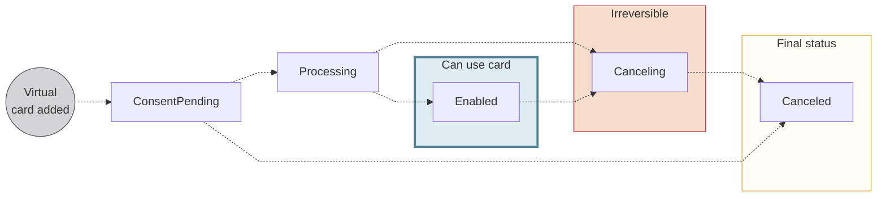

# Virtual card statuses

The lifecycle of a <Term id="cards-virtual">virtual card</Term>, from <Term id="consent">consent</Term> to cancelation.
These statuses also represent the status of the Swan card contract.
For the model behind the flow, refer to [virtual cards](/cards/concepts/virtual).

## Statuses {#statuses}

```mermaid
%%{ init: { 'flowchart': { 'curve': 'linear' } } }%%
flowchart LR
    VA((Virtual<br/>card added)) -.-> CP[ConsentPending]
    CP -.-> P[Processing]
    P -.-> E[Enabled]
    P -.-> CL
    E -.-> CL[Canceling]
    CL -.-> CD[Canceled]
    CP -.-> CD
    subgraph U[Can use card]
        E
    end
    subgraph IR[Irreversible]
        CL
    end
    subgraph F[Final status]
        CD
    end
    style VA fill:#D4D3D5,stroke:#514F59
    style F fill:#fffdf4,stroke:#cca922
    style IR fill:#f6ddcc,stroke:#c12236
    style U fill:#dfedf2,stroke:#4d8296,stroke-width:3px
```

| Virtual card status | Explanation |
|---|---|
| `ConsentPending` | Virtual card was added and is waiting for the cardholder's consent.  **Next steps**:<ul><li>If consent is refused or fails, the status moves directly to `Canceled`.</li><li>Otherwise, the status moves to `Processing`.</li></ul> |
| `Processing` | Consent has been received and the card is being prepared. This status only applies when adding multiple virtual cards (`addCards` mutation).  **Next steps**:<ul><li>After the card is ready, the status moves to `Enabled`.</li><li>If the card is canceled before it's ready, the status moves to `Canceling`.</li></ul> |
| `Enabled` | Virtual card is available for use.  **Next steps**:<ul><li>If the card is canceled, the status moves to `Canceling`.</li></ul> |
| `Canceling` | Card is in the process of being canceled.  **Next steps**: Card is `Canceled`. After a card is assigned the `Canceling` status, the process can't be reversed. |
| `Canceled` | Card is canceled, no longer available for use, and can't be re-enabled. |
