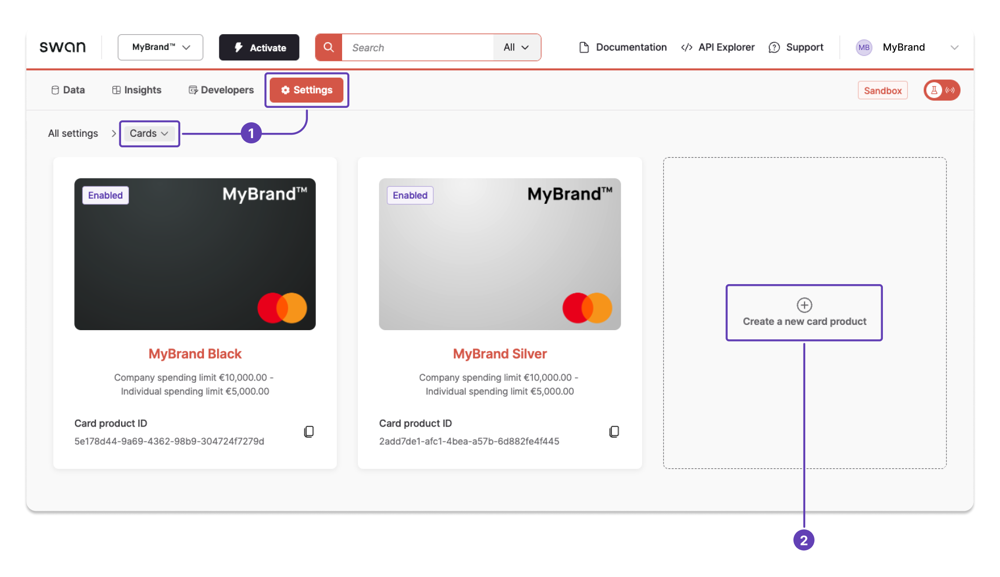
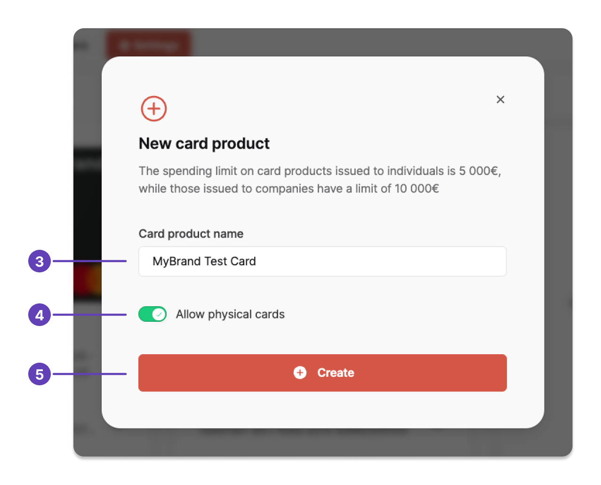
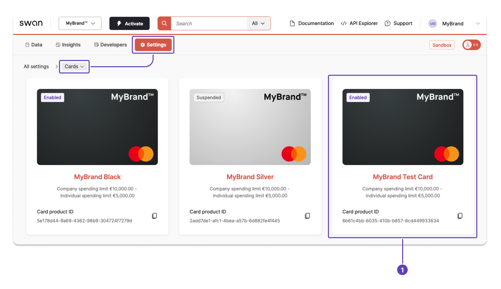
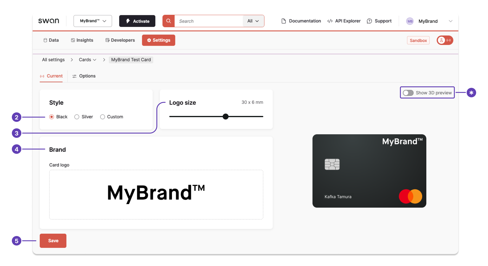

# Configure standard cards

Standard designs are used everywhere for virtual, physical, and digital cards: in-app, in digital wallets, and when revealing a card's sensitive information.

Before creating cards, personalize the [standard card design](/cards/concepts/design).
You can use Swan's [card design studio](https://swan-io.github.io/card-design-studio/) to get a 3D preview of how your card will look.

:::tip Packaging
You can [customize your packaging](/cards/concepts/design#packaging) for standard cards.
:::

## Create a standard card {#create}

1. Go to **Dashboard** > **Settings** > **Cards**.
1. Click **Create a new card product**.

    

1. Name your new card product.
1. If you'd like to allow physical cards, toggle **Allow physical cards** to **on**.
1. Click **Create**.

## Configure your standard card {#configure}

1. Open the card product you'd like to configure.
Remember to start on **Dashboard** > **Settings** > **Cards**.

    

1. Choose **black** or **silver**. If you'd like to design a custom card, refer to the [dedicated guide](/cards/guides/design/custom).
1. Choose your **logo size**.
1. Upload your logo, resizing if needed. Refer to [preparing your logo file](#logo) for more information about logos.
1. Click **Save**.

You can also preview your card in 3D from this page.

After clicking **Save**, your updates are available immediately in Sandbox.
But Swan needs to review changes to Live cards.
If you didn't upload a new logo, upload your logo again and click **Save**, which forces the API to trigger a review.

:::info Card settings
In the **Options** tab, you can also update your [card settings](/cards/guides/lifecycle/update).
:::

## Prepare your logo file {#logo}

Add your logo for standard card designs and your Swan Dashboard.

Follow these guidelines when creating your `.svg` file, both so your logo looks sharp on your card and so Swan can validate the file.

1. The SVG file can be a maximum of 100 kilobytes (KB).
1. Use black monochrome.
    - Swan changes it to white for standard black cards.
    - If you'd prefer other color options, consider [designing a custom card](/cards/guides/design/custom).
1. Don't use any opacity settings. Don't apply the `fill-opacity` attribute.
1. Don't use any non-vectorial text, meaning no `text` tag.
1. Don't use layering, meaning there should be no overlaid elements.
1. The logo edges must fit inside the container, or `viewBox` attribute.

Here are some tips to make sure your logo meets requirements.

| Problem | Explanation |
| --- | --- |
| Logo appearing too small | If your logo is appearing smaller than expected, check that your logo fits perfectly in the SVG `viewBox` attribute. Any padding between your logo and the `viewBox` edges will appear on your card. |
| Empty rectangle instead of logo | If you see an empty rectangle (black or white) instead of your uploaded logo, there might be an issue with your SVG file. Check that there are no overlaid elements in your file. If there are overlaid elements, remove them and upload the new file. |
| Logo isn't the correct color | If your logo is showing up as black on a black card, or white on a silver card, there might be an issue with your SVG file. Make sure you're not using CSS to apply your color, which is only compatible with browser renderers.  |