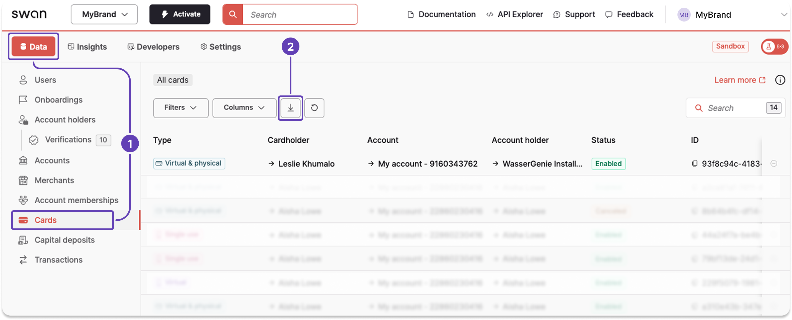

# Export card data from the Dashboard

## Steps {#dashboard}

1. On your Dashboard, go to **Data** > **Cards**.
1. Click the **download icon** to trigger a `.csv` export.
1. A modal appears. Click **Export data** to finalize the request.

