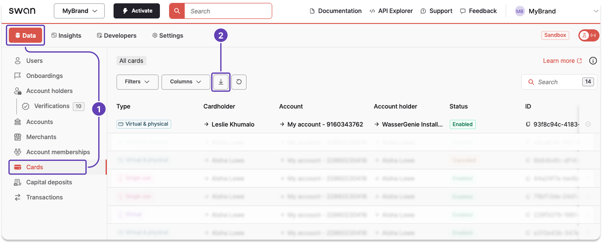

# Export card data from the Dashboard

Trigger a CSV export of your card data directly from your Dashboard.

## Steps {#dashboard}

1. On your Dashboard, go to **Data** > **Cards**.
1. Click the **download icon** to trigger a `.csv` export.
1. A modal appears. Click **Export data** to finalize the request.

After finalizing your export, [a download link is sent to the email address you provided](/cards/guides/lifecycle/export#next).
