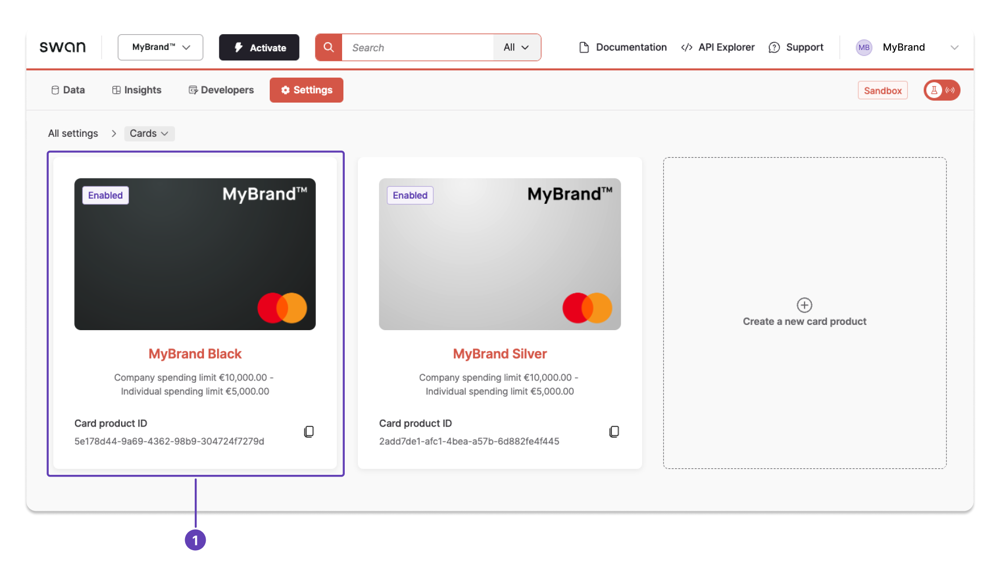
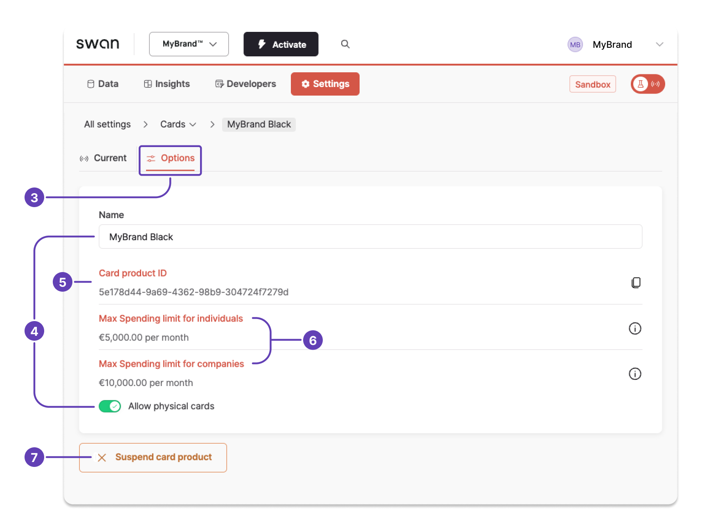

# Update card settings from the Dashboard

To understand all options for card product settings, please review the [card settings reference](/cards/reference/card-settings#settings).

Update your card settings, including the name, whether physical cards are allowed for this card product, and suspending the card product.
You can also review and click-to-copy important information about the card product.

## Steps {#guide-dashboard}

1. Go to **Dashboard** > **Settings** > **Cards**, and click the card product you'd like to update.

2. Open **Options**. (Note the first tab, **Current**, where you can [update design settings](/cards/guides/design/standard#configure).)
1. Update the following options as needed. Changes are saved automatically.
    1. Card name.
    1. Whether you allow physical cards for this card product.
1. Click-to-copy the **card product ID** when you need it.
1. Review the **spending limits** for individuals and companies.
1. Click **Suspend card product** if you need to block this card product. Suspended card products can be reactivated by contacting Swan Support.

