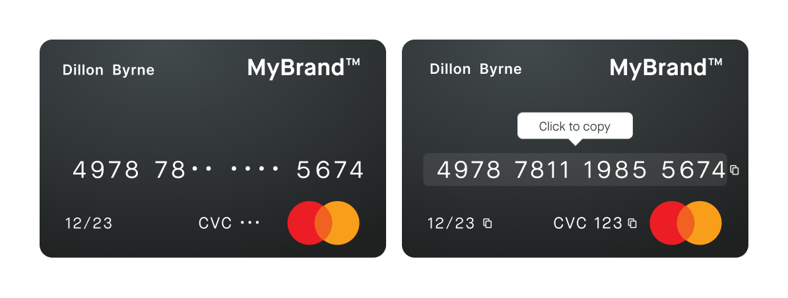

# View sensitive information

View a <Term id="cards-physical">physical card</Term>'s numbers and PIN, both protected by the cardholder's <Term id="consent">consent</Term>.

import InfoNotVisible from '../../partials/_info-not-visible.mdx';

<InfoNotVisible />

## View physical card numbers {#view-number}

View the physical card numbers, which is different from the virtual card numbers, by calling the `viewPhysicalCardNumbers` mutation which returns a consent.
When you do this, make sure you're authenticated with a user access token using the name of the card's account member.
Then a `consentUrl` is returned, inviting the user to start the <Term id="sca">Strong Customer Authentication</Term> with Swan.

import AfterConsent from '../../partials/_after-consent.mdx';

<AfterConsent mutation="viewPhysicalCardNumbers" />



:::info Store `consentId`
To avoid repeating the Strong Customer Authentication each time the client wants to reveal the card numbers, the same `consentUrl` can be called anytime for five minutes after the consent.
Store the `consentId` on your side and run a consent query to check that the consent status is `Accepted` and the `updatedAt` is less than five minutes old, before reusing the `consentUrl`.
The `consentUrl` only works in the cardholder's browser where the consent was completed.
:::

### Mutation {#view-number-mutation}

<a href="https://explorer.swan.io?query=bXV0YXRpb24gVmlld1BoeXNpY2FsQ2FyZE51bWJlcnMgewogIHZpZXdQaHlzaWNhbENhcmROdW1iZXJzKAogICAgaW5wdXQ6IHsKICAgICAgY2FyZElkOiAiJFlPVVJfQ0FSRF9JRCIKICAgICAgY29uc2VudFJlZGlyZWN0VXJsOiAiJFlPVVJfUkVESVJFQ1RfVVJMIgogICAgfQogICkgewogICAgLi4uIG9uIFZpZXdQaHlzaWNhbENhcmROdW1iZXJzU3VjY2Vzc1BheWxvYWQgewogICAgICBfX3R5cGVuYW1lCiAgICAgIGNvbnNlbnQgewogICAgICAgIGNvbnNlbnRVcmwKICAgICAgfQogICAgfQogIH0KfQo%3D&tab=api" className="explorer-badge">Open in API Explorer</a>

```graphql {4-5} showLineNumbers
mutation ViewPhysicalCardNumbers {
  viewPhysicalCardNumbers(
    input: {
      cardId: "$YOUR_CARD_ID"
      consentRedirectUrl: "$YOUR_REDIRECT_URL"
    }
  ) {
    ... on ViewPhysicalCardNumbersSuccessPayload {
      __typename
      consent {
        consentUrl
      }
    }
  }
}
```

## View PIN {#view-pin}

You can display the physical card's PIN by calling the `viewPhysicalCardPin` mutation which returns a consent.
When you do this, make sure you're authenticated with a user access token using the name of the card's account member.
Then a `consentUrl` is returned which invites the user to start the Strong Customer Authentication with Swan.

If your card was created before 19:00 Central European [Summer] Time (CET/CEST), you can call the mutation starting from 19:00 the same day.
Otherwise, you'll have to wait until the next day at 19:00 to start calling the mutation.

You can check the `isPINReady` boolean in the physical card's `statusInfo` when the status is `ToActivate`.
It's `true` when the PIN is available.
Refer to the section on [PIN availability](/cards/concepts/physical/pin#pin-ready) to understand when a PIN should be ready.

### Mutation {#view-pin-mutation}

<a href="https://explorer.swan.io?query=bXV0YXRpb24gVmlld1BpbiB7CiAgdmlld1BoeXNpY2FsQ2FyZFBpbigKICAgIGlucHV0OiB7CiAgICAgIGNhcmRJZDogIiRZT1VSX0NBUkRfSUQiCiAgICAgIGNvbnNlbnRSZWRpcmVjdFVybDogIiRZT1VSX1JFRElSRUNUX1VSTCIKICAgIH0KICApIHsKICAgIC4uLiBvbiBWaWV3UGh5c2ljYWxDYXJkUGluU3VjY2Vzc1BheWxvYWQgewogICAgICBfX3R5cGVuYW1lCiAgICAgIGNvbnNlbnQgewogICAgICAgIGNvbnNlbnRVcmwKICAgICAgfQogICAgfQogICAgLi4uIG9uIFBJTk5vdFJlYWR5UmVqZWN0aW9uIHsKICAgICAgX190eXBlbmFtZQogICAgICBtZXNzYWdlCiAgICAgIHBoeXNpY2FsQ2FyZElkZW50aWZpZXIKICAgIH0KICB9Cn0K&tab=api" className="explorer-badge">Open in API Explorer</a>

```graphql {4-5} showLineNumbers
mutation ViewPin {
  viewPhysicalCardPin(
    input: {
      cardId: "$YOUR_CARD_ID"
      consentRedirectUrl: "$YOUR_REDIRECT_URL"
    }
  ) {
    ... on ViewPhysicalCardPinSuccessPayload {
      __typename
      consent {
        consentUrl
      }
    }
    ... on PINNotReadyRejection {
      __typename
      message
      physicalCardIdentifier
    }
  }
}
```

### Payload {#view-pin-payload}

Open the `consentUrl` returned by the mutation to provide consent, then view the PIN.

```json {6} showLineNumbers
{
  "data": {
    "viewPhysicalCardPin": {
      "__typename": "ViewPhysicalCardPinSuccessPayload",
      "consent": {
        "consentUrl": "$YOUR_CONSENT_URL"
      }
    }
  }
}
```
