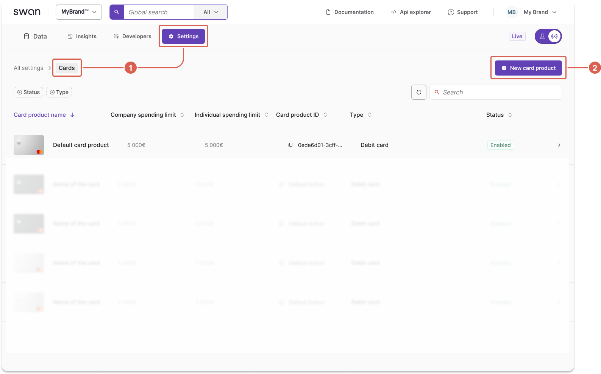

# Configure a card product

To create a new <Term id="card-product">card product</Term> in the Dashboard, first select and configure the [card package](/cards/concepts/card-packages). After configuring your card package, Swan reviews and validates it before it can be used. Your package choice determines features and pricing.

## Create a card product {#create}

1. Go to **Dashboard** > **Settings** > **Cards**.
1. Select **+ New card product**.

1. Select a card package: `Standard`, `Essential`, or `Premium`.
Select **No package** for basic features with no insurance and base fees.

:::caution
You can't change the card package tier after creating the card product.
:::

1. Name your new card product.
1. Toggle **Allow physical cards** to enable physical cards.
1. Select **Create**.

## Configure your card design {#configure-design}

1. Select **+ Create new design**.
1. Choose your card style:
    - Black or silver (Standard and Essential)
    - Metal (Premium only)
    - Custom (available for all card products)
1. Adjust your logo size.
1. Upload your [logo](/cards/guides/design/standard#logo) file.
1. Select **Submit for review**.
