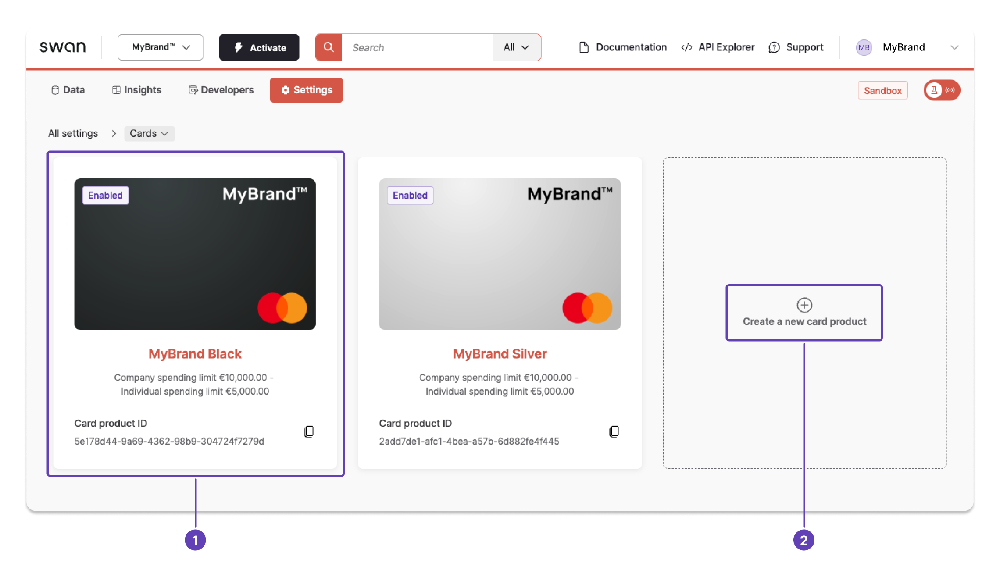

# Card settings

The settings that manage a card product and all the virtual, physical, and digital cards associated with it.

## Settings {#settings}

Use **settings to manage your card product** and all virtual, physical, and digital cards associated with it.

| Setting | Explanation | Update with |
| --- | --- | :---: |
| Name | You can name the card product for easy reference from your Dashboard. | Dashboard |
| Allow physical cards | Decide whether physical cards are allowed to be issued for this card product. | Dashboard |
| Suspend | Suspend this card product. Your users won't be able to add new cards with this card product. You'll need to contact Swan Support to reactivate the card product. | Dashboard |
| `cardContractExpiryDate` | Date you'd like the card to expire.  Leave it empty if you don't want to set an expiration date, in which case, cards are renewed automatically every three years. Refer to [renewal and expiry](/cards/concepts/virtual#renewal) for details. | API |
| `international` | Allow or disable payments outside of the account holder's country. | API |
| `withdrawal` | Allow or disable cash withdrawals, such as at ATMs. | API |
| `nonMainCurrencyTransactions` | Allow or disable transactions outside of the card's currency. | API |
| `eCommerce` | Allow or disable transactions on eCommerce sites or for online transactions. | API |
| `spendingLimit` | Fixed by the account holder or qualifying account member, within the limits set by Swan. | API |

## International {#international}

If `international` is disabled, payments can only be made in the account holder's country. They can still pay using other currencies. For example, a cardholder in France can only make payments in France, but in euros as well as other currencies.

## Non-main currency transactions {#currency}

If `nonMainCurrencyTransactions` is disabled, payments can be made in other countries, but not using other currencies. For example, a cardholder in France can make payments in euros in the United Kingdom, but not in the GBP (Pound Sterling).

## Manage settings {#dashboard}

Manage card settings on your **Dashboard** > **Settings** > **Cards**.
You can (1) manage existing card products that are already validated, or (2) create a new standard card product.

## Custom card expiry {#custom-expiry}

You can customize the expiration date for virtual cards using the `cardContractExpiryDate` field.

:::caution Maximum expiry
Custom expiry dates must be at most 3 years from card creation.
:::

This setting is available in the following mutations:

- [`addCard`](https://api-reference.swan.io/mutations/add-card/): add a single virtual card.
- [`addCards`](https://api-reference.swan.io/mutations/add-cards/): add multiple virtual cards.
- [`updateCard`](https://api-reference.swan.io/mutations/update-card/): update an existing card.
- [`addSingleUseVirtualCard`](https://api-reference.swan.io/mutations/add-single-use-virtual-card/): add a single-use virtual card.

:::warning One-off SUV cards
For one-off single-use virtual cards with `SpendingLimitPeriod` set to `Always`, cards automatically expire 30 days after creation. This overrides any custom expiry date you set.
:::
