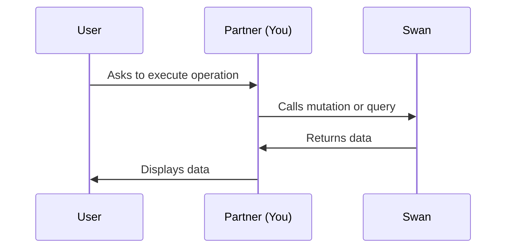

# About the Swan API

## Overview {#overview}

Swan uses a **GraphQL API**, explained in more detail on [About GraphQL](./graphql.mdx).

With Swan's API, you can request data and perform actions on your accounts, cards, transactions, and more.
In this communication process, the API consumer asks Swan to execute operations and Swan responds.

This sequence diagram shows the most basic interactions between Swan's API, your users, and you.
Note that the flow changes when [webhooks](./using-api/webhooks.mdx) are involved.



## Environments {#environments}

Swan hosts two environments: **Live** and **Sandbox**.
They are completely separate with different endpoints.
This means that access tokens, user credentials, URLs, and more, won't work between environments.
[Projects are also environment-dependent](../topics/projects/index.mdx#environments).

In short, **test in Sandbox, build in Live**—and remember, you can't move anything between the two.

## Calling the API {#call-api}

### Endpoints {#endpoints}

| Name | Endpoint |
| --- | --- |
| Server OAuth 2.0 | https://oauth.swan.io/oauth2 |
| Sandbox | https://api.swan.io/sandbox-partner/graphql |
| Sandbox (Testing API) | https://api.swan.io/sandbox-partner-admin/graphql |
| Live | https://api.swan.io/live-partner/graphql |

### Rate limiting {#rate-limits}

Swan imposes rate limits on the endpoints to protect the API.

The default limit for each IP is **2,000 requests every 5 minutes**.
If you send over 2,000 requests for a single endpoint, you'll receive an HTTP 429 Too Many Requests response.
This limit applies to all endpoints.

If you need to increase the rate limits for your use case, request it through email: integration@swan.io. 

### Backend communication {#backend}

Swan is designed to communicate between the Swan backend and yours.
For security reasons, Swan doesn't allow API calls originating from a frontend application; all calls must come from the backend.

If you try to call the API from the frontend, you'll get a Cross-Origin Resource Sharing (CORS) error.

### Using cURL {#curl}

You can test the Swan API using cURL or any other HTTP client.

The following example is a query to get the IDs and IBANs of all the accounts in your project.
Replace `$YOUR_ACCESS_TOKEN` with a valid [user or project access token](./using-api/authentication/index.mdx) before sending your request.

```curl title="Request" showLineNumbers
curl -X POST https://api.swan.io/sandbox-partner/graphql \
-H 'Content-Type: application/json' \
-H 'Authorization: Bearer $YOUR_ACCESS_TOKEN' \
-d '{"query":"query MyQuery{ accounts { edges { node { id IBAN } } } }"}'
```

```json title="Response" {4} showLineNumbers
{
    "data": {
        "accounts": {
            "edges": [
                {
                    "node": {
                        "id": "$YOUR_ID",
                        "IBAN": "$YOUR_IBAN"
                    }
                }
            ]
        }
    }
}
```

### Automatic retry {#overview-retry}

If we encounter an error during an API request, we'll retry it up to **8 times**.
Additionally, outgoing requests have a **timeout of 15 seconds**, after which the request fails and an automatic retry is triggered.

The Swan retry policy is exponential and behaves as follows:

| Retry attempt | Time to trigger retry (approximate) |
| --- | --- |
| 1 | 5 seconds |
| 2 | 17 seconds |
| 3 | 1 minute |
| 4 | 3 minutes |
| 5 | 15 minutes |
| 6 | 40 minutes |
| 7 | 2 hours |
| 8 | 7 hours |


## Time-to-live {#ttl}

Swan's Partner Dashboard and the Web Banking user interface each have a time-to-live (TTL) after which the session is discontinued automatically.

- **Dashboard**: 72 hours; sessions refresh every time you call the API.
- **Web Banking**: 5 minutes; session tokens refresh as long as the page stays open.

## Troubleshooting {#troubleshooting}

If you experience an issue or a bug working with Swan's API, complete the following steps:

1. **Check the [status page](https://status.swan.io/)** to see if there's planned maintenance or an outage that could impact services.
1. **Search the documentation** with keywords about your specific problem. It could be an expected behavior or something else explained in the docs.
1. Otherwise, **submit a ticket** through your Dashboard, or **send an email** to integration@swan.io.