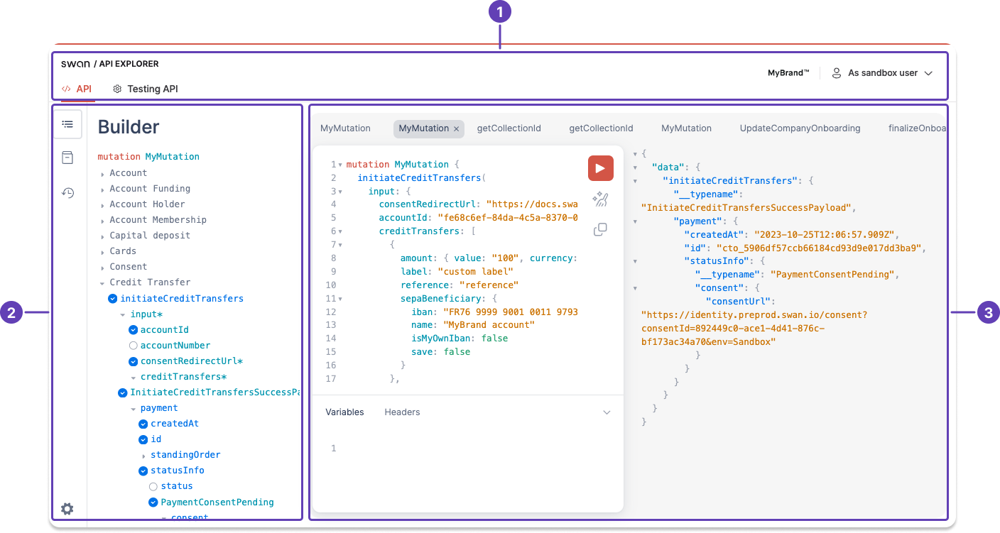
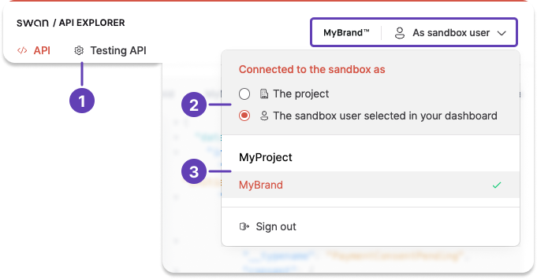
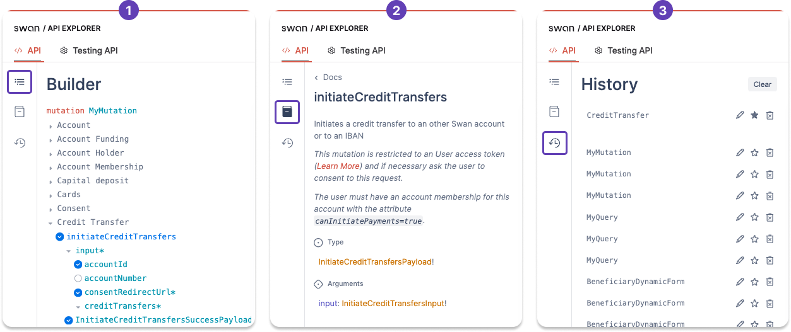
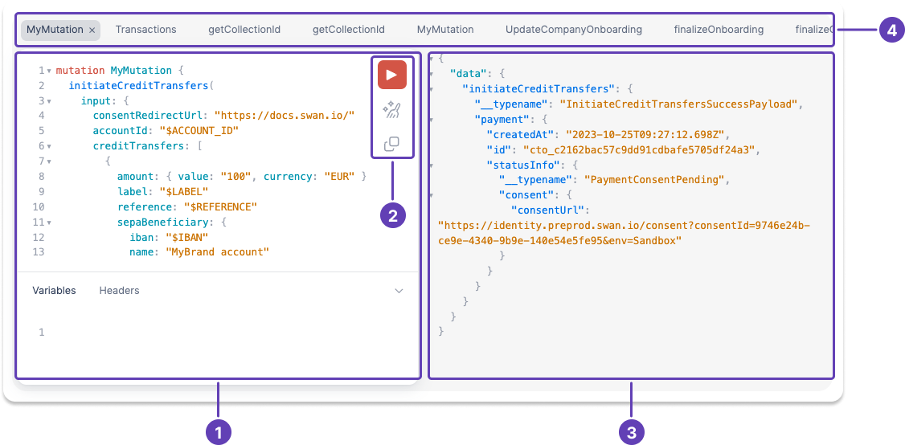

# API Explorer

Swan is an API-first product, and the [**API Explorer**](https://explorer.swan.io/) provides a way to test all of Swan's features.
You can use the Explorer for both Live and Sandbox environments (remember, your data doesn't transfer between environments).

## Overview {#overview}

The API Explorer can be broken up into **three main blocks**:

1. Use the **top navigation** to switch between APIs, projects, and authentication tokens.
1. Use the **side modules and navigation** for building, checking documentation, reviewing history, and clearing local data.
1. Use the **body of the API Explorer** to input information, test mutations and queries, get payloads, and more.

## Block 1: Top navigation {#top-nav}

1. Swan exposes two APIs:
    - Use the **Live API** to perform all of your real work with Swan.
    - Use the [**Testing API**](./testing-api.mdx) in partnership with the [**Event Simulator**](./event-simulator.mdx) to simulate events that must include other people, such as consent and authentications.

**Open the menu to switch** between tokens and projects by clicking around your logo or user type:

2. Switch between [**access tokens**](../using-api/authentication/index.mdx#tokens):
    - **Project** uses a project access token.
    - **Sandbox user** selected in your dashboard uses the user access token associated with the chosen user. Change this user on **Dashboard** > **Developers** > **Sandbox users**.
1. Toggle between projects you have access to. If you think a project is missing from this list, talk to the project's admin.

## Block 2: Side modules and navigation {#side-modules-nav}

1. **Builder**: Add mutations and queries, as well as all fields, objects, responses, and more.
1. **Documentation**: Refer to the [API Reference](https://api-reference.swan.io/) without leaving the Explorer.
1. **History**: Review your exploration history. You can:
    - Edit the names of your mutations and queries for easy reference.
    - Star mutations and queries you use frequently.
    - Delete items from the history if they're not helpful anymore. You can also clear all of your local data by clicking the settings icon (not pictured).

## Block 3: Body {#body}

1. Edit your query or mutation in the **primary terminal**.
    - All of the fields, objects, rejections, and more that you select in the **builder** will appear in this terminal.
    - You'll need to **input all information in the terminal**, such as IDs, addresses, IBANs, and all other required and optional content.
1. Inside of the primary terminal, you have buttons to:
    - **Run** your query or mutation.
    - **Prettify** (or clean up) the formatting of your content.
    - **Share** the exact query or mutation.
1. Payloads and responses are displayed in a non-editable **secondary terminal**.
1. Your **recently-used queries and mutations** appear at the top of the body block of the API Explorer. Click one to autofill the primary terminal.

## Limitations {#limitations}

To maximize performance and keep the Explorer secure, please work within the following limitations:

- Maximum of 10 nested fields per object
- Maximum of 1000 fields per query
- Maximum of 3 root fields per Explorer operation (you can call up to 3 mutations or queries at the same time)