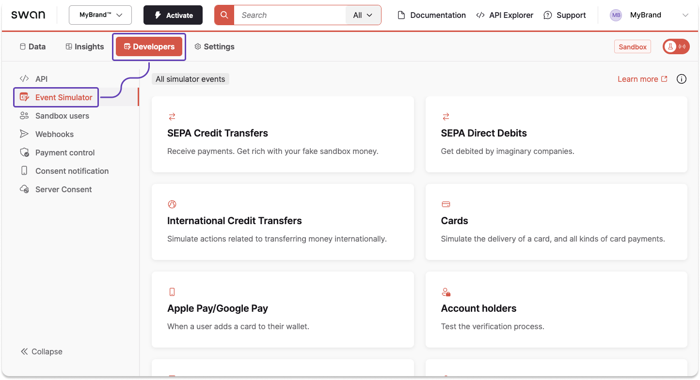
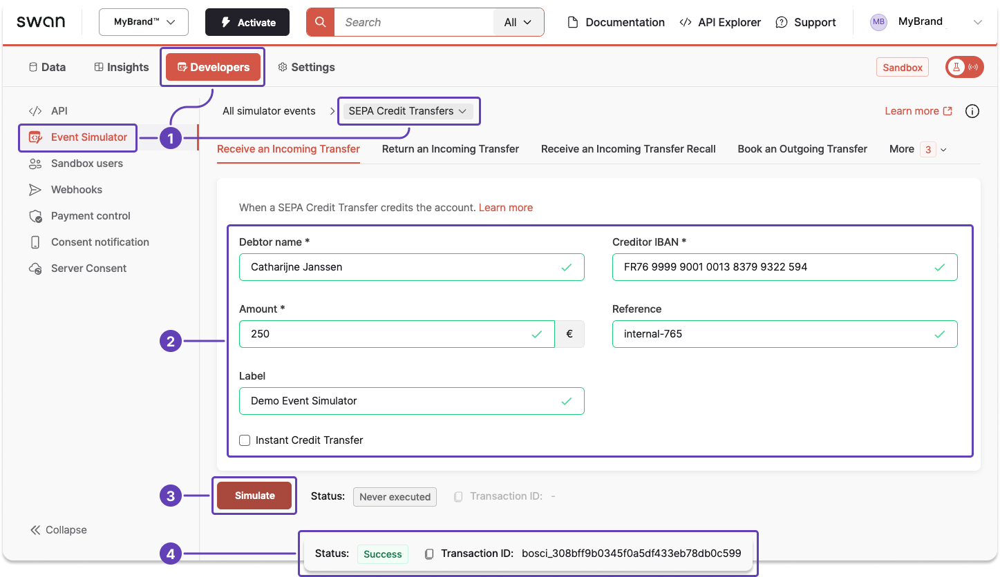

# Event Simulator

## Overview {#overview}

With a live project, a multitude of people and technical services are involved in making a Swan account function.
Swan facilitates identification (verifying a user's identity) and risk assessments, debtors send credit transfers, users add Swan cards to their Apple or Google wallets, and more.

But when you're testing Swan, those people and services aren't involved.
Instead, you simulate all external events with the Event Simulator.

Go to **Dashboard** > **Developers** > **Event Simulator** to open the simulator.

import TestingApiEventSimulator from './_testing-simulator.mdx';

<TestingApiEventSimulator />

## Simulator events {#events}

Use the Event Simulator to perform many events that another person or a technical service would perform for a live project.

Events you can simulate include:

- Changing an account holder's verification status
- Changing a funding limit
- Receiving a Direct Debit cancellation
- Requesting a Direct Debit refund
- Approving a Merchant profile and their submitted payment product
- Manually provision a card for Apple or Google Pay

:::info
The list of simulator events is not exhaustive, and Swan often adds events as new features are released.
Please go to **Dashboard** > **Developers** > **Event Simulator** for all possibilities.

If there is an event you'd like to simulate to test your integration, please send an email to support@swan.io.
:::

## Example {#example}

Use the Event Simulator to simulate receiving a SEPA Credit Transfer from a debtor to your Swan Sandbox account.
In a live situation, the debtor would perform this action on their own.
In Sandbox, you need to do it yourself.

1. On your Dashboard, go to **Developers** > **Event Simulator** > **SEPA Credit Transfers**.
1. In the **Receive an Incoming Transfer** tab, enter all required information.
   - You can also add an internal reference and a label. If you don't add a label, your transaction history will show _Transfer from \{Debtor name\}_.
1. Click **Simulate**.
1. Instantly, the status changes to the new status. If the simulation succeeded, you'll see the status `Success` and your transaction ID.

:::tip Success
After a successful simulation transfer, you can use these funds on API Explorer.
:::
