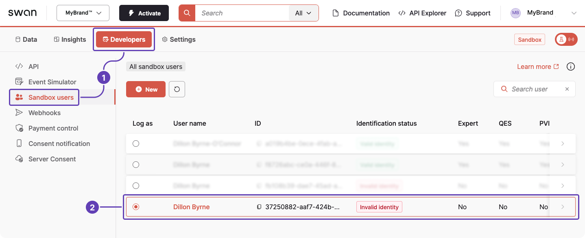
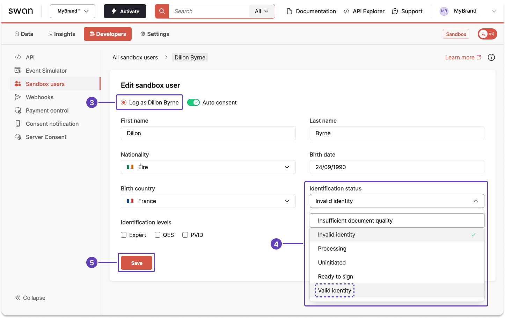

# Work with Swan tools

Consider this example that uses several tools to create a new Sandbox user, validate their identity, then receive and return a SEPA Credit Transfer.

## Step 1: Testing API → Add Sandbox user {#add-sandbox-user}

This tutorial is for demonstrative purposes; you can also add a Sandbox user directly from your Dashboard.

1. Call the `createSandboxUser` mutation to [create a new Sandbox user](https://explorer.swan.io?query=bXV0YXRpb24gU2FuZGJveFVzZXJXaXRoQXBpIHsKICBjcmVhdGVTYW5kYm94VXNlcigKICAgIGlucHV0OiB7CiAgICAgIGZpcnN0TmFtZTogIkRpbGxvbiIKICAgICAgbGFzdE5hbWU6ICJCeXJuZSIKICAgICAgYmlydGhEYXRlOiAiMTk5MC0wOS0yNCIKICAgICAgbmF0aW9uYWxpdHlDQ0EzOiAiSVJMIgogICAgICBpZGVudGlmaWNhdGlvblN0YXR1czogSW52YWxpZElkZW50aXR5CiAgICAgIGF1dG9Db25zZW50OiB0cnVlCiAgICAgIHZlcmlmaWNhdGlvblN0YXR1czogVmVyaWZpZWQKICAgIH0KICApIHsKICAgIC4uLiBvbiBDcmVhdGVTYW5kYm94VXNlclN1Y2Nlc3NQYXlsb2FkIHsKICAgICAgX190eXBlbmFtZQogICAgICBzYW5kYm94VXNlciB7CiAgICAgICAgaWQKICAgICAgICBpZGVudGlmaWNhdGlvblN0YXR1cwogICAgICB9CiAgICB9CiAgICAuLi4gb24gTmF0aW9uYWxpdHlOb3RGb3VuZFJlamVjdGlvbiB7CiAgICAgIF9fdHlwZW5hbWUKICAgICAgaWRlbnRpZmllcgogICAgICBtZXNzYWdlCiAgICB9CiAgICAuLi4gb24gRm9yYmlkZGVuUmVqZWN0aW9uIHsKICAgICAgX190eXBlbmFtZQogICAgICBtZXNzYWdlCiAgICB9CiAgfQp9Cg%3D%3D&tab=test-api) connected to your user access token.
1. The sample mutation includes all required fields. Change any information you'd like.
1. Choose `InvalidIdentity` for testing purposes only (line 8).
1. Click **⏵ Run**.

```graphql title="Mutation" {8} showLineNumbers
mutation SandboxUserWithApi {
  createSandboxUser(
    input: {
      firstName: "Dillon"
      lastName: "Byrne"
      birthDate: "1990-09-24"
      nationalityCCA3: "IRL"
      identificationStatus: InvalidIdentity
      autoConsent: true
      verificationStatus: Verified
    }
  ) {
    ... on CreateSandboxUserSuccessPayload {
      __typename
      sandboxUser {
        id
      }
    }
    ... on NationalityNotFoundRejection {
      __typename
      identifier
      message
    }
    ... on ForbiddenRejection {
      __typename
      message
    }
  }
}

```

```json title="Payload" {6,7} showLineNumbers
{
  "data": {
    "createSandboxUser": {
      "__typename": "CreateSandboxUserSuccessPayload",
      "sandboxUser": {
        "id": "$YOUR_SANDBOX_USER_ID",
        "identificationStatus": "InvalidIdentity"
      }
    }
  }
}
```

## Step 2: Dashboard → Validate Sandbox user's identity {#validate-identity}

1. Go to **Dashboard** > **Developers** > **Sandbox users**.
1. Click the line for your new Sandbox user.



3. Select the radio button for **Log as *your Sandbox user***.
1. Change the identification status to **Valid identity**.
1. Click **Save**.



## Step 3: Testing API → Simulate receiving a transfer {#receive-transfer}

1. Call the `simulateIncomingSepaCreditTransferReception` mutation to [simulate receiving an incoming SEPA Credit Transfer](https://explorer.swan.io?query=bXV0YXRpb24gU2ltdWxhdGVSZWNlaXZpbmdUcmFuc2ZlciB7CiAgc2ltdWxhdGVJbmNvbWluZ1NlcGFDcmVkaXRUcmFuc2ZlclJlY2VwdGlvbigKICAgIGlucHV0OiB7CiAgICAgIGFtb3VudDogeyB2YWx1ZTogIjEwMCIsIGN1cnJlbmN5OiAiRVVSIiB9CiAgICAgIGNyZWRpdG9ySWJhbjogIiRTV0FOX0FDQ09VTlRfSUJBTiIKICAgICAgY3JlZGl0b3JOYW1lOiAiTWFsaWthIE5nb21hIgogICAgICBkZWJ0b3JJYmFuOiAiRlIyNzMwMDAzMDAwNzA2MzE1NzM0MTc0QjkzIgogICAgICBkZWJ0b3JOYW1lOiAiSnVsZXMgRmxldXJ5IgogICAgICBjcmVkaXRvckFkZHJlc3M6IHsKICAgICAgICBhZGRyZXNzTGluZTE6ICIxMjMgYXZlbnVlIGRlIFBhcmlzIgogICAgICAgIGNpdHk6ICJQYXJpcyIKICAgICAgICBwb3N0YWxDb2RlOiAiNzUwMDAiCiAgICAgICAgY291bnRyeTogIkZSQSIKICAgICAgfQogICAgICBkZWJ0b3JBZGRyZXNzOiB7CiAgICAgICAgYWRkcmVzc0xpbmUxOiAiODc2IGF2ZW51ZSBkZSBUb3Vsb3VzZSIKICAgICAgICBjaXR5OiAiUGFyaXMiCiAgICAgICAgY291bnRyeTogIkZSQSIKICAgICAgICBwb3N0YWxDb2RlOiAiNzUwMDAiCiAgICAgIH0KICAgICAgZW5kVG9FbmRJZDogIkV0b0UgUmVmIgogICAgICBsYWJlbDogIkxhYmVsIHRvIGRpc3BsYXkiCiAgICB9CiAgKSB7CiAgICAuLi4gb24gU2ltdWxhdGVJbmNvbWluZ1NlcGFDcmVkaXRUcmFuc2ZlclJlY2VwdGlvblN1Y2Nlc3NQYXlsb2FkIHsKICAgICAgdHJhbnNhY3Rpb25JZAogICAgfQogICAgLi4uIG9uIEZvcmJpZGRlblJlamVjdGlvbiB7CiAgICAgIG1lc3NhZ2UKICAgICAgX190eXBlbmFtZQogICAgfQogIH0KfQo%3D&tab=test-api).
1. Make sure the creditor IBAN belongs to one of your Swan accounts.
1. Copy the transaction ID provided in the payload.

```graphql title="Mutation" {7} showLineNumbers
mutation SimulateReceivingTransfer {
  simulateIncomingSepaCreditTransferReception(
    input: {
      amount: { value: "100", currency: "EUR" }
      creditorIban: "$SWAN_ACCOUNT_IBAN"
      creditorName: "Malika Ngoma"
      debtorIban: "FR2730003000706315734174B93"
      debtorName: "Jules Fleury"
      creditorAddress: {
        addressLine1: "123 avenue de Paris"
        city: "Paris"
        postalCode: "75000"
        country: "FRA"
      }
      debtorAddress: {
        addressLine1: "876 avenue de Toulouse"
        city: "Paris"
        country: "FRA"
        postalCode: "75000"
      }
      endToEndId: "End-to-end reference"
      label: "Label to display"
    }
  ) {
    ... on SimulateIncomingSepaCreditTransferReceptionSuccessPayload {
      transactionId
    }
    ... on ForbiddenRejection {
      message
      __typename
    }
  }
}

```

```json title="Payload" {4} showLineNumbers
{
  "data": {
    "simulateIncomingSepaCreditTransferReception": {
      "transactionId": "$YOUR_TRANSACTION_ID"
    }
  }
}
```

## Step 4: Event Simulator → Simulate returning the transfer {#return-transfer}

1. Go to **Developers** > **Event Simulator** > **SEPA Credit Transfers**.


2. Open the **Return an Incoming Transfer** tab.
1. Enter the transaction ID collected in 3.iii.
1. Click **Simulate**.
1. The status changes to `Success` and a new transaction ID appears for the return transaction.

