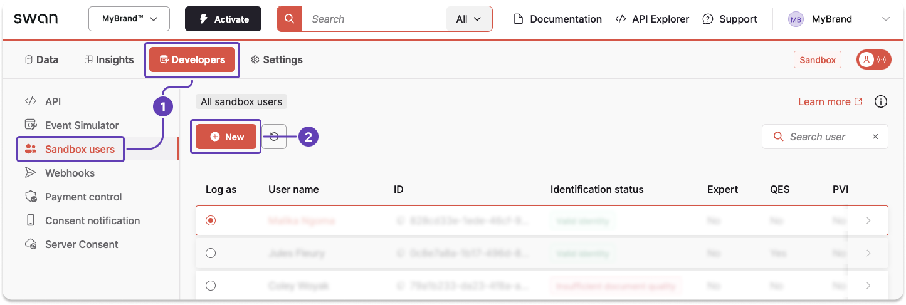

# Work with Swan tools

Consider this example that uses several tools to create a new Sandbox user, validate their identity, then receive and return a SEPA Credit Transfer.

## Step 1: Dashboard → Add Sandbox user {#add-sandbox-user}

This tutorial is for demonstrative purposes; you can also call the `createSandboxUser` mutation in the Testing API to add a Sandbox user.

1. Go to **Dashboard** > **Developers** > **Sandbox users**.
1. Click **+ New** to add a new Sandbox user.



3. Choose whether to activate auto consent for your new Sandbox user.
1. Enter your Sandbox user's information.
1. Click **Save**.


## Step 2: Event Simulator → Validate Sandbox user's identity {#validate-sandbox-user}

Your new Sandbox user is created with the identification status `Uninitiated`.
You need to validate their identity before they can perform operations.

1. **Click to copy** the Sandbox user ID.


2. Go to **Dashboard** > **Developers** > **Event Simulator**
1. Open **Sandbox users**.


4. Enter the Sandbox user ID, choose an identification process, and choose a status for each level you see.
1. Click **Simulate**.
1. The status changes to `Success` and a new identification ID appears for the Sandbox user.

You can now perform operations with this Sandbox user.


## Step 3: Testing API → Simulate receiving a transfer {#receive-transfer}

1. Call the `simulateIncomingSepaCreditTransferReception` mutation to [simulate receiving an incoming SEPA Credit Transfer](https://explorer.swan.io?query=bXV0YXRpb24gU2ltdWxhdGVSZWNlaXZpbmdUcmFuc2ZlciB7CiAgc2ltdWxhdGVJbmNvbWluZ1NlcGFDcmVkaXRUcmFuc2ZlclJlY2VwdGlvbigKICAgIGlucHV0OiB7CiAgICAgIGFtb3VudDogeyB2YWx1ZTogIjEwMCIsIGN1cnJlbmN5OiAiRVVSIiB9CiAgICAgIGNyZWRpdG9ySWJhbjogIiRTV0FOX0FDQ09VTlRfSUJBTiIKICAgICAgY3JlZGl0b3JOYW1lOiAiTWFsaWthIE5nb21hIgogICAgICBkZWJ0b3JJYmFuOiAiRlIyNzMwMDAzMDAwNzA2MzE1NzM0MTc0QjkzIgogICAgICBkZWJ0b3JOYW1lOiAiSnVsZXMgRmxldXJ5IgogICAgICBjcmVkaXRvckFkZHJlc3M6IHsKICAgICAgICBhZGRyZXNzTGluZTE6ICIxMjMgYXZlbnVlIGRlIFBhcmlzIgogICAgICAgIGNpdHk6ICJQYXJpcyIKICAgICAgICBwb3N0YWxDb2RlOiAiNzUwMDAiCiAgICAgICAgY291bnRyeTogIkZSQSIKICAgICAgfQogICAgICBkZWJ0b3JBZGRyZXNzOiB7CiAgICAgICAgYWRkcmVzc0xpbmUxOiAiODc2IGF2ZW51ZSBkZSBUb3Vsb3VzZSIKICAgICAgICBjaXR5OiAiUGFyaXMiCiAgICAgICAgY291bnRyeTogIkZSQSIKICAgICAgICBwb3N0YWxDb2RlOiAiNzUwMDAiCiAgICAgIH0KICAgICAgZW5kVG9FbmRJZDogIkV0b0UgUmVmIgogICAgICBsYWJlbDogIkxhYmVsIHRvIGRpc3BsYXkiCiAgICB9CiAgKSB7CiAgICAuLi4gb24gU2ltdWxhdGVJbmNvbWluZ1NlcGFDcmVkaXRUcmFuc2ZlclJlY2VwdGlvblN1Y2Nlc3NQYXlsb2FkIHsKICAgICAgdHJhbnNhY3Rpb25JZAogICAgfQogICAgLi4uIG9uIEZvcmJpZGRlblJlamVjdGlvbiB7CiAgICAgIG1lc3NhZ2UKICAgICAgX190eXBlbmFtZQogICAgfQogIH0KfQo%3D&tab=test-api).
1. Make sure the creditor IBAN belongs to one of your Swan accounts.
1. Copy the transaction ID provided in the payload.

```graphql title="Mutation" {7} showLineNumbers
mutation SimulateReceivingTransfer {
  simulateIncomingSepaCreditTransferReception(
    input: {
      amount: { value: "100", currency: "EUR" }
      creditorIban: "$SWAN_ACCOUNT_IBAN"
      creditorName: "Malika Ngoma"
      debtorIban: "FR2730003000706315734174B93"
      debtorName: "Jules Fleury"
      creditorAddress: {
        addressLine1: "123 avenue de Paris"
        city: "Paris"
        postalCode: "75000"
        country: "FRA"
      }
      debtorAddress: {
        addressLine1: "876 avenue de Toulouse"
        city: "Paris"
        country: "FRA"
        postalCode: "75000"
      }
      endToEndId: "End-to-end reference"
      label: "Label to display"
    }
  ) {
    ... on SimulateIncomingSepaCreditTransferReceptionSuccessPayload {
      transactionId
    }
    ... on ForbiddenRejection {
      message
      __typename
    }
  }
}
```

```json title="Payload" {4} showLineNumbers
{
  "data": {
    "simulateIncomingSepaCreditTransferReception": {
      "transactionId": "$YOUR_TRANSACTION_ID"
    }
  }
}
```

## Step 4: Event Simulator → Simulate returning the transfer {#return-transfer}

1. Go to **Developers** > **Event Simulator** > **SEPA Credit Transfers**.


2. Open the **Return an Incoming Transfer** tab.
1. Enter the transaction ID collected in [step 3.3](#receive-transfer).
1. Click **Simulate**.
1. The status changes to `Success` and a new transaction ID appears for the return transaction.


