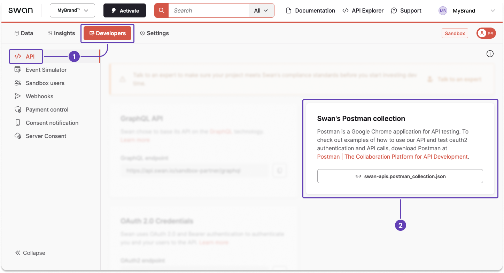
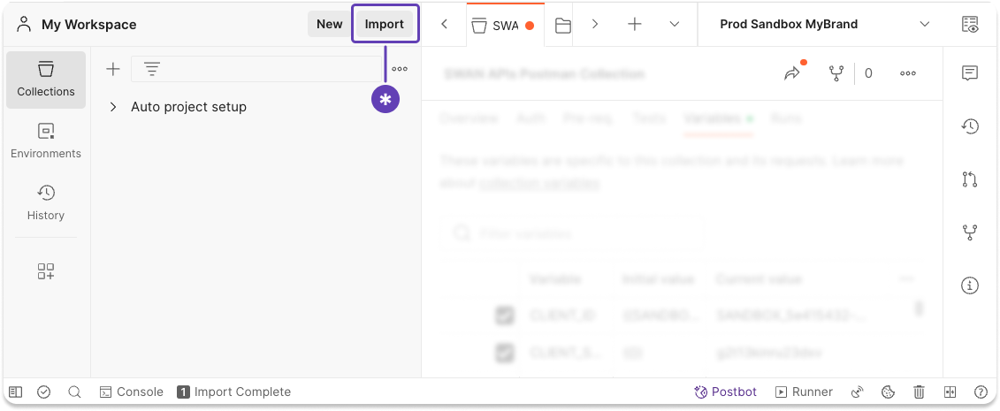
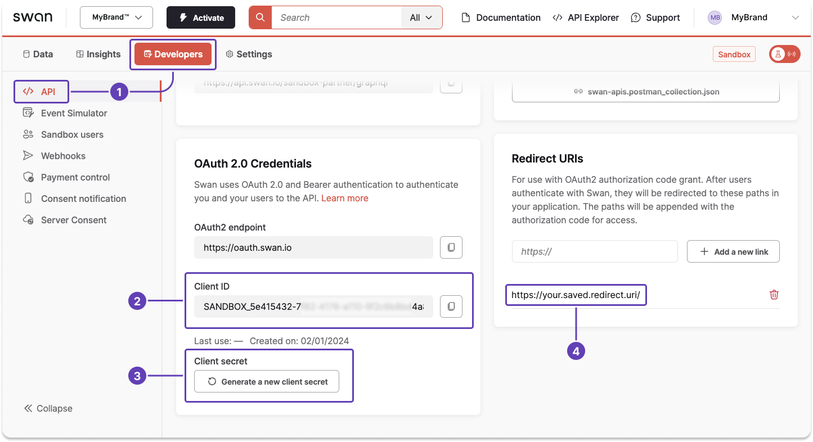
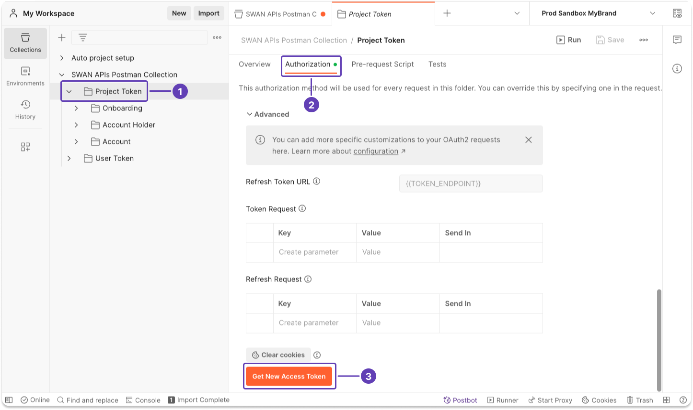
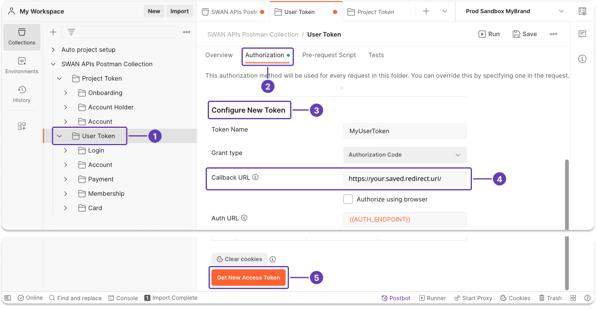
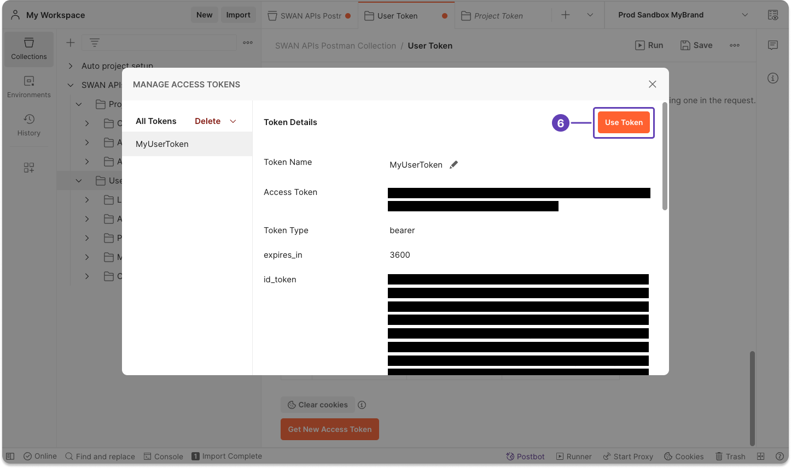

# Postman collection

Postman is a platform for API development and testing.
Use Swan's Postman collection with OAuth 2.0 authentication as a sample implementation to help with your integration.

:::tip Prerequisites
You have [Postman downloaded](https://www.postman.com/downloads/) on your machine, and you're logged in.
:::

:::info Swan Banking Frontend
Along with this Postman collection, you can use the open source [Swan Banking Frontend](https://swan-io.github.io/swan-partner-frontend/getting-started).

Modify the open source code to provide a web banking app that matches your company's style and your user onboarding flows.
The open source project contains the code Swan uses for their banking interface.
:::

## Step 1: Download Swan's Postman collection

Use Swan's Postman collection to try Swan's APIs and test the authorization flow from Postman before integrating Swan.

1. Go to **Dashboard** > **Developers** > **API**.
1. Locate the block named **Swan's Postman collection** and **download** the collection.

## Step 2: Import Swan collection to Postman

In Postman, click **Import**, then import the file you downloaded from your Dashboard.

## Step 3: Get Dashboard information

After you download the collection, configure Postman to communicate with your Swan Dashboard.

1. Go to **Dashboard** > **Developers** > **API**.
1. Notice the location of your **Client ID** in the OAuth 2.0 Credentials block.
1. Notice the location of your **Client secret** in the OAuth 2.0 Credentials block. If needed, generate a new secret.
1. Locate your saved redirect **URI** (Uniform Resource Identifier) in the Redirect URIs block.

## Step 4: Configure Postman

Add the information from your Dashboard to Swan's Postman collection.

1. In Postman, open **SWAN APIs Postman Collection**.
1. Go to **Variables**.
1. Add your Dashboard values for `CLIENT_ID`, `CLIENT_SECRET`, and `CALLBACK_URL` (redirect URI).

## Step 5: Get access tokens

### 5.1 Project access token

1. In Postman, open the **Project Token** folder in SWAN APIs Postman Collection.
1. Go to **Authorization**.
1. Scroll to the end of the page, then click **Get New Access Token**.

After clicking **Get New Access Token**, a popup appears briefly.
You can cancel authentication if needed.

4. A modal with all information about your project access token appears on the screen. Click **Use Token**.

### 5.2 User access token

Getting a new user access token requires consent from the user associated with the token.

1. In Postman, open the **User Token** folder in SWAN APIs Postman Collection.
1. Go to **Authorization**.
1. Locate the section called **Configure New Token**.
1. In **Callback URL**, enter the redirect URI from your Dashboard.
1. Scroll to the end of the page, then click **Get New Access Token**.

:::info Consent
For you to generate a user access token for one of your users, the user must consent.

After clicking **Get New Access Token**, Swan sends a text message to the mobile number saved for this user.
The user needs to use their phone to consent to your user access token before you can continue.
:::

6. After the user consents, a modal with all information about your user access token appears on the screen. Click **Use Token**.

