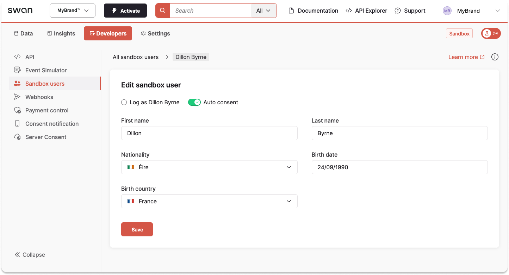

# Sandbox users

## Overview {#overview}

Sandbox users make it possible to simulate the different situations you may encounter with your real users when you go Live.
You can simulate different onboarding scenarios and processes, or practice managing the membership permissions of your accounts.

By default, you have a first Sandbox user.
You can add, modify, and endorse the identity of Sandbox users from your Dashboard and with the Testing API.
You can also delete certain Sandbox users, but only with the Testing API.

Go to **Dashboard** > **Developers** > **Sandbox users** to open your list of Sandbox users.

## Settings {#settings}

The following settings are required and modifiable for each Sandbox user:

1. First name
1. Last name
1. Birthdate
1. Nationality
1. Auto consent
    - Automatically consents for that Sandbox user, removing the need to repeatedly get the user's consent.
    - If toggled to on, auto consent can save you considerable time during the development phase, by automatically allowing consent, removing the need to repeatedly get consent.

## Access to Sandbox users {#access}

Team members with access to the Sandbox users section* can create an unlimited number of Sandbox users using either the Dashboard or the Testing API
User access tokens link team members with all Sandbox users they create.

If team members have access to **Developers** > **Sandbox users**, they can only see and use Sandbox users associated with their own user access token.

:::caution Dashboard roles*
The team member's Dashboard role determines whether or not they have access to the Sandbox users section.
:::

## Example mutations {#examples}

Call these mutations with a user access token.

1. [Create a Sandbox user](https://explorer.swan.io?query=bXV0YXRpb24gTXlNdXRhdGlvbiB7CiAgY3JlYXRlU2FuZGJveFVzZXIoCiAgICBpbnB1dDogewogICAgICBmaXJzdE5hbWU6ICJEaWxsb24iCiAgICAgIGxhc3ROYW1lOiAiQnlybmUiCiAgICAgIGJpcnRoRGF0ZTogIjE5OTAtMDktMjQiCiAgICAgIG5hdGlvbmFsaXR5Q0NBMzogIklSTCIKICAgICAgaWRlbnRpZmljYXRpb25TdGF0dXM6IFZhbGlkSWRlbnRpdHkKICAgICAgYXV0b0NvbnNlbnQ6IHRydWUKICAgICAgdmVyaWZpY2F0aW9uU3RhdHVzOiBWZXJpZmllZAogICAgfQogICkgewogICAgLi4uIG9uIENyZWF0ZVNhbmRib3hVc2VyU3VjY2Vzc1BheWxvYWQgewogICAgICBfX3R5cGVuYW1lCiAgICAgIHNhbmRib3hVc2VyIHsKICAgICAgICBpZAogICAgICB9CiAgICB9CiAgICAuLi4gb24gTmF0aW9uYWxpdHlOb3RGb3VuZFJlamVjdGlvbiB7CiAgICAgIF9fdHlwZW5hbWUKICAgICAgaWRlbnRpZmllcgogICAgICBtZXNzYWdlCiAgICB9CiAgICAuLi4gb24gRm9yYmlkZGVuUmVqZWN0aW9uIHsKICAgICAgX190eXBlbmFtZQogICAgICBtZXNzYWdlCiAgICB9CiAgfQp9Cg%3D%3D&tab=test-api)
1. [Update a Sandbox user](https://explorer.swan.io?query=bXV0YXRpb24gTXlNdXRhdGlvbiB7CiAgdXBkYXRlU2FuZGJveFVzZXIoCiAgICBpbnB1dDogewogICAgICBpZDogIiRZT1VSX1NBTkRCT1hfVVNFUl9JRCIKICAgICAgZmlyc3ROYW1lOiAiRGlsbG9uIgogICAgICBsYXN0TmFtZTogIkJ5cm5lLU%2FigJlDb25ub3IiCiAgICAgIGJpcnRoRGF0ZTogIjE5OTAtMDktMjQiCiAgICAgIG5hdGlvbmFsaXR5Q0NBMzogIklSTCIKICAgICAgYXV0b0NvbnNlbnQ6IGZhbHNlCiAgICB9CiAgKSB7CiAgICAuLi4gb24gVXBkYXRlU2FuZGJveFVzZXJTdWNjZXNzUGF5bG9hZCB7CiAgICAgIF9fdHlwZW5hbWUKICAgICAgc2FuZGJveFVzZXIgewogICAgICAgIGlkCiAgICAgICAgbGFzdE5hbWUKICAgICAgfQogICAgfQogICAgLi4uIG9uIEZvcmJpZGRlblJlamVjdGlvbiB7CiAgICAgIF9fdHlwZW5hbWUKICAgICAgbWVzc2FnZQogICAgfQogICAgLi4uIG9uIE5hdGlvbmFsaXR5Tm90Rm91bmRSZWplY3Rpb24gewogICAgICBfX3R5cGVuYW1lCiAgICAgIGlkZW50aWZpZXIKICAgICAgbWVzc2FnZQogICAgfQogICAgLi4uIG9uIFNhbmRib3hVc2VyTm90Rm91bmRSZWplY3Rpb24gewogICAgICBfX3R5cGVuYW1lCiAgICAgIG1lc3NhZ2UKICAgICAgdXNlcklkCiAgICB9CiAgfQp9Cg%3D%3D&tab=test-api)
1. [Endorse a Sandbox user](https://explorer.swan.io?query=bXV0YXRpb24gTXlNdXRhdGlvbiB7CiAgZW5kb3JzZVNhbmRib3hVc2VyKGlucHV0OiB7IGlkOiAiJFlPVVJfU0FOREJPWF9VU0VSX0lEIiB9KSB7CiAgICAuLi4gb24gRW5kb3JzZVNhbmRib3hVc2VyU3VjY2Vzc1BheWxvYWQgewogICAgICBfX3R5cGVuYW1lCiAgICAgIHNhbmRib3hVc2VyIHsKICAgICAgICBpZAogICAgICAgIGlzQWN0aXZlCiAgICAgIH0KICAgIH0KICAgIC4uLiBvbiBGb3JiaWRkZW5SZWplY3Rpb24gewogICAgICBfX3R5cGVuYW1lCiAgICAgIG1lc3NhZ2UKICAgIH0KICAgIC4uLiBvbiBTYW5kYm94VXNlck5vdEZvdW5kUmVqZWN0aW9uIHsKICAgICAgX190eXBlbmFtZQogICAgICBtZXNzYWdlCiAgICAgIHVzZXJJZAogICAgfQogIH0KfQo%3D&tab=test-api)
1. [Delete a Sandbox user](https://explorer.swan.io?query=bXV0YXRpb24gTXlNdXRhdGlvbiB7CiAgZGVsZXRlU2FuZGJveFVzZXIoaW5wdXQ6IHsgaWQ6ICIkWU9VUl9TQU5EQk9YX1VTRVJfSUQiIH0pIHsKICAgIC4uLiBvbiBEZWxldGVTYW5kYm94VXNlclN1Y2Nlc3NQYXlsb2FkIHsKICAgICAgX190eXBlbmFtZQogICAgICBzdWNjZXNzCiAgICB9CiAgICAuLi4gb24gRm9yYmlkZGVuUmVqZWN0aW9uIHsKICAgICAgX190eXBlbmFtZQogICAgICBtZXNzYWdlCiAgICB9CiAgICAuLi4gb24gTGFzdFNhbmRib3hVc2VyQ2Fubm90QmVEZWxldGVkUmVqZWN0aW9uIHsKICAgICAgX190eXBlbmFtZQogICAgICBtZXNzYWdlCiAgICAgIHVzZXJJZAogICAgfQogICAgLi4uIG9uIFNhbmRib3hVc2VyTm90Rm91bmRSZWplY3Rpb24gewogICAgICBfX3R5cGVuYW1lCiAgICAgIG1lc3NhZ2UKICAgICAgdXNlcklkCiAgICB9CiAgfQp9Cg%3D%3D&tab=test-api)

:::note Deleting Sandbox users
Note that you can only delete Sandbox users if you haven't used them to simulate any operations.
Since you can't delete a user from your Live environment, deleting from the Sandbox environment would be inconsistent.
:::