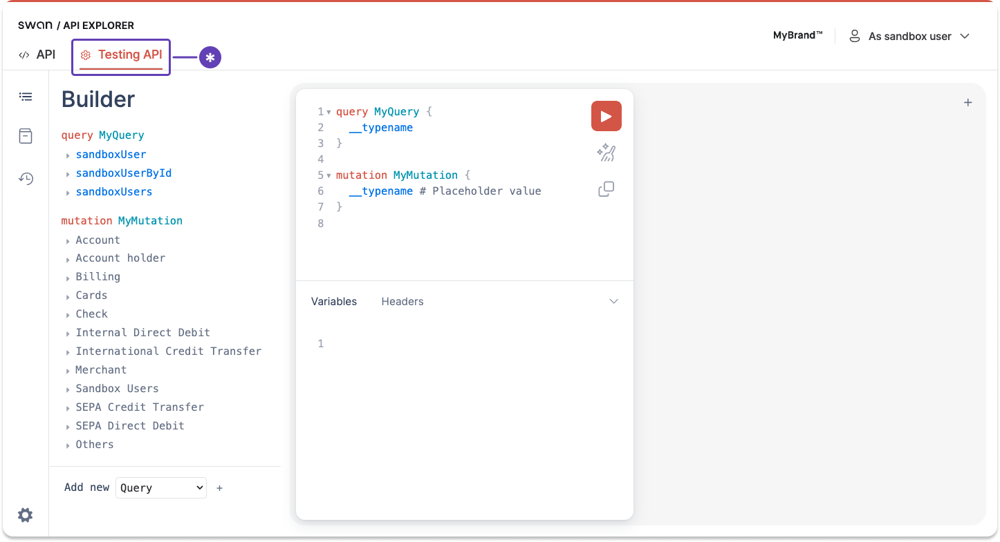

# Testing API

## Overview {#overview}

Swan's testing, or simulation, API lets you trigger events that happen outside of Swan.
Swan's API reacts as it would in real life, displaying the right information at the right time.

When using the Testing API and your Sandbox environment, you can perform end-to-end tests without the user's intervention and without connecting to the Dashboard.

Testing API mutations function in the same way as the Live API, except they don't trigger real events.
You'll need a [user access token](../using-api/authentication/guide-get-token-user.mdx) to use most Testing API mutations, though sometimes a project access token is enough.

Go to **API Explorer** > [**Testing API**](https://explorer.swan.io/?tab=test-api) to see all available mutations.

## Example mutations {#examples}

The following links lead to examples to personalize and test with the Testing API Explorer.
As a reminder, this list isn't exhaustive.

1. **SEPA Credit Transfers**
    1. [Simulate receiving an incoming SEPA Credit Transfer](https://explorer.swan.io?query=bXV0YXRpb24gTXV0YXRpb24gewogIHNpbXVsYXRlSW5jb21pbmdTZXBhQ3JlZGl0VHJhbnNmZXJSZWNlcHRpb24oCiAgICBpbnB1dDogewogICAgICBhbW91bnQ6IHsgdmFsdWU6ICIxMDAiLCBjdXJyZW5jeTogIkVVUiIgfQogICAgICBjcmVkaXRvckliYW46ICIkU1dBTl9BQ0NPVU5UX0lCQU4iCiAgICAgIGNyZWRpdG9yTmFtZTogIk1hbGlrYSBOZ29tYSIKICAgICAgZGVidG9ySWJhbjogIkZSMjczMDAwMzAwMDcwNjMxNTczNDE3NEI5MyIKICAgICAgZGVidG9yTmFtZTogIkp1bGVzIEZsZXVyeSIKICAgICAgY3JlZGl0b3JBZGRyZXNzOiB7CiAgICAgICAgYWRkcmVzc0xpbmUxOiAiMTIzIGF2ZW51ZSBkZSBQYXJpcyIKICAgICAgICBjaXR5OiAiUGFyaXMiCiAgICAgICAgcG9zdGFsQ29kZTogIjc1MDAwIgogICAgICAgIGNvdW50cnk6ICJGUkEiCiAgICAgIH0KICAgICAgZGVidG9yQWRkcmVzczogewogICAgICAgIGFkZHJlc3NMaW5lMTogIjg3NiBhdmVudWUgZGUgVG91bG91c2UiCiAgICAgICAgY2l0eTogIlBhcmlzIgogICAgICAgIGNvdW50cnk6ICJGUkEiCiAgICAgICAgcG9zdGFsQ29kZTogIjc1MDAwIgogICAgICB9CiAgICAgIGVuZFRvRW5kSWQ6ICJFdG9FIFJlZiIKICAgICAgbGFiZWw6ICJMYWJlbCB0byBkaXNwbGF5IgogICAgfQogICkgewogICAgLi4uIG9uIFNpbXVsYXRlSW5jb21pbmdTZXBhQ3JlZGl0VHJhbnNmZXJSZWNlcHRpb25TdWNjZXNzUGF5bG9hZCB7CiAgICAgIHRyYW5zYWN0aW9uSWQKICAgIH0KICAgIC4uLiBvbiBGb3JiaWRkZW5SZWplY3Rpb24gewogICAgICBtZXNzYWdlCiAgICAgIF9fdHlwZW5hbWUKICAgIH0KICB9Cn0K&tab=test-api)
    1. [Simulate an accepted recall of an Incoming SEPA Credit Transfer](https://explorer.swan.io?query=bXV0YXRpb24gTXV0YXRpb24gewogIHNpbXVsYXRlSW5jb21pbmdTZXBhQ3JlZGl0VHJhbnNmZXJBY2NlcHRlZFJlY2FsbCgKICAgIGlucHV0OiB7CiAgICAgIHJlYXNvbkNvZGU6IEJlbmVmaWNpYXJ5QWNjb3VudEluY29ycmVjdAogICAgICB0cmFuc2FjdGlvbklkOiAiJFlPVVJfVFJBTlNBQ1RJT05fSUQiCiAgICB9CiAgKSB7CiAgICAuLi4gb24gU2ltdWxhdGVJbmNvbWluZ1NlcGFDcmVkaXRUcmFuc2ZlckFjY2VwdGVkUmVjYWxsU3VjY2Vzc1BheWxvYWQgewogICAgICBfX3R5cGVuYW1lCiAgICAgIHRyYW5zYWN0aW9uSWQKICAgIH0KICAgIC4uLiBvbiBGb3JiaWRkZW5SZWplY3Rpb24gewogICAgICBfX3R5cGVuYW1lCiAgICAgIG1lc3NhZ2UKICAgIH0KICAgIC4uLiBvbiBUcmFuc2FjdGlvbk5vdEZvdW5kUmVqZWN0aW9uIHsKICAgICAgX190eXBlbmFtZQogICAgICBtZXNzYWdlCiAgICAgIHRyYW5zYWN0aW9uSWQKICAgIH0KICB9Cn0K&tab=test-api)
    1. [Simulate booking an outgoing SEPA Credit Transfer](https://explorer.swan.io?query=bXV0YXRpb24gTXV0YXRpb24gewogIHNpbXVsYXRlT3V0Z29pbmdTZXBhQ3JlZGl0VHJhbnNmZXJCb29raW5nKAogICAgaW5wdXQ6IHsgdHJhbnNhY3Rpb25JZDogIiRZT1VSX1RSQU5TQUNUSU9OX0lEIiB9CiAgKSB7CiAgICAuLi4gb24gU2ltdWxhdGVPdXRnb2luZ1NlcGFDcmVkaXRUcmFuc2ZlckJvb2tpbmdTdWNjZXNzUGF5bG9hZCB7CiAgICAgIHRyYW5zYWN0aW9uSWQKICAgIH0KICAgIC4uLiBvbiBGb3JiaWRkZW5SZWplY3Rpb24gewogICAgICBtZXNzYWdlCiAgICB9CiAgICAuLi4gb24gVHJhbnNhY3Rpb25Ob3RGb3VuZFJlamVjdGlvbiB7CiAgICAgIHRyYW5zYWN0aW9uSWQKICAgICAgbWVzc2FnZQogICAgfQogIH0KfQo%3D&tab=test-api)
1. **SEPA Direct Debit**
    1. [Simulate the reception of an outgoing SEPA Direct Debit](https://explorer.swan.io?query=bXV0YXRpb24gTXV0YXRpb24gewogIHNpbXVsYXRlT3V0Z29pbmdTZXBhRGlyZWN0RGViaXRSZWNlcHRpb24oCiAgICBpbnB1dDogewogICAgICBhbW91bnQ6IHsgdmFsdWU6ICIxMDAiLCBjdXJyZW5jeTogIkVVUiIgfQogICAgICBjcmVkaXRvcjogewogICAgICAgIGliYW46ICJERTg4NTAwMTA1MTcxNTc5ODMzNzMxIgogICAgICAgIG5hbWU6ICJSYWUgU2NobWlkdCIKICAgICAgICBpZGVudGlmaWVyOiAiREUxMUFCQzEyMzQ1NiIKICAgICAgICBhZGRyZXNzOiB7CiAgICAgICAgICBhZGRyZXNzTGluZTE6ICJBbiBkZXIgS2lyY2hlIDYiCiAgICAgICAgICBjaXR5OiAiQmVybGluIgogICAgICAgICAgY291bnRyeTogIkRFVSIKICAgICAgICAgIHBvc3RhbENvZGU6ICI5NTM1NiIKICAgICAgICB9CiAgICAgIH0KICAgICAgZGVidG9ySWJhbjogIiRTV0FOX0FDQ09VTlRfSUJBTiIKICAgICAgZXhlY3V0aW9uRGF0ZTogIjIwMjQtMDItMTBUMTY6MDA6MDAuMDAwWiIKICAgICAgbWFuZGF0ZVJlZmVyZW5jZTogIjhkYjA1OGNjNThlYTRiZTc5MmZlZjQzNzBhYTg2ZTUwIgogICAgICBtYW5kYXRlU2VxdWVuY2U6IE9uZU9mZgogICAgICBtYW5kYXRlVHlwZTogQjJCCiAgICB9CiAgKSB7CiAgICAuLi4gb24gU2ltdWxhdGVPdXRnb2luZ1NlcGFEaXJlY3REZWJpdFJlY2VwdGlvblN1Y2Nlc3NQYXlsb2FkIHsKICAgICAgdHJhbnNhY3Rpb25JZAogICAgfQogICAgLi4uIG9uIEZvcmJpZGRlblJlamVjdGlvbiB7CiAgICAgIG1lc3NhZ2UKICAgIH0KICB9Cn0K&tab=test-api)
    1. [Simulate reversing an outgoing SEPA Direct Debit](https://explorer.swan.io?query=bXV0YXRpb24gTXV0YXRpb24gewogIHNpbXVsYXRlT3V0Z29pbmdTZXBhRGlyZWN0RGViaXRSZXZlcnNlKAogICAgaW5wdXQ6IHsKICAgICAgcmVhc29uQ29kZTogTm90U3BlY2lmaWVkQnlCYW5rCiAgICAgIHRyYW5zYWN0aW9uSWQ6ICIkWU9VUl9UUkFOU0FDVElPTl9JRCIKICAgIH0KICApIHsKICAgIC4uLiBvbiBTaW11bGF0ZU91dGdvaW5nU2VwYURpcmVjdERlYml0UmV2ZXJzZVN1Y2Nlc3NQYXlsb2FkIHsKICAgICAgdHJhbnNhY3Rpb25JZAogICAgfQogICAgLi4uIG9uIEZvcmJpZGRlblJlamVjdGlvbiB7CiAgICAgIG1lc3NhZ2UKICAgIH0KICAgIC4uLiBvbiBUcmFuc2FjdGlvbk5vdEZvdW5kUmVqZWN0aW9uIHsKICAgICAgdHJhbnNhY3Rpb25JZAogICAgICBtZXNzYWdlCiAgICB9CiAgfQp9Cg%3D%3D&tab=test-api)
    1. [Simulate releasing reserved balance from a SEPA Direct Debit](https://explorer.swan.io?query=bXV0YXRpb24gTXV0YXRpb24gewogIHNpbXVsYXRlUmVsZWFzZVJlc2VydmVkQmFsYW5jZSgKICAgIGlucHV0OiB7IHRyYW5zYWN0aW9uSWQ6ICIkWU9VUl9UUkFOU0FDVElPTl9JRCIgfQogICkgewogICAgLi4uIG9uIEZvcmJpZGRlblJlamVjdGlvbiB7CiAgICAgIF9fdHlwZW5hbWUKICAgICAgbWVzc2FnZQogICAgfQogICAgLi4uIG9uIFRyYW5zYWN0aW9uTm90Rm91bmRSZWplY3Rpb24gewogICAgICBfX3R5cGVuYW1lCiAgICAgIG1lc3NhZ2UKICAgICAgdHJhbnNhY3Rpb25JZAogICAgfQogICAgLi4uIG9uIFJlbGVhc2VSZXNlcnZlZEJhbGFuY2VTdWNjZXNzUGF5bG9hZCB7CiAgICAgIF9fdHlwZW5hbWUKICAgICAgdHJhbnNhY3Rpb25JZAogICAgfQogIH0KfQo%3D&tab=test-api)
1. **Card payments**
    1. [Simulate creating an authorization request from a merchant](https://explorer.swan.io?query=bXV0YXRpb24gTXV0YXRpb24oJGlucHV0OiBTaW11bGF0ZU91dGdvaW5nQ2FyZEF1dGhvcml6YXRpb25JbnB1dCEpIHsKICBzaW11bGF0ZU91dGdvaW5nQ2FyZEF1dGhvcml6YXRpb24oaW5wdXQ6ICRpbnB1dCkgewogICAgLi4uIG9uIFNpbXVsYXRlT3V0Z29pbmdDYXJkQXV0aG9yaXphdGlvblN1Y2Nlc3NQYXlsb2FkIHsKICAgICAgdHJhbnNhY3Rpb25JZAogICAgfQogICAgLi4uIG9uIFNpbXVsYXRlT3V0Z29pbmdDYXJkQXV0aG9yaXphdGlvblJlamVjdFBheWxvYWQgewogICAgICB0cmFuc2FjdGlvbklkCiAgICAgIHJlYXNvbgogICAgfQogICAgLi4uIG9uIENhcmROb3RGb3VuZFJlamVjdGlvbiB7CiAgICAgIGlkCiAgICAgIG1lc3NhZ2UKICAgIH0KICAgIC4uLiBvbiBGb3JiaWRkZW5SZWplY3Rpb24gewogICAgICBtZXNzYWdlCiAgICB9CiAgfQp9Cg%3D%3D&tab=test-api&variables=ewogICJpbnB1dCI6IHsKICAgICJhbW91bnQiOiB7CiAgICAgICJ2YWx1ZSI6IDEwLAogICAgICAiY3VycmVuY3kiOiAiRVVSIgogICAgfSwKICAgICJhdXRob3JpemF0aW9uVHlwZSI6ICJDbGFzc2ljIiwKICAgICJjYXJkSWQiOiAiJFlPVVJfQ0FSRF9JRCIsCiAgICAiY2FyZFRyYW5zYWN0aW9uQ2F0ZWdvcnkiOiAiSW5TdG9yZSIsCiAgICAiY2FyZFR5cGUiOiAiVmlydHVhbCIsCiAgICAibWVyY2hhbnQiOiB7CiAgICAgICJjaXR5IjogbnVsbCwKICAgICAgImNvZGUiOiBudWxsLAogICAgICAiY291bnRyeSI6IG51bGwsCiAgICAgICJpZCI6IG51bGwsCiAgICAgICJuYW1lIjogbnVsbAogICAgfSwKICAgICJvcmlnaW5hbEFtb3VudCI6IHsKICAgICAgInZhbHVlIjogMTAsCiAgICAgICJjdXJyZW5jeSI6ICJFVVIiCiAgICB9LAogICAgIm91dGNvbWUiOiBudWxsLAogICAgInRlcm1pbmFsSWQiOiBudWxsCiAgfQp9)
    1. [Simulate reversing a card debit](https://explorer.swan.io?query=bXV0YXRpb24gTXV0YXRpb24oJGlucHV0OiBTaW11bGF0ZU91dGdvaW5nQ2FyZENyZWRpdFJldmVyc2VJbnB1dCEpIHsKICBzaW11bGF0ZU91dGdvaW5nQ2FyZENyZWRpdFJldmVyc2UoaW5wdXQ6ICRpbnB1dCkgewogICAgLi4uIG9uIFNpbXVsYXRlT3V0Z29pbmdDYXJkQ3JlZGl0UmV2ZXJzZVN1Y2Nlc3NQYXlsb2FkIHsKICAgICAgdHJhbnNhY3Rpb25JZAogICAgfQogICAgLi4uIG9uIEZvcmJpZGRlblJlamVjdGlvbiB7CiAgICAgIG1lc3NhZ2UKICAgIH0KICAgIC4uLiBvbiBUcmFuc2FjdGlvbk5vdEZvdW5kUmVqZWN0aW9uIHsKICAgICAgdHJhbnNhY3Rpb25JZAogICAgICBtZXNzYWdlCiAgICB9CiAgfQp9Cg%3D%3D&tab=test-api&variables=ewogICJpbnB1dCI6IHsKICAgICJhbW91bnQiOiB7CiAgICAgICJ2YWx1ZSI6IDEwLAogICAgICAiY3VycmVuY3kiOiAiRVVSIgogICAgfSwKICAgICJvcmlnaW5hbEFtb3VudCI6IHsKICAgICAgInZhbHVlIjogMTAsCiAgICAgICJjdXJyZW5jeSI6ICJFVVIiCiAgICB9LAogICAgInRyYW5zYWN0aW9uSWQiOiAiJFlPVVJfVFJBTlNBQ1RJT05fSUQiCiAgfQp9)
    1. [Simulate crediting a card](https://explorer.swan.io?query=bXV0YXRpb24gTXV0YXRpb24oJGlucHV0OiBTaW11bGF0ZU91dGdvaW5nQ2FyZENyZWRpdElucHV0ISkgewogIHNpbXVsYXRlT3V0Z29pbmdDYXJkQ3JlZGl0KGlucHV0OiAkaW5wdXQpIHsKICAgIC4uLiBvbiBTaW11bGF0ZU91dGdvaW5nQ2FyZENyZWRpdFN1Y2Nlc3NQYXlsb2FkIHsKICAgICAgdHJhbnNhY3Rpb25JZAogICAgfQogICAgLi4uIG9uIENhcmROb3RGb3VuZFJlamVjdGlvbiB7CiAgICAgIGlkCiAgICAgIG1lc3NhZ2UKICAgIH0KICAgIC4uLiBvbiBGb3JiaWRkZW5SZWplY3Rpb24gewogICAgICBtZXNzYWdlCiAgICB9CiAgfQp9Cg%3D%3D&tab=test-api&variables=ewogICJpbnB1dCI6IHsKICAgICJhbW91bnQiOiB7CiAgICAgICJ2YWx1ZSI6IDEwLAogICAgICAiY3VycmVuY3kiOiAiRVVSIgogICAgfSwKICAgICJjYXJkSWQiOiAiJFlPVVJfQ0FSRF9JRCIsCiAgICAiY2FyZFR5cGUiOiBudWxsLAogICAgIm9yaWdpbmFsQW1vdW50IjogewogICAgICAidmFsdWUiOiAxMCwKICAgICAgImN1cnJlbmN5IjogIkVVUiIKICAgIH0KICB9Cn0%3D)
1. **Billing**
    1. [Simulate generating an invoice](https://explorer.swan.io?query=bXV0YXRpb24gc2ltdWxhdGVJbnZvaWNlR2VuZXJhdGlvbiB7CiAgc2ltdWxhdGVJbnZvaWNlR2VuZXJhdGlvbihpbnB1dDogeyBhY2NvdW50SWQ6ICIkWU9VUl9BQ0NPVU5UX0lEIiB9KSB7CiAgICAuLi4gb24gU2ltdWxhdGVJbnZvaWNlR2VuZXJhdGlvblN1Y2Nlc3NQYXlsb2FkIHsKICAgICAgX190eXBlbmFtZQogICAgICBpbnZvaWNlIHsKICAgICAgICBhY2NvdW50SWQKICAgICAgICBhbW91bnQgewogICAgICAgICAgY3VycmVuY3kKICAgICAgICAgIHZhbHVlCiAgICAgICAgfQogICAgICAgIGNsb3NpbmdEYXRlCiAgICAgICAgZXhwaXJlc0F0CiAgICAgICAgaWQKICAgICAgICBjcmVhdGVkQXQKICAgICAgICBuYW1lCiAgICAgICAgb3BlbmluZ0RhdGUKICAgICAgICBzdGF0dXMKICAgICAgICB0eXBlCiAgICAgICAgdXBkYXRlZEF0CiAgICAgICAgdXJsCiAgICAgIH0KICAgIH0KICAgIC4uLiBvbiBBY2NvdW50Tm90Rm91bmRSZWplY3Rpb24gewogICAgICBpZAogICAgICBtZXNzYWdlCiAgICB9CiAgICAuLi4gb24gQWNjb3VudE5vdEVsaWdpYmxlUmVqZWN0aW9uIHsKICAgICAgX190eXBlbmFtZQogICAgICBtZXNzYWdlCiAgICB9CiAgICAuLi4gb24gRm9yYmlkZGVuUmVqZWN0aW9uIHsKICAgICAgX190eXBlbmFtZQogICAgICBtZXNzYWdlCiAgICB9CiAgfQp9Cg%3D%3D&tab=test-api)
    1. [Simulate creating a `FeesOut` transaction](https://explorer.swan.io?query=bXV0YXRpb24gc2ltdWxhdGVNYW51YWxCYW5raW5nRmVlIHsKICBzaW11bGF0ZU1hbnVhbEJhbmtpbmdGZWUoCiAgICBpbnB1dDogewogICAgICBhY2NvdW50SWQ6ICI5ZDM4ZjdhZC03YWY1LTRhOGEtYjg5NC05NWE5MDY4ZDg5YzEiCiAgICAgIHR5cGU6IENpcmN1bGF0aW9uTGV0dGVyRHJhZnRpbmdGZWUKICAgICAgZWZmZWN0aXZlRGF0ZTogIjIwMjQtMDQtMTJUMTY6Mjg6MjIuODY3WiIKICAgICAgZHVlQW1vdW50OiB7IHZhbHVlOiAiNTAiLCBjdXJyZW5jeTogIkVVUiIgfQogICAgfQogICkgewogICAgLi4uIG9uIFNpbXVsYXRlTWFudWFsQmFua2luZ0ZlZVN1Y2Nlc3NQYXlsb2FkIHsKICAgICAgaWQKICAgICAgZGViaXRlZEFtb3VudCB7CiAgICAgICAgY3VycmVuY3kKICAgICAgICB2YWx1ZQogICAgICB9CiAgICB9CiAgICAuLi4gb24gQWNjb3VudE5vdEZvdW5kUmVqZWN0aW9uIHsKICAgICAgbWVzc2FnZQogICAgICBpZAogICAgfQogICAgLi4uIG9uIEFjY291bnROb3RFbGlnaWJsZVJlamVjdGlvbiB7CiAgICAgIF9fdHlwZW5hbWUKICAgICAgbWVzc2FnZQogICAgfQogICAgLi4uIG9uIEZvcmJpZGRlblJlamVjdGlvbiB7CiAgICAgIF9fdHlwZW5hbWUKICAgICAgbWVzc2FnZQogICAgfQogIH0KfQo%3D&tab=test-api)