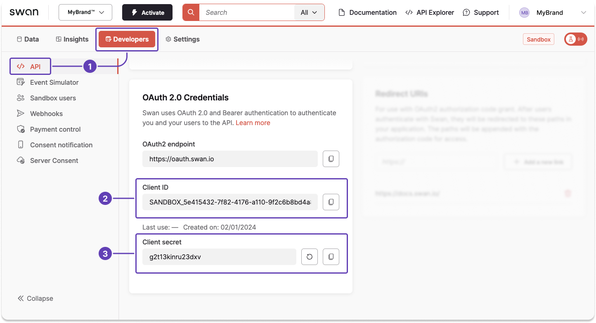

# Get a project access token

Learn how to get [project access tokens](./index.mdx#tokens-project).

:::tip Prerequisites
You have a Swan project and you have access to your Dashboard.
:::

## Step 1: Get your credentials {#get-credentials}

1. Go to **Dashboard** > **Developers** > **API**.
1. Locate your client ID.
1. Locate your client secret, or generate a new secret if needed.

Keep this page open; you'll need these values for the next step.



## Step 2: Request your access token {#request-token}

**Send a cURL request** with your **client ID** and **secret** (lines 2-3) to get your project access token.

```curl title="Request project access token" showLineNumbers
curl -v -X POST <https://oauth.swan.io/oauth2/token> \\
     -d "client_id=$YOUR_CLIENT_ID" \\
     -d "client_secret=$YOUR_CLIENT_SECRET" \\
     -d "grant_type=client_credentials"
```

## Step 3: Get your access token {#get-token}

Assuming the credentials provided were correct, you'll receive a response with a project access token.

The example response explains that you're receiving a [bearer token](./index.mdx#bearer-auth), which is a cryptic string, and that the token provides project-level access for one hour.

```json title="Response" showLineNumbers
{
  "access_token": "$YOUR_PROJECT_ACCESS_TOKEN",
  "token_type": "bearer",
  "expires_in": 3600,
  "scope": ""
}
```

:::danger Troubleshooting
If your request returns an error, your **client secret might be invalid**.
Generate a new secret on your Dashboard, then try again.
:::
