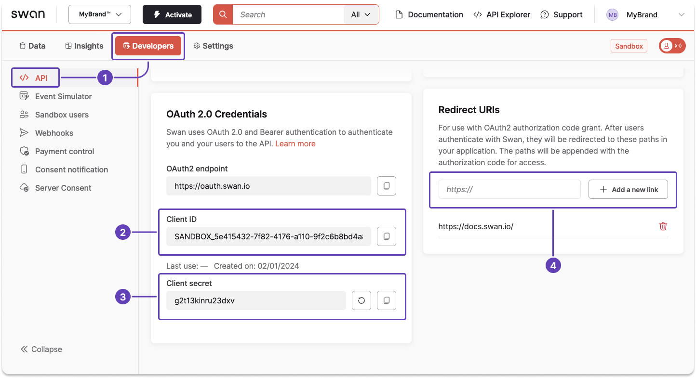

import UseImmediately from './_use-uat-immediately.mdx';

# Get a user access token

Learn how to get [user access tokens](./index.mdx#tokens-user), including getting your authorization code, requesting and getting your token, and using a refresh token.

:::tip Prerequisites
You have a Swan project and you have access to your Dashboard.
:::

<UseImmediately overview="After getting a user access token in step 4" />

## Step 1: Get your credentials and add a redirect URI {#get-credentials-add-uri}

1. Go to **Dashboard** > **Developers** > **API**.
1. Locate your client ID.
1. Locate your client secret, or generate a new secret if needed.
1. Enter your redirect URI, then click **+ Add a new link**.

Keep this page open; you'll need these values for subsequent steps.



## Step 2: Get an authorization code {#auth-code}

You need an authorization code to request a user access token.

Follow steps 2.1 through 2.3 to get your code.
Note that **authorization codes are single-use**.

### 2.1 Construct authorization URL {#code-construct-url}

Construct a URL with the required query parameters, adding any optional parameters you'd like.
Query parameters are case sensitive.

1. **Review the example URL** in the code block. Note that the example features hard returns for readability, which you should remove before sharing your URL.
1. Add your **client ID** and **redirect URI** to your URL.
1. Add any **optional parameters** to the end of your URL following the model `&parameter=value`.
1. **Send the URL** to your user.

```bash title="Authorization URL example" showLineNumbers
# Model
&parameter=value

# Spaced-out example
https://oauth.swan.io/oauth2/auth?
response_type=code
&client_id=$YOUR_CLIENT_ID
&redirect_uri=$YOUR_REDIRECT_URI
&scope=openid%20offline
&state=kdqsjdlkjsqdlkqjsdlkjsqd

# Full URL
https://oauth.swan.io/oauth2/auth?response_type=code&client_id=$YOUR_CLIENT_ID&redirect_uri=$YOUR_REDIRECT_URI&scope=openid%20offline&state=kdqsjdlkjsqdlkqjsdlkjsqd
```

#### Required parameters {#url-parameters-required}

| Parameter | Description |
| --- | --- |
| `response_type=code`<br/>(line 6) |  Initiates the authorization code flow. |
| `client_id`<br/>(line 7) |  Public identifier for the Swan app, obtained from your Dashboard in step 1. |
| `redirect_uri`<br/>(line 8) |  Specifies where the authorization server should send the user after approval, added to your Dashboard in step 1. |
| `scope=openid%20offline`<br/>(line 9) |  Defines the requested scopes for the user authorization.<br/><br/><ul><li>`openid`: User will connect to Swan through the Partner</li><li>`offline`: Access is continuous</li></ul> |
| `state`<br/>(line 10) |  A value to be retransmitted in the query string when redirecting back to you. |

#### Optional parameters {#url-parameters-optional}

| Parameter | Description |
| --- | --- |
| `phoneNumber`<br />`firstName`<br />`lastName`<br />`birthDate`<br />`birthCity`<br />`birthCountry`<br />`nationality`<br />`language` |  Avoids asking the customer to enter this information during user registration.<br /><br />Required formats: <ul><li>`birthDate`: YYYY-MM-DD *(year-month-day)*</li><li>`birthCountry` and `nationality`: ISO 3166-1 alpha-3 *(France = `FRA`)*</li><li>`language`: ISO 639-1 (alpha 2) *(Spanish = `es`)*</li></ul> |
| `identificationLevel` |  Indicate your preferred [identification level](../../../topics/users/identifications/index.mdx#levels-processes): `PVID`, `QES`, `Expert`, or `Auto`.<br /><br />If you include the `onboardingId`, or if you're trying to reengage your user to complete their identification, Swan recommends setting `Auto` as your preferred identification level. `Auto` allows Swan to direct your users to the best identification flow for their situation. |
| `onboardingId` |  Avoids asking the customer to enter their own residence address and email if they provide that information during onboarding. |

### 2.2 Receive approval from user {#code-approve}

If you didn't send your authorization URL to your user, send it now.

When clicked, the URL opens an authorization page explaining how to connect with Swan and why the user's phone number is required.

- If the user is on a **mobile device**, they validate their phone number with a 6-digit code sent by Swan in a text message.
- If the user is using a **computer**, they enter their phone number, then receive a link on their mobile phone that opens a browser.

:::info Displaying authorization page
You can choose to display the authorization page in **fullscreen** or as a **native popup**.
A native popup is more challenging to implement but provides a better user experience.

Note that you **can't use webviews or iFrames**.
Read about why in the overview of the [integrate Strong Customer Authentication](../../../topics/users/consent/guide-integrate-sca.mdx#overview) guide.
:::

### 2.3 Receive authorization code {#code-receive}

If the user approves the request, the authorization server redirects the browser back to your redirect URI.
Your authorization code **expires 10 minutes** after being created, so use it immediately to request your user access token.

1. Copy the full URL from your browser. It contains your **authorization code** and **state** in the query string.
1. Confirm that the `state` in the URL matches the initial state to protect against Cross-Site Request Forgery (CSRF) and related attacks.

```bash title="Authorization code example" showLineNumbers
# Full URL
https://$YOUR_REDIRECT_URI?code=$YOUR_AUTHORIZATION_CODE&state=kdqsjdlkjsqdlkqjsdlkjsqd

# Spaced-out example
https://$YOUR_REDIRECT_URI?
code=$YOUR_AUTHORIZATION_CODE
&state=kdqsjdlkjsqdlkqjsdlkjsqd
```

## Step 3: Request your access token {#request-token}

To get your user access token, **send a cURL request** with the following information:

1. The **user authorization code** you received in step 2 (line 2).
1. Your **client ID** and **secret** from your Swan Dashboard, explained in step 1 (lines 3-4).
1. The **URI** you added to your Swan Dashboard in step 1 (line 5).

```curl title="Request user access token" showLineNumbers
curl -v -X POST <https://oauth.swan.io/oauth2/token> \\
     -d "code=$YOUR_AUTHORIZATION_CODE" \\
     -d "client_id=$YOUR_CLIENT_ID" \\
     -d "client_secret=$YOUR_CLIENT_SECRET" \\
     -d "redirect_uri=$YOUR_REGISTRATED_URI" \\
     -d "grant_type=authorization_code"
```

## Step 4: Get your access token {#get-token}

Assuming the information provided was correct, you'll receive a response with a user access token.

<UseImmediately overview="After getting the token" />

The example response explains that you're receiving a [bearer token](./index.mdx#bearer-auth), which is a cryptic string, and that the token provides user-level access for one hour.
The token scope lets you know you can use the token for OpenID Connect purposes.

The response also provides a [refresh token](./index.mdx#tokens-user-refresh) that you can use one time to extend the validity of your user access token.
**Store the refresh token** to use later.

```json title="Response" showLineNumbers
{
  "access_token": "$YOUR_USER_ACCESS_TOKEN",
  "expires_in": 3600,
  "id_token": "$YOUR_ID_TOKEN",
  "refresh_token": "$YOUR_USER_REFRESH_TOKEN",
  "scope": "openid offline",
  "token_type": "bearer"
}
```

:::danger Troubleshooting
If your request returns an error, your **authorization code** from step 2 might already be expired, or your **client secret might be invalid**.
Use a new authorization code or a new client secret (or both) to try your request again.
:::

## Step 5: Refresh your access token {#refresh-token}

When your user access token expires, you can use the refresh token provided in the cURL response to extend the usage of your user access token.

To refresh your user access token, **send a cURL request** to the same endpoint as step 3 with the following information:

1. The **refresh token** you received in step 4 (line 2).
1. Your **client ID** and **secret** from your Swan Dashboard, retrieved in step 1 (lines 3-4).

```curl title="Request user access token" showLineNumbers
curl -v -X POST <https://oauth.swan.io/oauth2/token> \\
     -d "refresh_token=$YOUR_REFRESH_TOKEN" \\
     -d "client_id=$YOUR_CLIENT_ID" \\
     -d "client_secret=$YOUR_CLIENT_SECRET" \\
     -d "grant_type=refresh_token"
```

The response is the same as in step 4, but with a **new refresh token**.
**Store the new refresh token** to use later, but **delete the refresh token you already used** because refresh tokens are single-use.

```json title="Response" showLineNumbers
{
  "access_token": "$YOUR_USER_ACCESS_TOKEN",
  "expires_in": 3600,
  "id_token": "$YOUR_ID_TOKEN",
  "refresh_token": "$YOUR_USER_REFRESH_TOKEN",
  "scope": "openid offline",
  "token_type": "bearer"
}
```

:::danger Troubleshooting
If your refresh request returns an error, your **refresh token** might be expired, or your **client secret might be invalid**.

First, generate a new secret on your Dashboard and try your request again.

If your request still returns an error, your refresh token isn't working and you'll need to get a new user access token starting from step 2 of this guide.
:::
