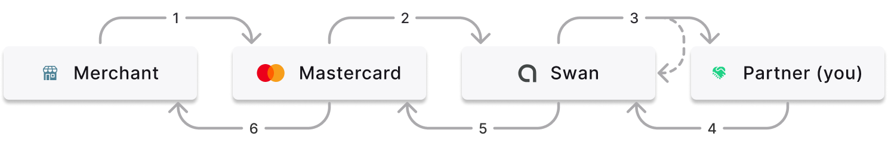

# Payment control

Mastercard requires Swan to accept (authorize) or reject all transactions.

To comply, Swan performs certain tests on all card transactions, and also provides a feature called payment control so you can participate, too.
Using payment control, you can let Swan know whether you **accept or reject most card transactions** within your project.

:::tip Card payments section
Refer to the [card payments section](../../topics/payments/cards/index.mdx) for more information about card transaction authorization and clearing.
:::

## Payment control flow {#flow}



1. Merchant charges a Swan Mastercard.
1. Mastercard asks Swan to accept or reject the transaction.
1. Swan:
    - Lets the you know about the transaction so you can accept or reject it.
        - Certain types of transactions aren't sent to you for approval, such as forced debits and delay charges. 
    - Checks that:
        - The **card and associated account exist**,
        - The card hasn't reached its **spending limit**,
        - There are **sufficient funds** to cover the transaction, and
        - There's no **suspicion of fraud**.
1. You let Swan know if you accept or reject the transaction.
1. Swan sends the decision to Mastercard.
    - Both you and Swan say yes: Transaction accepted
    - Both you and Swan say no: Transaction rejected
    - Either you *or* Swan says no: Transaction rejected
1. Based on the response from you and Swan, Mastercard allows the transaction or rejects it at the merchant's point of sale.

:::caution Mastercard rejections 
Though rare, it's possible that Mastercard rejects a transaction even if you and Swan both accept it.
:::

## Time-sensitive operation {#time-sensitive}

Payment control is a time-sensitive operation.
If Swan doesn't receive your decision quickly enough, the payment operation times out and the card holder's transaction is rejected.

Therefore, you'll want to test this feature thoroughly using the [tools](../tools/index.mdx) available to you.
You can also set a default answer in case of timeout.

## Configure payment control {#configure}

Add and update payment control on your Dashboard.
Go to **Developers** > **Payment control**. Add your information and click **Save**.

The following settings are available for your payment control configuration:

1. `endpoint`: Your endpoint (mandatory).
1. `protocol`: HTTP / JSON protocol.
1. `defaultResponse`: In case of timeout, choose whether you accept or reject the transaction (true or false). Swan suggests setting the default response to `true` for a better card holder experience.
1. `timeoutMs`: Timeout is up to 10 seconds in Sandbox and 1.5 seconds in Live.
1. `secret`: Your secret is added to a `x-swan-secret` header.
1. `enabled`: Only enabled payment control endpoints can be used by Swan.

## Swan's `POST` request {#swan-request}

Swan adds flags to specify that Swan is making the `POST` request:

- `x-swan` HTTP header
- `x-swan-secret` HTTP header with your secret

The payload is as follows.
All fields are optional as they can change.
Note that times are written in [epoch millis](https://www.unixtimestamp.com/).

```json title="Swan payment control request" showLineNumbers
{
    "timeoutAt": 1646214666661, //fallback time to default response
    "transactionId": "$TRANSACTION_ID",
    "paymentId": "$PAYMENT_ID",
    "accountId": "$ACCOUNT_ID",
    "cardId": "$CARD_ID",
    "digitalCardWalletProvider": "ApplePay", //digital token used for transaction; ApplePay, GooglePay, Merchant
    "dateTime": 1646214656661, //time payment occured
    "expirationDateTime": 1647114656661, //time authorization will be released if preauthorized amount is not used
    "originalAmountValue": 10.00,
    "originalAmountCurrency": "EUR",
    "amountValue": 10.00,
    "amountCurrency": "EUR",
    "merchantId": "SWAN",
    "terminalId": "156428",
    "merchantCategoryCode": "0000",
    "merchantName": "SWAN",
    "merchantCity": "PARIS",
    "merchantPostalCode": "75010", //optional information
    "merchantCountry": "FRA",
    "readMode": "Chip", //Chip, ContactlessChip, ContactlessStripe, Manual, ManualChip, ManualStripe, Other, PreSavedData, Stripe
    "transactionCategory": "InStore", //InStore, eCommerce, eCommerceWith3DS, Withdrawal, Other
    "authorizationType": "Classic", //Classic, PreAuthorization, DataRequest
    "allowsPartialAuthorization": true //if amount can be modified
}
```

:::caution Digital Wallet provider
Per your and Swan's agreement with Mastercard, you **can't reject** transactions based on digital Wallet provider (line 7).
:::

## Partner response {#partner-response}

Send your response in the `accepted` field with a Boolean: `true` or `false`.

If the authorization allows a `partialAuthorizationAmountValue`, you can either approve the authorization amount requested or lower the requested amount.
Provide the authorization amount in your response, which is sent to the merchant.

In case of timeout, or if your endpoint wasn't reachable, Swan applies your default response, which you chose when configuring payment control.

```json title="Partner response" {7} showLineNumbers
{ 
    "accepted": true,
    "partialAuthorizationAmountValue": 10
}
```