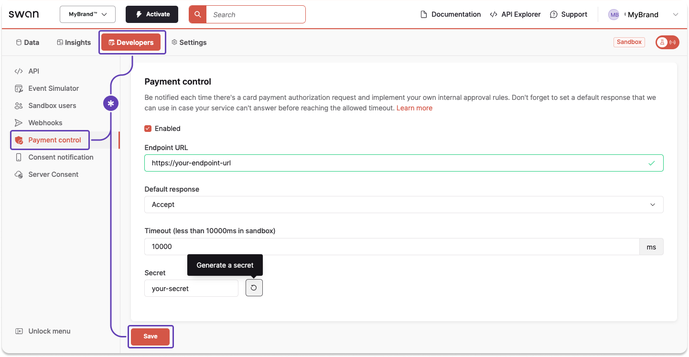

# Payment control

Mastercard requires Swan to accept (authorize) or reject all transactions.

To comply, Swan performs certain tests on all card transactions, and also provides a feature called payment control so you can participate, too.
Using payment control, you can let Swan know whether you **accept or reject most card transactions** within your project.

**Payment control is a time-sensitive operation**.
If Swan doesn't receive your decision quickly enough, the payment operation times out and the cardholder's transaction is rejected.
Therefore, test this feature thoroughly [using the tools](../tools/index.mdx) available to you.

:::info Card payments section
Refer to the [card payments section](../../topics/payments/cards/index.mdx) for more information about card transaction authorization and clearing.
:::

## General recommendations {#recommendations}

1. **Respond quickly**. In the [Live environment](../index.mdx#environments), authorizations time out after **1.5 seconds**.
1. Make your payment control process [**idempotent**](#idempotent) for each transaction.
1. Choose **accept** as your [**default response**](#configure) in case of a timeout for a better user experience.
1. **Consider [capture types](#flow-capture)** as you configure your payment control.
1. You **can't reject** transactions based on digital wallet provider, as per your and Swan's agreement with Mastercard. Swan shares the `digitalCardWalletProvider` in the [`POST` request](#swan-request).

## Schema file {#schema}

Download Swan's [OpenAPI payment control schema file](../../assets/payment-control-openapi.yaml) to get started with your integration.

You can test your updated file with the [Swagger Editor](https://editor-next.swagger.io/).

## Payment control flow {#flow}


1. Merchant charges a Swan Mastercard.
1. Mastercard asks Swan to accept or reject the transaction.
1. Swan:
    - Lets you know about the transaction so you can accept or reject it.
        - Certain types of transactions aren't sent to you for approval, such as forced debits and delay charges. 
    - Checks that:
        - The **card and associated account exist**,
        - The card hasn't reached its **spending limit**,
        - There are **sufficient funds** to cover the transaction, and
        - There's no **suspicion of fraud**.
1. You let Swan know if you accept or reject the transaction.
1. Swan sends the decision to Mastercard.
    - Both you and Swan say yes: Transaction accepted ✓
    - Both you and Swan say no: Transaction rejected ✕
    - Either you or Swan says no: Transaction rejected ✕
1. Based on the response from you and Swan, Mastercard allows the transaction or rejects it at the merchant's point of sale.

:::caution Mastercard rejections 
Though rare, it's possible that Mastercard rejects a transaction even if you and Swan both accept it.
:::

### Capture types {#flow-capture}

Capture refers to the process of completing a transaction and moving the funds from the customer's account to the merchant's account after authorization.
The [**primary capture types**](../../topics/payments/cards/index.mdx#capture-types) you might encounter at Swan are explained in the card payments section.

Only authorizations go through payment control, so **captures can't be rejected**.
Therefore, Swan processes the transaction in all capture cases, even if the captured amount is different from the authorized amount.

Though 99% of all captures are standard, you can plan for the various capture types in your payment control configuration.

:::note Example: currency exchange
Consider the **fluctuating nature of currency exchange** in your payment control configuration.

Rather than assuming a static exchange rate of 1 USD being equivalent to 1 EUR, assume 1 USD to be 1.1 EUR.
This might result in an account's spending limit being reached more quickly, but it can help prevent over capture and therefore a negative balance.

Alternatively, you can advise account holders to maintain a buffer of around 10% in their accounts, especially if they make frequent payments in currencies other than euros.
:::

## Idempotent process {#idempotent}

Payment control authorizations are subject to a retry mechanism.
If somewhere in the authorization chain, the process takes too much time, **Swan might process the authorization twice**.

It's guaranteed that the payment control process is idempotent on Swan's side and **matches the first authorization Swan processes**.
However, it's possible that the first authorization Swan processes is the second one that you process.
This is rare and typically due to network latency.

:::tip
Swan strongly suggests **making your payment control process idempotent** for each transaction.
:::

An idempotent payment control process ensures that your response to authorizations can be repeated multiple times without producing different outcomes.
Several calls to your payment control with the same transaction ID should always yield the same result.
Please note that repeated calls can happen within a few milliseconds.

## Configuring payment control {#configure}

Add and update payment control on your **Dashboard** > **Developers** > **Payment control**.
The following settings are available for your payment control configuration.
Enter your information and click **Save**.

- **Enabled**: Only enabled payment control endpoints can be used and updated.
- **Endpoint URL**: Enter your endpoint (mandatory), using either `http` or `https`.
- **Default response**: In case of a timeout, choose whether you **accept** or **reject** the transaction by default. Swan suggests choosing **accept** for a better cardholder experience.
- **Timeout**: Timeout is up to 10 seconds (10000 milliseconds) in Sandbox. In Live, it's 1.5 seconds (1500 milliseconds) and not configurable.
- **Secret**: Generate a secret. Make sure to add it to your `x-swan-secret` header.

If you use the API, you also need to provide `protocol`, which only has one option: `HttpJson`.



## Swan's `POST` request {#swan-request}

Swan adds flags to specify that Swan is making the `POST` request:

- `x-swan`: HTTP header
- `x-swan-secret`: HTTP header with your secret

Consider the following payload.
All fields are optional as they can change.
Note that times are written in [epoch millis](https://www.unixtimestamp.com/).

```json title="Swan payment control request" showLineNumbers
{
    "timeoutAt": 1646214666661, //fallback time to default response
    "transactionId": "$TRANSACTION_ID",
    "paymentId": "$PAYMENT_ID",
    "accountId": "$ACCOUNT_ID",
    "cardId": "$CARD_ID",
    "digitalCardWalletProvider": "ApplePay", //digital token used for transaction; ApplePay, GooglePay, Merchant
    "dateTime": 1646214656661, //time payment occurred
    "expirationDateTime": 1647114656661, //time authorization will be released if preauthorized amount is not used
    "originalAmountValue": 10.00,
    "originalAmountCurrency": "EUR",
    "amountValue": 10.00,
    "amountCurrency": "EUR",
    "merchantId": "SWAN",
    "terminalId": "156428",
    "merchantCategoryCode": "0000",
    "merchantName": "SWAN",
    "merchantCity": "PARIS",
    "merchantPostalCode": "75010", //optional information
    "merchantCountry": "FRA",
    "readMode": "Chip", //Chip, ContactlessChip, ContactlessStripe, Manual, ManualChip, ManualStripe, Other, PreSavedData, Stripe
    "transactionCategory": "InStore", //InStore, eCommerce, eCommerceWith3DS, Withdrawal, Other
    "authorizationType": "Classic", //Classic, PreAuthorization, DataRequest
    "allowsPartialAuthorization": true, //if amount can be modified
    "operationCode": "OtcWithdrawal", //AtmWithdrawal, CashBackPayment, Credit, OtcWithdrawal, Payment, Quasicash, VtsOrMdes
    "merchantAcquirerId": "123ABC",
    "subMerchantId": "452YEZ"
}
```

:::caution Digital Wallet provider
Per your and Swan's agreement with Mastercard, you **can't reject transactions** based on the digital wallet provider (line 7).
:::

## Partner response {#partner-response}

Send your response in the `accepted` field with a Boolean: `true` or `false`.

If `allowsPartialAuthorization` is `true` in Swan's `POST` request, you can also return `partialAuthorizationAmountValue` in your response.

In case of a timeout, or if your endpoint wasn't reachable, Swan applies your [default response](#configure), which you set when configuring payment control.

```json title="Partner response" {7} showLineNumbers
{ 
    "accepted": true,
    "partialAuthorizationAmountValue": 10 //optional, refer to partial authorization options
}
```

### Partial authorization options {#partner-response-partial}

| Use case | In your response |
| --- | --- |
| ✓ **Accept** the authorized amount | Set `accepted` to `true`.<br />Don't include `partialAuthorizationAmountValue` in your response. |
| ↓ **Decrease** the authorized amount | Set `accepted` to `true`.<br />Include the lower authorized amount in the `partialAuthorizationAmountValue`. The lower authorized amount must be greater than 0 and less than the original authorized amount. |
| ✕ **Reject** the partial authorization | Set `accepted` to `false`.<br />Don't include `partialAuthorizationAmountValue` in your response. |