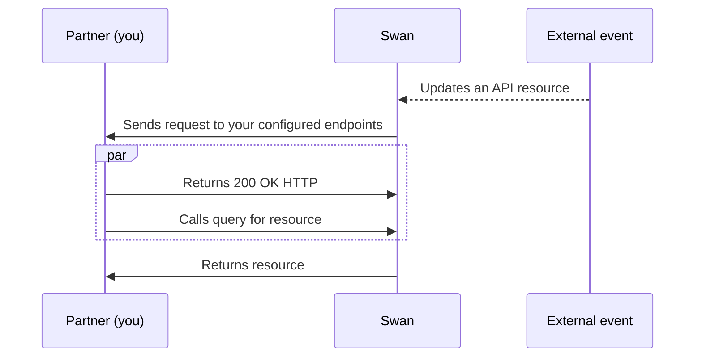
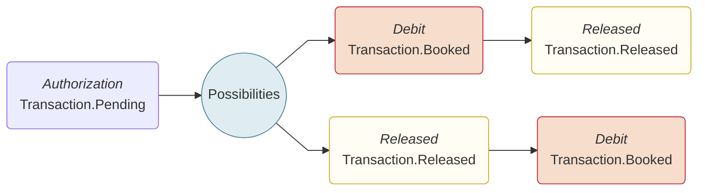

# Webhooks

import WebhooksDefinition from '../../topics/definitions/_webhooks.mdx';

<WebhooksDefinition />

## Overview {#overview}

You're aware of events you request or that your user's request directly from you.
Consider the [basic API flow](../index.mdx#overview) for reference.
However, **not all events are under your control**; some events are triggered by external parties.
When external events occur, resources are updated in Swan, but you aren't notified by default.

If you **configure webhooks for these external events**, Swan initiates a request on your endpoint and you receive a webhook notification.

### Response time {#overview-response}

Webhooks operate with a near-real-time efficiency, typically delivering responses **within seconds** of the event.

It's worth clarifying that webhooks don't actively *respond* but autonomously send information to your system, potentially introducing delays of up to 10 minutes after the actual action occurs.

### Security {#overview-security}

Webhooks aren't the most secure communication method, and banking data can be sensitive.
Therefore, **Swan never uses webhooks to send sensitive information** that requires authentication to view.

If an event involves sensitive information, the webhook only includes a notification that an event occurred.
You need to use your Dashboard or the API to actually review the information.

:::note Swan's webhook IP addresses
If you have security restrictions in your infrastructure, you might need to add the following IPs to your allowlist for both Sandbox and Live environments.

- 52.210.172.90
- 52.51.125.72
- 54.194.47.212
:::

### Automatic retry {#overview-retry}

If we encounter an error during a webhook request, we'll retry every **30 seconds** up to **7 times**.

If all retries fail, you can retry it manually by selecting **Retry** from your **Dashboard** > **Developers** > **Webhooks**.
You can also trigger the webhook manually at any time.

## Event handling {#event-handling}

Handling webhooks is important to make sure your integration's business logic works as expected.

### Delivery method {#event-handling-delivery}

Swan webhooks are designed following the `at-least once` delivery method.
Taking transactions as an example, the `at-least once` delivery means that for the same `eventId`, you might receive more than one notification.

Swan chose `at-least once` delivery deliberately over the `at-most once` delivery; it's better you receive the information multiple times instead of not at all, which can occur with `at-most once` in case of technical error.

### Idempotent process {#event-handling-idempotent}

Due to `at-least once` delivery, a webhook endpoint might receive the same event notification multiple times.
Therefore, Swan strongly suggests **making your event processing idempotent**, essentially making sure your response to webhook notifications can be repeated multiple times without producing different outcomes.

For example, you might log the events you've processed, and then not process events that are already logged.

### Event order {#event-handling-order}

Webhook notifications aren't always delivered in the order the events occur.
If you want to receive webhooks in a specific order, you'll need to implement logic on your end.

For example, consider the regular card payment flow, which is always **Authorization** to **Debit** to **Released**.
The flow generates the following webhook events:

- Authorization: `Transaction.Pending`
- Debit: `Transaction.Booked`
- Released: `Transaction.Released`

You'll receive the `Transaction.Pending` as soon as the authorization is created.

However, you can receive `Transaction.Booked` and `Transaction.Released` webhooks in any order, even though the flow is always Debit, then Released.

## List of webhook events {#events}

The first part of the `eventType` will tell you what resources to query in an API call. In the following table, you will find all the event types and examples of their functional triggers.

### Accounts {#events-accounts}

| `eventType` | Explanation |
| --- | --- |
| `Account.Created` | Onboarding was finalized |
| `Account.Updated` | Account attribute was changed |
| `Account.Closing` | Account is closing |
| `Account.Closed` | Account was closed |

### Account holders {#events-account-holders}

| `eventType` | Explanation |
| --- | --- |
| `AccountHolder.Created` | Onboarding was finalized |
| `AccountHolder.Updated` | Swan updated a banking verification status |

### Account memberships {#events-account-memberships}

| `eventType` | Explanation |
| --- | --- |
| `AccountMembership.Bound` | User was bound with the account membership |
| `AccountMembership.Created` | New account membership was created |
| `AccountMembership.Disabled` | Account membership was disabled |
| `AccountMembership.Resumed` | Suspended account membership was resumed  |
| `AccountMembership.Suspended` | Account membership was suspended  |
| `AccountMembership.Updated` | Account membership was updated by an action |

### Billing {#events-billing}

| `eventType` | Explanation |
| --- | --- |
| `AccountInvoice.Generated` | New invoice was generated and available for download |

### Capital deposits {#events-capital-deposits}

| `eventType` | Explanation |
| --- | --- |
| `CapitalDepositCaseEvent.Created` | Capital deposit case was created |
| `CapitalDepositCaseEvent.Updated` | Capital deposit case was updated |
| `CapitalDepositDocument.Created` | Document for a capital deposit case or a shareholder was created |
| `CapitalDepositDocument.Updated` | Document for a capital deposit case or a shareholder was updated |
| `Shareholder.Created` | Shareholder was created |
| `Shareholder.Updated` | Shareholder was updated |

### Cards {#events-cards}

| `eventType` | Explanation |
| --- | --- |
| `Card.Created` | New virtual card was created |
| `Card.Updated` | Physical card was printed, spending limit was updated, and more (doesn't not include PIN notifications) |

### Consent {#events-consent}

| `eventType` | Explanation |
| --- | --- |
| `Consent.Canceled` | Consent was canceled by the Partner |
| `Consent.Created` | Consent was created for a sensitive operation |
| `Consent.Expired` | Consent expired without being refused or granted |
| `Consent.Granted` | User accepted a sensitive operation  |
| `Consent.Refused` | User refused a sensitive operation  |
| `Consent.Started` | ConsentURL was opened |

### Funding {#events-funding}

| `eventType` | Explanation |
| --- | --- |
| `FundingLimitSettingsChangeRequest.Created` | Funding limit settings change request was created |
| `FundingLimitSettingsChangeRequest.Updated` | Funding limit settings change request was updated |
| `FundingSource.Created` | Funding source was created |
| `FundingSource.Updated` | Funding source was updated |

### Merchants {#events-merchants}

| `eventType` | Explanation |
| --- | --- |
| `MerchantProfile.Created` | Merchant profile was created |
| `MerchantProfile.Updated` | Merchant profile was updated |

### Onboarding {#events-onboarding}

| `eventType` | Explanation |
| --- | --- |
| `Onboarding.Created` | New onboarding was created either through the API or the no-code interface |
| `Onboarding.Updated` | Onboarding was either finalized, or changed because new data was added to it |

### Payments and transactions {#events-payments-transactions}

| `eventType` | Explanation |
| --- | --- |
| `ReceivedDirectDebitMandate.Created` | Received direct debit mandate was created either through the API or automatically by Swan |
| `ReceivedDirectDebitMandate.Updated` | Received direct debit mandate was updated |
| `StandingOrder.Canceled` | Standing order was canceled |
| `StandingOrder.Scheduled` | Standing order was scheduled |
| `Transaction.Booked` | Transaction was completed and will appear on the account statement |
| `Transaction.Canceled` | Upcoming direct debit was canceled |
| `Transaction.Deleted` | Scheduled direct debit was deleted  |
| `Transaction.Pending` | Outgoing SEPA Credit Transfer was processed and is waiting for the next SEPA batch, a card authorization was accepted, and more |
| `Transaction.Rejected` | Transaction was rejected for compliance reasons |
| `Transaction.Upcoming` | Transaction was booked for a future date |

### Users {#events-users}

| `eventType` | Explanation |
| --- | --- |
| `User.Joined` | User joins your project |
| `User.Updated` | User's information was updated, such as their phone number |