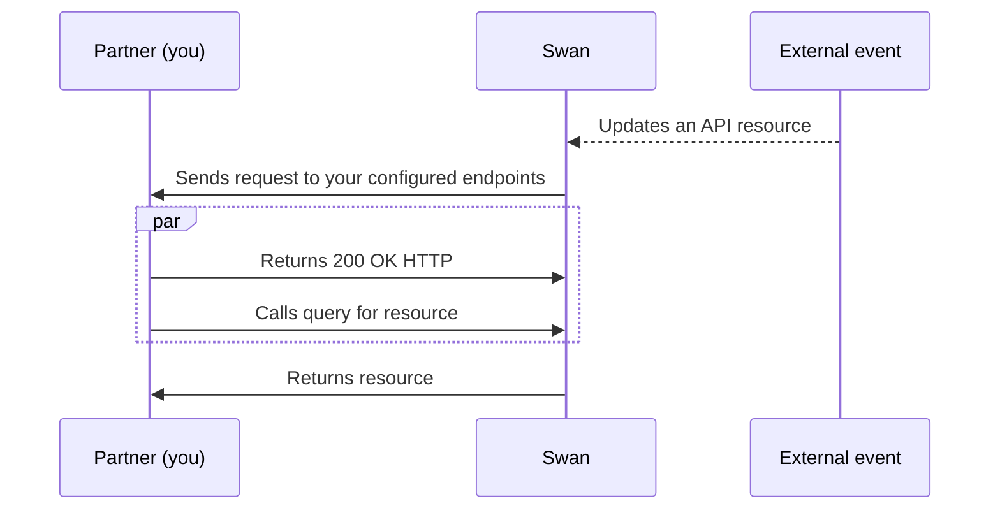
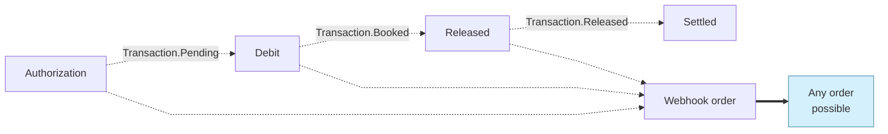

# Webhooks

import WebhooksDefinition from '../../topics/definitions/_webhooks.mdx';

<WebhooksDefinition />

## Overview {#overview}

You're aware of events you request or that your user's request directly from you.
Consider the [basic API flow](../index.mdx#overview) for reference.
However, **not all events are under your control**; some events are triggered by external parties.
When external events occur, resources are updated in Swan, but you aren't notified by default.

If you **subscribe to webhooks for these external events**, Swan initiates a request on your endpoint and you receive webhook notifications.
Requests to your endpoint **must be answered** with a 200 OK HTTP response.



:::tip
For guidance on optimizing your webhook setup, refer to [best practices for webhook consumption](#best-practices).
:::

### Response time {#overview-response}

Webhooks operate with a near-real-time efficiency, typically delivering responses **within seconds** of the event.

It's worth clarifying that webhooks don't actively *respond* but autonomously send information to your system, potentially introducing delays of up to 10 minutes after the actual action occurs.

### Time to reply {#overview-reply}

Your endpoint must respond with a `200 OK` HTTP status code within **10 seconds**. 
To avoid timeouts, respond immediately and handle the event asynchronously. 
A timeout is considered a delivery failure and is [automatically retried](/developers/using-api/webhooks/#overview-retry).

### Automatic retry {#overview-retry}

If Swan encounters an error during a webhook request, the request is retried every **30 seconds** and up to **7 times**.

If all retries fail, you can retry it manually by selecting **Retry** from your **Dashboard** > **Developers** > **Webhooks**.
You can also trigger the webhook manually at any time.

### Subscription limits {#subscription-limits}

In order to avoid overconsumption caused by too many subscriptions to the same webhook event, there's a limit on how many subscriptions you can enable per event.
Consider following [best practices for webhook consumption](#best-practices) to optimize your subscription strategy.

The following limits apply:

- **Sandbox**: 10 subscriptions per event.
- **Live**: 5 subscriptions per event.

:::warning Legacy subscriptions
All webhook subscriptions enabled before these limits were established remain intact.
However, you won't be able to add additional subscriptions for the same event.

For example, if you had 12 subscriptions to a Sandbox event:

- All 12 subscriptions remain active.
- To add a new subscription to that event, delete 3 existing subscriptions first.
:::

### Security {#overview-security}

Webhooks notify your application that an event has occurred, but they don't contain sensitive information. 
If an event involves sensitive information, use the Swan API or Dashboard, both of which require authentication, to retrieve the full details.

To help verify that webhook requests actually come from Swan and not someone who just knows your endpoint URL, you can use **webhook secrets**. Each request includes a shared secret in the `x-swan-secret` header. This secret acts like a password, known only to you and Swan.

We strongly recommend checking the HTTP header on every webhook request. 
If you've set a webhook secret and it's missing or incorrect, reject the request to prevent unauthorized or fake webhook attempts.

:::note Swan's webhook IP addresses
If you have security restrictions in your infrastructure, you might need to add the following IPs to your allowlist for both Sandbox and Live environments.

- 52.210.172.90
- 52.51.125.72
- 54.194.47.212
:::

## Best practices for webhook consumption {#best-practices}

Effective webhook management ensures critical events are processed promptly and improves your integration's reliability.

### Event subscription strategy {#best-practices-subscription}

Rather than subscribing to all available events, determine exactly which events your integration needs to monitor.
Subscriptions can be created, modified, or removed at any time, so start with essential events and expand as needed.

**Subscribing to all events creates several challenges:**

- **Endpoint downtime impact**: When a single endpoint receives all events, any downtime creates a significant backlog, causing delays across all event types and creating blind spots in your monitoring.
- **Event volume disparity**: Some events occur far more frequently than others. For example, `Transaction.Booked` events can significantly outnumber `Account.Created` events, potentially delaying critical low-volume events.
- **Processing bottlenecks**: High-volume, low-priority events can prevent timely processing of critical events that require immediate action.

### Event prioritization {#best-practices-priority}

Assess the criticality of each event type based on your integration's business logic and user experience requirements.

Consider these factors when prioritizing events:

- **Immediate impact**: Events that affect user-facing operations or require real-time responses (e.g., payment authorizations, account suspensions).
- **Business criticality**: Events that trigger essential workflows or compliance requirements.
- **Volume considerations**: High-volume events that can be processed asynchronously without immediate user impact.

For example, `Consent.Granted` might require immediate processing to complete a user action, while `AccountInvoice.Generated` can be processed with more flexibility.

### Endpoint architecture {#best-practices-endpoints}

Create separate webhook subscriptions with dedicated endpoints for different priority levels.
This architecture prevents low-priority events from blocking critical ones and isolates failures to specific event categories.

**Benefits of distributed webhook handling:**

- **Isolated processing**: Critical events aren't delayed by high-volume routine events.
- **Targeted scaling**: Scale endpoint capacity based on specific event volume and criticality.
- **Simplified troubleshooting**: Endpoint-specific issues are easier to diagnose and resolve.
- **Improved reliability**: Downtime or processing issues for one category don't affect others.

#### Example: Multiple subscription setup {#best-practices-example}

This example demonstrates creating three separate subscriptions with different endpoints based on priority levels.

```graphql title="Critical events endpoint"
mutation AddCriticalEventsSubscription {
  addWebhookSubscription(
    input: {
      label: "Critical events"
      endpoint: "https://api.yourcompany.com/webhooks/critical"
      secret: "$YOUR_WEBHOOK_SECRET_CRITICAL"
      eventTypes: [
        "Consent.Granted"
        "Consent.Refused"
        "AccountMembership.Suspended"
        "Account.Closing"
      ]
      status: Enabled
    }
  ) {
    ... on WebhookSubscriptionSuccessPayload {
      __typename
      webhookSubscription {
        id
        label
        endpoint
        eventTypes
      }
    }
  }
}
```

```graphql title="Payment events endpoint"
mutation AddPaymentEventsSubscription {
  addWebhookSubscription(
    input: {
      label: "Payment events"
      endpoint: "https://api.yourcompany.com/webhooks/payments"
      secret: "$YOUR_WEBHOOK_SECRET_PAYMENTS"
      eventTypes: [
        "Transaction.Booked"
        "Transaction.Pending"
        "Transaction.Rejected"
        "MerchantPayment.Captured"
      ]
      status: Enabled
    }
  ) {
    ... on WebhookSubscriptionSuccessPayload {
      __typename
      webhookSubscription {
        id
        label
        endpoint
        eventTypes
      }
    }
  }
}
```

```graphql title="Administrative events endpoint"
mutation AddAdminEventsSubscription {
  addWebhookSubscription(
    input: {
      label: "Administrative events"
      endpoint: "https://api.yourcompany.com/webhooks/admin"
      secret: "$YOUR_WEBHOOK_SECRET_ADMIN"
      eventTypes: [
        "AccountInvoice.Generated"
        "AccountStatement.Generated"
        "SupportingDocumentCollection.Updated"
      ]
      status: Enabled
    }
  ) {
    ... on WebhookSubscriptionSuccessPayload {
      __typename
      webhookSubscription {
        id
        label
        endpoint
        eventTypes
      }
    }
  }
}
```

## Event handling {#event-handling}

Handling webhooks is important to make sure your integration's business logic works as expected.

### Delivery method {#event-handling-delivery}

Swan webhooks are designed following the `at-least once` delivery method.
Taking transactions as an example, the `at-least once` delivery means that for the same `eventId`, you might receive more than one notification.

Swan chose `at-least once` delivery deliberately over the `at-most once` delivery; it's better you receive the information multiple times instead of not at all, which can occur with `at-most once` in case of technical error.

### Notification content {#event-handling-info}

Webhook notifications contain the following information in a `POST` request:

```
{
  "eventType": "Transaction.Booked",
  "eventId": "$YOUR_EVENT_ID",
  "eventDate": "2021-08-18T09:35:46.673Z",
  "projectId": "$YOUR_PROJECT_ID",
  "resourceId": "$YOUR_RESOURCE_ID"
}
```

Note that `eventType` is the action performed on which resource type, `eventId` is a unique ID for this event, and  `resourceId` is a unique ID for the resource.

:::caution Limited information
For security reasons, webhook notifications **include limited information**.
You can always **query the API** for more information about these events.
:::

### Idempotent process {#event-handling-idempotent}

Due to `at-least once` delivery, a webhook endpoint might receive the same event notification multiple times.
Therefore, Swan strongly suggests **making your event processing idempotent**, essentially making sure your response to webhook notifications can be repeated multiple times without producing different outcomes.

For example, you might log the events you've processed, and then not process events that are already logged.

### Manage webhooks with the API {#event-handling-api}

You can manage your webhooks with the API.

1. **Add** a new webhook subscription: [`addWebhookSubscription`](https://api-reference.swan.io/mutations/add-webhook-subscription/).
1. **Update** a webhook subscription: [`updateWebhookSubscription`](https://api-reference.swan.io/mutations/update-webhook-subscription/).
1. **Remove** a webhook subscription: [`removeWebhookSubscription`](https://api-reference.swan.io/mutations/remove-webhook-subscription/).
1. **Trigger a retry** of a failed webhook: [`replayWebhookEvent`](https://api-reference.swan.io/mutations/replay-webhook-event/).
1. Subscriptions:
    1. Get a **single subscription**: [`webhookSubscription`](https://api-reference.swan.io/queries/webhook-subscription/).
    1. Get a **list of all subscriptions**: [`webhookSubscriptions`](https://api-reference.swan.io/queries/webhook-subscriptions/).
1. Event logs:
    1. Get **one event log**: [`webhookEventLog`](https://api-reference.swan.io/queries/webhook-event-log/).
    1. Get a **log of all events**: [`webhookEventLogs`](https://api-reference.swan.io/queries/webhook-event-logs/).

### Event order {#event-handling-order}

Webhook notifications aren't always delivered in the order the events occur.
If you want to receive webhooks in a specific order, you'll need to implement logic on your end.

For example, consider the regular card payment flow, which is always **Authorization** to **Debit** to **Released**.
The flow generates the following webhook events:

- Authorization: `Transaction.Pending`
- Debit: `Transaction.Booked`
- Released: `Transaction.Released`

You'll receive the `Transaction.Pending` as soon as the authorization is created.

However, you can receive `Transaction.Booked` and `Transaction.Released` webhooks in any order, even though the flow is always Debit, then Released.



## Webhook events {#events}

This section describes the available webhook events.

### [Account holders](../../topics/onboarding/account-holders/index.mdx) {#events-account-holders}

| `eventType` | Explanation |
| --- | --- |
| `AccountHolder.Created` | Onboarding was finalized |
| `AccountHolder.Updated` | Swan updated a banking verification status |

### [Account onboarding](../../topics/onboarding/index.mdx) {#events-onboarding}

| `eventType` | Explanation |
| --- | --- |
| `Onboarding.Created` | New onboarding was created either through the API or the no-code interface |
| `Onboarding.Updated` | Onboarding was either finalized, or changed because new data was added to it |

### [Account memberships](../../topics/accounts/memberships/index.mdx) {#events-account-memberships}

| `eventType` | Explanation |
| --- | --- |
| `AccountMembership.Bound` | User was bound with the account membership |
| `AccountMembership.Created` | New account membership was created |
| `AccountMembership.Disabled` | Account membership was disabled |
| `AccountMembership.Resumed` | Suspended account membership was resumed  |
| `AccountMembership.Suspended` | Account membership was suspended  |
| `AccountMembership.Updated` | Account membership was updated by an action |

### Account settings {#events-account-settings}

| `eventType` | Explanation |
| --- | --- |
| `AccountSetting.Updated` | The [`allowBulkCreditTransfersWithoutBeneficiaryVerification` setting](/topics/payments/credit-transfers/sepa/vop/bulk-credit-transfers/#parameters) changed. |

### [Accounts](../../topics/accounts/index.mdx) {#events-accounts}

| `eventType` | Explanation |
| --- | --- |
| `Account.Created` | Onboarding was finalized |
| `Account.Updated` | Account attribute was changed |
| `Account.Closing` | Account is closing |
| `Account.Closed` | Account was closed |
| `AccountStatement.Generated` | Account statement was generated and available for download |
| `AccountStatement.Voided` | Account statement was voided |

### [Billing](../../topics/accounts/billing/index.mdx) {#events-billing}

| `eventType` | Explanation |
| --- | --- |
| `AccountInvoice.Generated` | New invoice was generated and available for download |
| `AccountInvoice.Updated` | Invoice or refund note was updated |

### [Capital deposits](../../topics/capital-deposits/index.mdx) {#events-capital-deposits}

| `eventType` | Explanation |
| --- | --- |
| `CapitalDepositCaseEvent.Created` | Capital deposit case was created |
| `CapitalDepositCaseEvent.Updated` | Capital deposit case was updated |
| `CapitalDepositDocument.Created` | Document for a capital deposit case or a shareholder was created |
| `CapitalDepositDocument.Updated` | Document for a capital deposit case or a shareholder was updated |
| `Shareholder.Created` | Shareholder was created |
| `Shareholder.Updated` | Shareholder was updated |

### [Cards](../../topics/cards/index.mdx) {#events-cards}

| `eventType` | Explanation |
| --- | --- |
| `Card.Created` | New virtual card was created |
| `Card.Updated` | Physical card was printed, spending limit was updated, and more (doesn't not include PIN notifications) |

### [Consent](../../topics/users/consent/index.mdx) {#events-consent}

| `eventType` | Explanation |
| --- | --- |
| `Consent.Canceled` | Consent was canceled by the Partner or the end user |
| `Consent.Created` | Consent was created for a sensitive operation |
| `Consent.Expired` | Consent expired without being refused or granted |
| `Consent.Granted` | User accepted a sensitive operation  |
| `Consent.Refused` | User refused a sensitive operation  |
| `Consent.Started` | ConsentURL was opened |

### [Funding](../../topics/accounts/funding/index.mdx) {#events-funding}

| `eventType` | Explanation |
| --- | --- |
| `FundingLimitSettingsChangeRequest.Created` | Funding limit settings change request was created |
| `FundingLimitSettingsChangeRequest.Updated` | Funding limit settings change request was updated |
| `FundingSource.Created` | Funding source was created |
| `FundingSource.Updated` | Funding source was updated |

### [Merchants](../../topics/merchants/index.mdx) {#events-merchants}

#### Merchant profiles {#events-merchants-profiles}

| `eventType` | Explanation |
| --- | --- |
| `MerchantProfile.Created` | Merchant profile was created |
| `MerchantProfile.Updated` | Merchant profile was updated |
| `MerchantProfileUpdateRequest.Created` | Merchant profile update request was created |
| `MerchantProfileUpdateRequest.Updated` | Merchant profile update request was updated |

#### Merchant payment methods {#events-merchants-payment-methods}

| `eventType` | Explanation |
| --- | --- |
| `MerchantPaymentMethod.Created` | Merchant payment method was created |
| `MerchantPaymentMethod.Updated` | Merchant payment method was updated |
| `MerchantPaymentMethodUpdateRequest.Created` | Merchant payment method update request was created |
| `MerchantPaymentMethodUpdateRequest.Updated` | Merchant payment method update request was updated |

#### Merchant payment links {#events-merchants-payment-links}

| `eventType` | Explanation |
| --- | --- |
| `MerchantPaymentLink.Created` | Merchant payment link was created |
| `MerchantPaymentLink.Updated` | Merchant payment link was updated |

#### Merchant payments {#events-merchants-payments}

| `eventType` | Explanation |
| --- | --- |
| `MerchantPayment.Authorized` | Merchant payment was authorized |
| `MerchantPayment.Captured` | Merchant payment was captured |
| `MerchantPayment.Created` | Merchant payment was created |
| `MerchantPayment.Rejected` | Merchant payment was rejected |
| `MerchantPayment.Disputed` | Merchant payment was disputed |

### [Payments](../../topics/payments/index.mdx) {#events-payments}

| `eventType` | Explanation |
| --- | --- |
| `ReceivedDirectDebitMandate.Created` | Received direct debit mandate was created either through the API or automatically by Swan |
| `ReceivedDirectDebitMandate.Updated` | Received direct debit mandate was updated |
| `StandingOrder.Canceled` | Standing order was canceled |
| `StandingOrder.Scheduled` | Standing order was scheduled |

### [Supporting documents](../../topics/accounts/documents/index.mdx) {#events-documents}

| `eventType` | Explanation |
| --- | --- |
| `SupportingDocumentCollection.Created` | A new supporting document collection was created |
| `SupportingDocumentCollection.Updated` | A supporting document collection was either finalized or updated |
| `SupportingDocument.Updated` | A supporting document status was updated |

### [Transactions](../../topics/payments/index.mdx#transactions) {#events-transactions}

| `eventType` | Explanation | Impacts |
| --- | --- | --- |
| `Transaction.Booked` | Transaction was completed and will appear on the account statement | All payment types |
| `Transaction.Canceled` | Upcoming transaction was canceled | Credit transfers and direct debits |
| `Transaction.Deleted` | Scheduled transaction was deleted | Direct debits |
| `Transaction.Enriched` | [Enriched transaction information](../../topics/payments/cards/index.mdx#enriched) was received outside of a status update | Cards |
| `Transaction.Pending` | Outgoing SEPA Credit Transfer was processed and is waiting for the next SEPA batch, a card authorization was accepted, and more | Credit transfers and cards |
| `Transaction.Rejected` | Transaction was rejected | All payment types |
| `Transaction.Released` | Transaction was released | Cards |
| `Transaction.Upcoming` | Transaction was booked for a future date | Credit transfers and direct debits |
| `TransactionStatement.Generated` | [Transaction statement](../../topics/payments/index.mdx#transactions-statements) was generated successfully | All payment types |
| `TransactionRollingReserve.Released` | Reserved amount for a transaction was released. | All payment types |
| `TransactionRollingReserve.Updated` | Release date of the reserved amount for a transaction was updated. | All payment types |

### [Users](../../topics/users/index.mdx) {#events-users}

| `eventType` | Explanation |
| --- | --- |
| `User.Joined` | User joins your project |
| `User.Updated` | User's information was updated, such as their phone number |
| `User.Deactivated` | User was deactivated<br /><br />*The phone number associated with the deactivated user's Swan account can now be used to sign up a different user.* |