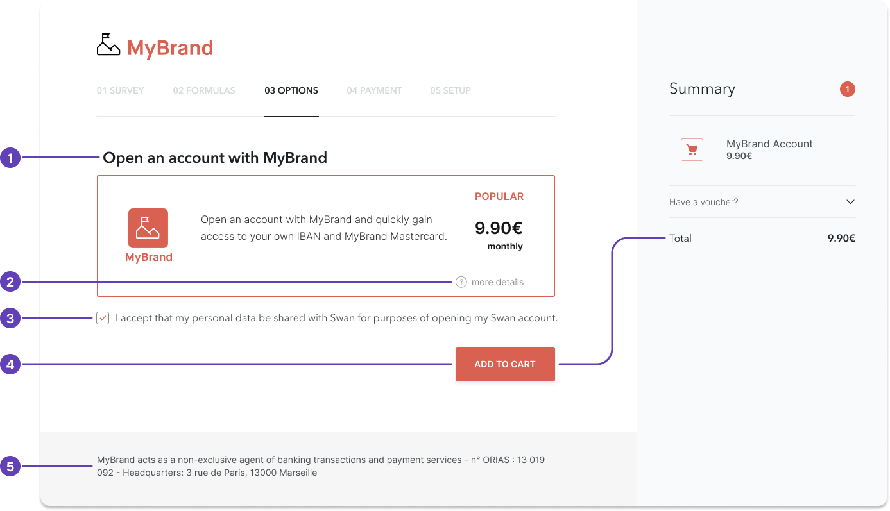

# Brand and communication rules

## Must → Partner obligations {#obligations}

As a Swan Partner, you are allowed to sell and present Swan's commercial offer as your own, without any obligation to mention Swan.

You must, however, comply with data protection regulations.
Communicate the following information to your users:

1. Provide a company **privacy policy**.
1. Tell your users that their **data will be shared with Swan**.
1. Share your **company's legal status**. Provide the following information in your footer and legal notices:
    - Your company's [legal status](/get-started/become-a-partner/licence-regulatory-status#legal-status)
    - If in France, your Orias registration number 
    - Legal name as provided on your official paperwork
    - Postal address

## Can't → Partner restrictions {#restrictions}

As a Swan Partner, you **can't** do the following:

1. You **can't manage sensitive operations** yourself (for example, [Strong Customer Authentication](/users/concepts/consent#sca)), although you may participate in collecting required documentation.
1. Regulations stipulate that companies with your legal status **can't call yourselves banks or neobanks**.
1. You **can't sell payment services**. Only Swan is allowed to sell payment services.
1. You **can't call your offer a “bank account”**. You may, however, use the wording "payment account". Please make sure not to choose wording that suggests you are the entity providing payment accounts because that's Swan's responsibility. Consider the following naming suggestions:
    - `MyBrand Account`
    - `MyBrand Premium`
    - `MyBrand Wallet`

## Can → Partner capabilities {#capabilities}

As a Swan Partner, you **can**:

1. **Present payment services** directly on your platform. You don't have to route your users to Swan.
1. **Provide access to your own platform**, app, or SaaS, where users can manage their Swan accounts, prepare payment orders, and more.
1. **White-label the branding**. You can brand Swan's payment services as your own. Make sure to mention Swan as a partner in your Terms and Conditions.
1. **Present Swan's Terms and Conditions** and commercial offer within your own Terms and Conditions, or directly on your website.
1. **Collect client information** and identification documents yourself (for example, proof of address, company registration), then forward them to Swan. Make sure to share this intention in your GDPR notice to your clients.

## How to present your offer {#offer}

1. You can brand banking services entirely as your own, without having to mention Swan as a partner. *(Note that if the product seems unclear about which entity is regulated, you might be asked to mention Swan.)*
1. You can provide details of banking services on your own website.
1. The example provides a correct mention of data protection policies.
1. You can offer banking services directly on your platform.
1. The example provides a correct way to declare that you are a Registered Swan Intermediary.

:::info Presenting your billing offer
To learn about how Swan handles fees and your options to charge your users, refer to the guide to [build a compliant billing offer](/accounts/guides/billing/compliant-billing).
:::

## Referring to Swan {#cite-swan}

If you are preparing another project or license application and wish to **cite Swan in communications** to partners, regulators, investors, and more, you must first submit materials that mention Swan to receive Swan's validation.

**Send an email** to compliance@swan.io with all **extracts of your presentation** that mention Swan (and only these extracts).

## Related

- [Licence & regulatory status](/get-started/become-a-partner/licence-regulatory-status) — your legal status and restricted businesses.
- [Become a partner](/get-started/become-a-partner)
