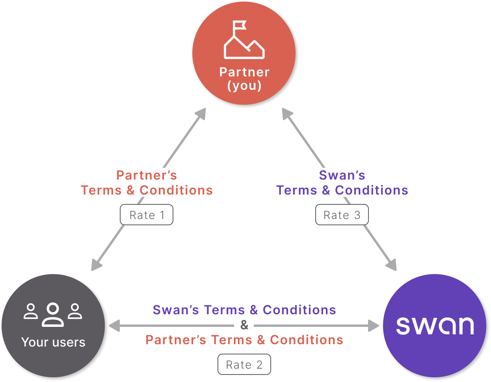

# Become a partner

Your partnership with Swan provides you **access to banking services** without needing to become a **regulated financial agent**.

**Offering banking services is a complex business** with high potential for fraud, money laundering, and more, requiring a **highly supervised license**.
Obtaining a license to offer banking services, however, is tedious, time-consuming, and expensive.

Some business activities are ineligible regardless of country — see [restricted businesses](/get-started/become-a-partner/licence-regulatory-status#restricted-businesses).

## In this section {#in-this-section}

- [Licence & regulatory status](/get-started/become-a-partner/licence-regulatory-status) — Swan's e-money licence, your legal status, and restricted businesses.
- [ORIAS registration](/get-started/become-a-partner/orias-registration) — required for France-based partners.
- [Rates & billing](/get-started/become-a-partner/rates-billing) — how rates and fees work.
- [Brand & communication rules](/get-started/become-a-partner/brand-communication) — how to present your offer.
- [Country coverage](/get-started/become-a-partner/country-coverage) — where Swan operates.
- [Protections](/get-started/become-a-partner/protections) — financial, data, and fraud protections.

## Three-party partnership model {#model}

To ensure that Swan doesn't delegate any risk to you, Swan must have a direct relationship with your users, the end consumers of Swan's banking product.

:::info Trust Center
Visit [Swan's Trust Center](https://trust.swan.io/) to learn how Swan keeps you, your users, and Swan secure.
:::

### You and your users {#model-you-users}

Your users access their Swan accounts through the product you created on Swan's APIs.
This could include [Swan's user interfaces or your own custom integration](/get-started/set-up-swan/choose-integration).

You have your own Terms and Conditions for this relationship with your users.
Your rates (rate 1 in the diagram), or the fees you charge your users to use your product or access your services, should be defined in your Terms and Conditions.
Note that you can't charge fees for what is already included in Swan's offer.

Note that Swan can audit your behavior in your relationship with your users in regards to their Swan accounts to ensure rules and regulations are respected.
For example, Swan might check that you are [billing your users for compliant services](/accounts/guides/billing/compliant-billing) only.

### Swan and your users {#model-swan-users}

This direct relationship, meaning direct contact between Swan and your users, is used primarily during the [account holder verification](/accounts/concepts/account-holders) and [Strong Customer Authentication](/users/concepts/consent#sca) processes.

When your users open Swan accounts, they must accept Swan's Terms and Conditions, sent by email.
As defined in the Terms and Conditions, your user accepts that you can perform certain operations:

1. Consult the account and the e-money account.
1. Transmit information to Swan to open an account or e-money account.
1. Prepare card orders.
1. Prepare transfer orders.
1. Prepare Internal Direct Debits for which the creditor is your user and for which the debtors are other Swan users.
1. Invalidate transfers, direct debits, or card payments.
1. Prepare electronic money loading by credit card.
1. Prepare the reimbursement of an e-money account balance.
1. Transmit requests to contest payment transactions.

For these operations, either [you or Swan can charge the user](/accounts/guides/billing/compliant-billing) depending on your marketing perspective.

:::note User interface
Swan Terms and Conditions mention the **Web Banking user interface**.
If you use a custom integration, please note that this is the **only time Swan mentions** the user interface.
If you use Swan's user interface, it's **your responsibility** to share your interface with your users.
:::

### Swan and you {#model-swan-you}

When you present Swan's payment services to your customers, Swan handles the most sensitive banking operations.
Swan **doesn't** delegate these operations to you.
Review the section on [Swan's e-money license](/get-started/become-a-partner/licence-regulatory-status#license) for more information.

Note that you can perform operations listed in the [Swan and your users](#model-swan-users) section.

In the relationship between you and Swan, Swan charges you a flat monthly fee plus fees per account and card.
Swan's website has the most [up-to-date pricing](https://www.swan.io/pricing), but your Terms and Conditions with Swan are the best place to view your rates.

