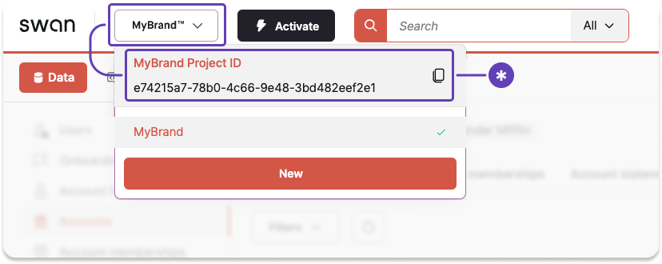
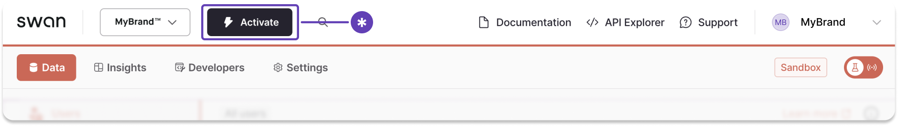
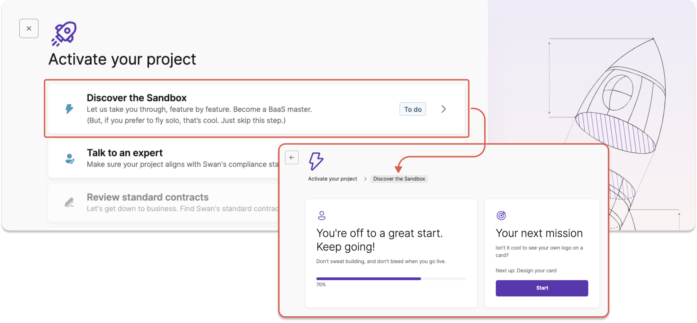
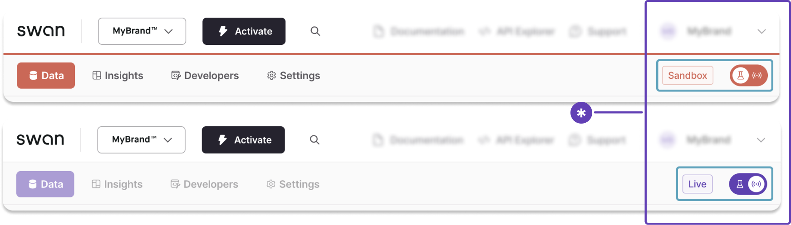

# Create your project

Using Swan means using projects.

**Partners** can have anywhere from one project to a large number of projects depending on the implementation.
Typically, there is one project per use case.
**Users** can belong to as many projects as needed.
They always use the **same identifier** (their phone number) to sign in.

## Project owner {#owner}

Projects are owned by the **legal entity** who opens a **project's first Live account** when activating a Swan project.

Additionally, the project owner's **legal representative** can perform specific actions, for example implementing security measures such as server consent or viewing their own card numbers with the API.

In Sandbox, you can use the mutation `promoteAccountHolderToProjectOwner` to promote any account holder to test project owner behavior.

## Project ID {#id}

Each project has a unique project ID (`projectId`).
On the Dashboard, click-to-copy your Project ID from any page.

## Project access tokens {#access-tokens}

Project access tokens serve several functions:

1. Allow you to **act on your own behalf** rather than on behalf of a user.
1. Allow you to **act as a user within your project**, sometimes referred to as [impersonation](/dev-tools/using-api/authentication#impersonate).
1. Must use the **client credentials** OAuth 2.0 flow (also referred to as *grant type*), intended for server-to-server authentication.

Learn more about project access tokens, including [how to get them](/dev-tools/using-api/authentication#get-token-project), in the [authentication](/dev-tools/using-api/authentication) section.

## Sandbox and Live projects {#environments}

Projects always start as Sandbox-only.
Projects can remain Sandbox-only if you're goal for the project is to test various implementations.

After a project passes to the status `LimitedLiveAccess`, the project owner can begin testing the Live implementation.
From there, more and more Live access is granted (assuming the project passes reviews).

After a project is Live, you can switch between Sandbox and Live.
Use Sandbox to test new features before releasing them to your Live users.

For regulatory reasons, it's **not possible to delete projects** or clear data from a project.

:::caution Can't move between projects
You can't migrate work between projects.
If you have a Live project and you'd like to test an implementation in Sandbox before launching, use that Live project's Sandbox mode.
:::

## Project statuses {#statuses}

| Status | Explanation |  Live available | Onboarding available |
| --- | --- | --- | --- |
| `Initiated` | Partner creates a project  **Next**: Partner schedules meeting with Swan | <No /> No | <No /> No |
| `MeetingScheduled` | Partner schedules a meeting  **Next**: Partner and Swan meet to discuss the Partner's use case and implementation before requesting a review | <No /> No | <No /> No |
| `PendingCompliance` | Swan performs a review of the project for risk and compliance reasons  **Next**: Partner starts investigative development of their implementation while Swan performs the review  | <No /> No | <Yes /> Yes for project owner only  <No /> No for users and companies |  
| `LimitedLiveAccess` | Review accepted; Partner can use Swan for *their own account only*  **Next**: Partner continues testing their development, then requests a review | <Yes /> Yes | <No /> No |
| `PendingLiveReview` | Partner asks Swan to review; Swan performs a technical review of the Live implementation  **Next**: Partner stays responsive to questions as Swan performs Live review | <Yes /> Yes | <No /> No |
| `BetaLiveAccess` | Swan approves implementation for a limited number of Live accounts  **Next**: Partner begins onboarding a limited number of accounts  | <Yes /> Yes | <Yes /> Yes *(limited)* |
| `FullLiveAccess` | Swan approves implementation for full Live access  **Next**: Partner uses their Swan implementation | <Yes /> Yes | <Yes /> Yes *(unlimited)* |
| `Disabled` | Project is not longer active (could be due to Partner request, Swan's choice, or a mutual decision)  **Next**: *No next steps* | <No /> No | <No /> No |
| `Suspended` | Project is suspended, either pending a review by Swan or at the Partner's request  **Next**: If due to *Swan review*, Partner stays responsive to questions as Swan performs the review; if due to *Partner request*, the Partner should communicate with Swan about reactivating the project | <No /> No | <No /> No |
| `Rejected` | Swan rejects the project (reasons vary and are communicated to the Partner or main point of contact)  **Next**: *No next steps* | <No /> No | <No /> No |

## Notifications {#notifications}

Send notifications to your end users automatically when certain events occur. 
Notifications are delivered in the [account membership language](/accounts/concepts/memberships#language).

The following tables list information about the available text message and email notifications.
Take note of the [account membership permissions](/accounts/reference/membership-permissions#permissions) required to receive each notification.
Account members won't receive the notification if they don't have the required permission.
Use the `notificationReminderPlannings` query to check your project's reminder schedule.

### Text message notifications {#notifications-text-message}

| Event | Notification | Permission required |
| --- | --- | --- |
| Card payment rejected due to **insufficient funds** | Your card payment was rejected due to insufficient funds. Please add money to your account before trying again. | `CanViewAccount` |
| Card payment rejected because the cardholder has already **reached their [spending limit](/topics/cards/#limits)** | Your card payment was rejected because you reached the card's spending limit. Try again when your spending limit resets, or ask to increase it. | *None* |
| Card payment rejected because the card is **permanently blocked [(canceled)](/topics/cards/physical/#statuses)** | Your card payment was rejected because the card is permanently blocked. Please order a new card. | *None* |
| Card payment rejected because the cardholder entered the **[incorrect PIN](/topics/cards/physical/#pin-incorrect-attempts)** | Your card payment was rejected because the PIN wasn't correct. Please check your PIN before trying again. | *None* |
| Card payment rejected because the cardholder entered an **invalid expiration date** | Your card payment was rejected because the expiration date is invalid. Please confirm your card isn't expired before trying again. | *None* |

### Email notifications {#notifications-email}

| Event | Notification | Permission required |
| --- | --- | --- |
| Physical card is about to expire and goes into `ToRenew` **[status](/topics/cards/physical/#renew-statuses)** 10 weeks before the expiration date | White-label email sent 10 weeks before card expiry. The email reminds the user about the upcoming expiration date. It includes the current delivery address and asks them to update it in their banking app within two weeks if it's incorrect. | *None* |
| Physical card **not activated** after estimated delivery date | White-label email reminder encouraging the user to [activate their physical card](/topics/cards/physical/guide-activate). Sent at configured intervals (for example, 5, 10, and 15 days after estimated delivery) until the card is activated or the maximum number of reminders is reached. Partners can enable or disable this notification from **Dashboard** > **Settings** > **Notifications**. | *None* |
| Account onboarding is **[finalized](/accounts/guides/onboarding/#statuses)** | White-label email containing Swan's terms and conditions along with your Partnership Conditions. The email is sent to the address provided during onboarding in the account's onboarding language. | *None* |
| Account holder **[verification process](/accounts/guides/onboarding/account-holders#verification-process)** requires action or is complete | White-label emails sent during verification, which may include: first transfer requests, supporting document requests and reminders, and account opened notifications. Swan can configure these notifications on your behalf; [submit a request](https://support.swan.io/hc/en-150/requests/new) if interested. | *None* |
| New account member is **[invited](/accounts/concepts/memberships#invite)** with status `InvitationSent` | White-label email invitation with a link for the invited member to accept the membership and bind their Swan user account. Configuration depends on your [integration setup](/accounts/concepts/memberships#notifications). | *None* |

## Activate your project {#activate}

Transforming your Sandbox project into a Live project that can manage funds is a multi-step process.

The order in which you complete these steps can vary.
Please note that you can **send the materials for step 9** as soon as they're ready, regardless of where you are in this process.

:::info Activation progress
You can view your progress anytime by clicking the **Activate** button in your Dashboard's top navigation.
You'll see an interactive list of everything you still need to do, as well as the steps you already completed.

:::

## Step 1: Discover the Sandbox

On your Dashboard, go to **Activate** > **Discover the Sandbox**.
Complete the list of tasks to learn more about the Dashboard and the Swan offer.

- Configure your design
- Open your first Sandbox account
- Send and receive your first transfers
- Design, issue, and use your first card
- Add your first account member
- Set up your first webhook

If you prefer to learn on your own, feel free to use the documentation to perform these tasks.

## Step 2: Talk to a Swan expert

On your Dashboard, go to **Activate** > **Talk to an expert**.

Enter your professional email and, optionally, your LinkedIn profile link.
Then, explain in a few words how you plan to use Swan.

A Swan expert will follow up quickly to discuss your product vision and make sure your plan aligns with Swan's compliance standards.

Consider discussing [Swan's integration options](/get-started/set-up-swan/choose-integration) with your expert.

## Step 3: Send Swan your project ID

*Note: Step 3 isn't on the Dashboard list.*

Swan needs your project ID to continue opening your first Live account.

1. On the Dashboard, toggle open the section with your project name.
1. Click-to-copy your project ID.
1. Send your project ID to your Swan expert by email.

## Step 4: Review standard contracts

On your Dashboard, go to **Activate** > **Review standard contracts**.

Take a look at Swan's standard contracts.
Let your expert know if you have any questions. 

## Step 5: Get compliance approval

As a regulated financial institution, Swan must review every project.
When you reach this step, your review has already begun.

In parallel with your project review, make sure you've **signed the contract** with the Swan sales team.
Your project will only be activated after the verification process is complete and the contract is signed.

## Step 6: Open your company's first Live account

On your Dashboard, go to **Activate** > **Open your company's first Live account**.

Complete the form in this section, then upload any required documents and verify your identity.

Opening and using this account is a great way to learn first hand how accounts work in real life.

:::caution French IBAN
The first Live account is **always** a French account with a French IBAN, regardless of where you're located.
:::

## Step 7: Start using the Live API

After Swan approves your project, switch from Sandbox to Live by changing the toggle.
The Dashboard accent color will change from orange to purple, and the label from Sandbox to Live.
You can start using your account immediately, and continue to test your integration.

After switching to Live, make sure to go to **Dashboard** > **Developers** to **generate new Live OAuth 2.0 credentials**.

## Step 8: Configure your branding in Live

*Note: Step 8 isn't on the Dashboard list.*

Data doesn't transfer from Sandbox to Live.
Therefore, you need to configure your branding in your Live environment.

1. Go to **Dashboard** > **Settings**.
1. Open **Branding**.
1. Upload a PNG of your logo and choose your accent color.
1. Click **Start review**.

Swan reviews all branding changes.
As soon as your branding is approved, you'll see it in your Live project environment.

## Step 9: Get your final integration review

Every integration must pass a final technical review.
Swan also reviews all materials that mention Swan and Swan features.

Please send the following materials to compliance@swan.io to start your final review:

1. Explanation of how you present your offer and where you market Swan features. Please make sure to review [Swan's guidelines](/get-started/become-a-partner/brand-communication) when creating these materials.
1. Link your clients will use to open their Swan accounts.
1. Access to your userflow (in your staging environment).
1. Your terms and conditions.
1. Your privacy policy.

The final review can take time (usually about one week).
You can send these materials to Swan as soon as they're ready, even if you are early in the activation process.

## Related

- [Step-by-step](/get-started/set-up-swan/step-by-step) — explore Swan before going live.
- [Become a partner](/get-started/become-a-partner) — partnership and compliance.
