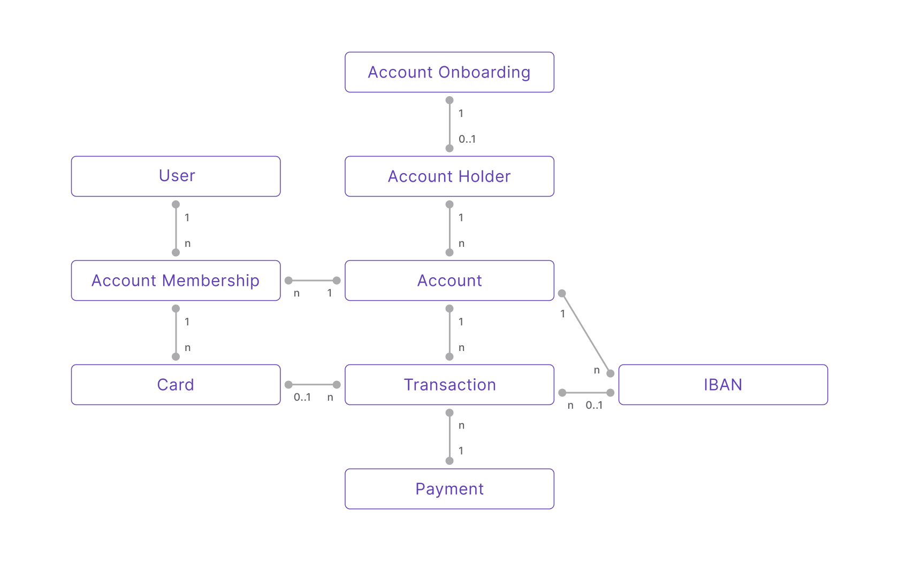

# Glossary

## Swan data model {#data-model}

The Swan data model depicts the relationship between key elements that make up Swan.

- `1` → exactly one of that element per user
- `0..1` → between zero and one of that element per user
- `n` → an unlimited number of that element per user

  
Text description of data model

  

<ol>
<li>To open a Swan <b>Account</b>, your end user completes one <b>Account Onboarding</b> form.</li>
<li>Before finalizing their <b>Account Onboarding</b>, your end user needs to sign up as a Swan <b>User</b>.</li>
<li>After the <b>Account Onboarding</b> is finalized, an <b>Account Holder</b> is created.</li>
<li>A first <b>Account</b> is created for your user (who is now an <b>Account Holder</b>).</li>
<li>The first <b>Account Membership</b> to that account is created for the <b>Account Holder</b>, which represents their membership permissions for that <b>Account</b>.</li>
<li>One <b>Account Holder</b> owns one or more <b>Accounts</b>.</li>
<li>One <b>Account</b> invites one or more <b>Account Memberships</b>.</li>
<li>One <b>User</b> is invited to accept one or more <b>Account Memberships</b> to different <b>Accounts</b>.</li>
<li>One <b>Account Membership</b> issues as many <b>Cards</b> as required.</li>
<li>One <b>Account</b> owns one or more <b>IBANs</b>. The first is the main <b>IBAN</b>, and all others are virtual.</li>
<li>One <b>Account</b> can execute unlimited <b>Transactions</b> with <b>Cards</b> or <b>IBANs</b>.</li>
<li>One <b>Payment</b> contains one or more <b>Transactions</b>.</li>
</ol>
  

***

## [Account onboarding](/accounts/guides/onboarding) {#account-onboarding}

import CompanyOnboardingDefinition from '../../_shared/definitions/_onboarding-company.mdx';

import IndividualOnboardingDefinition from '../../_shared/definitions/_onboarding-individual.mdx';

### [Company account onboarding](/accounts/guides/onboarding/company) {#account-onboarding-company}

<CompanyOnboardingDefinition />

### [Individual account onboarding](/accounts/guides/onboarding/individual) {#account-onboarding-individual}

<IndividualOnboardingDefinition />

import KycDefinition from '../../_shared/definitions/_kyc.mdx';

import KybDefinition from '../../_shared/definitions/_kyb.mdx';

import UboDefinition from '../../_shared/definitions/_ubo.mdx';

import PepDefinition from '../../_shared/definitions/_pep.mdx';

### Know Your Customer (KYC) {#kyc}

<KycDefinition />

### Know Your Business (KYB) {#kyb}

<KybDefinition />

### Ultimate Beneficial Owner (UBO) {#ubo}

<UboDefinition />

### Politically Exposed Person (PEP) {#pep}

<PepDefinition />

***

## Accounts {#accounts}

import AccountHolderDefinition from '../../_shared/definitions/_account-holder.mdx';

### [Account holder](/accounts/concepts/account-holders) {#account-holder}

<AccountHolderDefinition /> 

import AccountMembershipDefinition from '../../_shared/definitions/_account-membership.mdx';

### [Account membership](/accounts/concepts/memberships) {#account-membership}

<AccountMembershipDefinition /> 

import AccountFundingDefinition from '../../_shared/definitions/_account-funding.mdx';

### [Account funding](/accounts/concepts/funding) {#account-funding}

<AccountFundingDefinition /> 

***

## API {#api}

Swan's Application Programming Interface.
Read more about the Swan API in the [Build](/build) section.

import IdempotencyDefinition from '../../_shared/definitions/_idempotency.mdx';

### [Idempotency](/build/using-api/idempotency) {#idempotency}

<IdempotencyDefinition />

import PaginationDefinition from '../../_shared/definitions/_pagination.mdx';

### [Pagination](/build/using-api/pagination) {#pagination}

<PaginationDefinition />

import RejectionsDefinition from '../../_shared/definitions/_rejections.mdx';

### [Rejections](/build/using-api/errors-rejections) {#rejections}

<RejectionsDefinition />

import WebhooksDefinition from '../../_shared/definitions/_webhooks.mdx';

### [Webhooks](/build/using-api/webhooks) {#webhooks}

<WebhooksDefinition />

***

import BillingDefinition from '../../_shared/definitions/_billing.mdx';

## [Billing](/accounts/concepts/billing) {#billing}

<BillingDefinition />

***

import CapitalDepositDefinition from '../../_shared/definitions/_capital-deposit.mdx';

## [Capital deposit](/accounts/guides/capital-deposits) {#capital-deposit}

<CapitalDepositDefinition /> 

***

## [Card](/cards) {#cards}

import CardDefinition from '../../_shared/definitions/_cards.mdx';

import VirtualCardDefinition from '../../_shared/definitions/_cards-virtual.mdx';

import SingleUseVirtualCardDefinition from '../../_shared/definitions/_single-use-virtual-card.mdx';

import PhysicalCardDefinition from '../../_shared/definitions/_cards-physical.mdx';

import DigitalCardDefinition from '../../_shared/definitions/_cards-digital.mdx';

import CardProductDefinition from '../../_shared/definitions/_card-product.mdx';

import CardPackageDefinition from '../../_shared/definitions/_card-package.mdx';

import SpendingLimitDefinition from '../../_shared/definitions/_spending-limit.mdx';

<CardDefinition /> 

### [Virtual cards](/cards/concepts/virtual) {#cards-virtual}

<VirtualCardDefinition /> 

### [Single-use virtual cards](/cards/concepts/virtual/single-use-cards) {#single-use-virtual-card}

<SingleUseVirtualCardDefinition /> 

### [Physical cards](/cards/concepts/physical) {#cards-physical}

<PhysicalCardDefinition /> 

### [Digital cards](/cards/concepts/digital) {#cards-digital}

<DigitalCardDefinition /> 

### [Card products](/cards/concepts/card-products) {#card-product}

<CardProductDefinition /> 

### [Card packages](/cards/concepts/card-packages) {#card-package}

<CardPackageDefinition /> 

### [Spending limits](/cards/concepts/spending-limits) {#spending-limit}

<SpendingLimitDefinition /> 

***

import ConsentDefinition from '../../_shared/definitions/_consent.mdx';

## [Consent](/users/concepts/consent) {#consent}

<ConsentDefinition />

import ScaDefinition from '../../_shared/definitions/_sca.mdx';

### [Strong Customer Authentication (SCA)](/users/concepts/consent/sca) {#sca}

<ScaDefinition />

import SensitiveOperationDefinition from '../../_shared/definitions/_sensitive-operation.mdx';

### [Sensitive operations](/users/reference/sensitive-operations) {#sensitive-operation}

<SensitiveOperationDefinition />

***

import IbanDefinition from '../../_shared/definitions/_iban.mdx';

## [IBAN](/accounts/concepts/ibans) {#ibans}

<IbanDefinition />

***

import IdentificationDefinition from '../../_shared/definitions/_identification.mdx';

## [Identification](/users/concepts/identifications) {#identification}

<IdentificationDefinition />

***

import LegalRepDefinition from '../../_shared/definitions/_legal-rep.mdx';

## Legal representative {#legal-representative}

<LegalRepDefinition />

***

import MerchantsDefinition from '../../_shared/definitions/_merchants.mdx';

## [Merchant](/payments/concepts/merchants/) {#merchants}

<MerchantsDefinition />

import MerchantProfileDefinition from '../../_shared/definitions/_merchant-profile.mdx';

### [Merchant profile](/payments/concepts/merchants#profiles) {#merchant-profile}

<MerchantProfileDefinition />

import MerchantPaymentMethodDefinition from '../../_shared/definitions/_merchant-payment-method.mdx';

### [Merchant payment method](/payments/concepts/merchants#methods) {#merchant-payment-method}

<MerchantPaymentMethodDefinition />

import PaymentLinkDefinition from '../../_shared/definitions/_payment-link.mdx';

### [Payment link](/payments/concepts/merchants/payments#links) {#payment-link}

<PaymentLinkDefinition />

***

import PaymentDefinition from '../../_shared/definitions/_payments.mdx';

## [Payment](/payments/) {#payments}

<PaymentDefinition />

import PaymentControlDefinition from '../../_shared/definitions/_payment-control.mdx';

### [Payment control](/build/using-api/payment-control) {#payment-control}

<PaymentControlDefinition />

import PaymentMandateDefinition from '../../_shared/definitions/_payment-mandate.mdx';

### Payment mandates {#payment-mandates}

<PaymentMandateDefinition />

Several Swan features may require payment mandates, including [account funding](/accounts/concepts/funding/payment-mandates), [accepting payments](/payments/concepts/merchants/sepa-direct-debit#mandates), and [received payment mandates for SEPA Direct Debit](/payments/concepts/direct-debit/#mandates).

import SddDefinition from '../../_shared/definitions/_sdd.mdx';

### [SEPA Direct Debit](/payments/concepts/direct-debit) {#sdd}

<SddDefinition />

***

import RollingReserveDefinition from '../../_shared/definitions/_rolling-reserve.mdx';

### Rolling reserve {#rolling-reserve}

<RollingReserveDefinition />

import CreditTransferDefinition from '../../_shared/definitions/_credit-transfer.mdx';

### [Credit transfer](/payments/concepts/credit-transfers) {#credit-transfer}

<CreditTransferDefinition />

import StandingOrderDefinition from '../../_shared/definitions/_standing-order.mdx';

### [Standing Order](/payments/concepts/credit-transfers/sepa#standing-orders) {#standing-order}

<StandingOrderDefinition />

import TrustedBeneficiaryDefinition from '../../_shared/definitions/_trusted-beneficiary.mdx';

### [Trusted beneficiary](/payments/concepts/credit-transfers#beneficiaries) {#trusted-beneficiary}

<TrustedBeneficiaryDefinition />

import VerificationOfPayeeDefinition from '../../_shared/definitions/_verification-of-payee.mdx';

### [Verification of Payee (VoP)](/payments/concepts/verification-of-payee) {#verification-of-payee}

<VerificationOfPayeeDefinition />

import DirectDebitDefinition from '../../_shared/definitions/_direct-debit.mdx';

### [Direct debit](/payments/concepts/direct-debit) {#direct-debit}

<DirectDebitDefinition />

import RTransactionDefinition from '../../_shared/definitions/_r-transaction.mdx';

### [R-transaction](/payments/concepts/credit-transfers/sepa#r-transactions) {#r-transaction}

<RTransactionDefinition />

***

import ProjectDefinition from '../../_shared/definitions/_projects.mdx';

## [Project](/get-started/set-up-swan/create-project) {#projects}

<ProjectDefinition />

***

import SupportingDocumentCollectionDefinition from '../../_shared/definitions/_supporting-documents.mdx';

## [Supporting documents](/accounts/concepts/documents) {#supporting-documents}

<SupportingDocumentCollectionDefinition />

***

import TransactionsDefinition from '../../_shared/definitions/_transactions.mdx';

## [Transaction](/payments/concepts/transactions#transactions) {#transactions}

<TransactionsDefinition />

## Related {#related}
- [Set up Swan](/get-started/set-up-swan/step-by-step): explore the product step by step.
