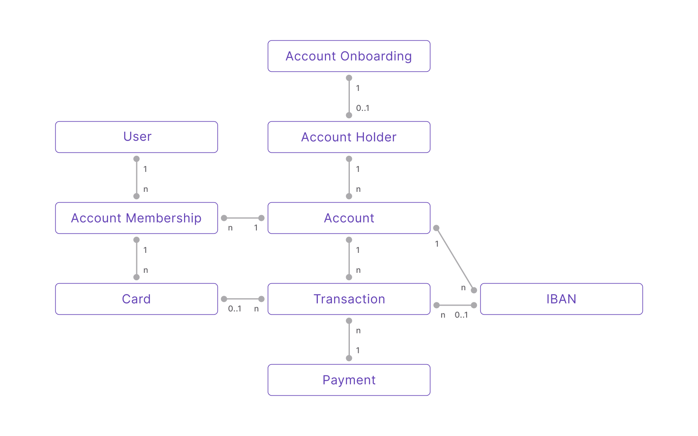

# Glossary

## Swan data model {#data-model}

The Swan data model depicts the relationship between key elements that make up Swan.

- `1` → exactly one of that element per user
- `0..1` → between zero and one of that element per user
- `n` → an unlimited number of that element per user

  
Text description of data model

  

<ol>
<li>To open a Swan <b>Account</b>, your end user completes one <b>Account Onboarding</b> form.</li>
<li>Before finalizing their <b>Account Onboarding</b>, your end user needs to sign up as a Swan <b>User</b>.</li>
<li>After the <b>Account Onboarding</b> is finalized, an <b>Account Holder</b> is created.</li>
<li>A first <b>Account</b> is created for your user (who is now an <b>Account Holder</b>).</li>
<li>The first <b>Account Membership</b> to that account is created for the <b>Account Holder</b>, which represents their membership permissions for that <b>Account</b>.</li>
<li>One <b>Account Holder</b> owns one or more <b>Accounts</b>.</li>
<li>One <b>Account</b> invites one or more <b>Account Memberships</b>.</li>
<li>One <b>User</b> is invited to accept one or more <b>Account Memberships</b> to different <b>Accounts</b>.</li>
<li>One <b>Account Membership</b> issues as many <b>Cards</b> as required.</li>
<li>One <b>Account</b> owns one or more <b>IBANs</b>. The first is the main <b>IBAN</b>, and all others are virtual.</li>
<li>One <b>Account</b> can execute unlimited <b>Transactions</b> with <b>Cards</b> or <b>IBANs</b>.</li>
<li>One <b>Payment</b> contains one or more <b>Transactions</b>.</li>
</ol>
  

***

## [Account onboarding](topics/onboarding/index.mdx) {#account-onboarding}

import CompanyOnboardingDefinition from './topics/definitions/_onboarding-company.mdx';

import IndividualOnboardingDefinition from './topics/definitions/_onboarding-individual.mdx';

### [Company account onboarding](topics/onboarding/company/index.mdx) {#account-onboarding-company}

<CompanyOnboardingDefinition />

### [Individual account onboarding](topics/onboarding/individual/index.mdx) {#account-onboarding-individual}

<IndividualOnboardingDefinition />

***

## Accounts {#accounts}

import AccountHolderDefinition from './topics/definitions/_account-holder.mdx';

### [Account holder](topics/onboarding/account-holders/index.mdx) {#account-holder}

<AccountHolderDefinition /> 

import AccountMembershipDefinition from './topics/definitions/_account-membership.mdx';

### [Account membership](topics/accounts/memberships/index.mdx) {#account-membership}

<AccountMembershipDefinition /> 

import AccountFundingDefinition from './topics/definitions/_account-funding.mdx';

### [Account funding](topics/accounts/funding/index.mdx) {#account-funding}

<AccountFundingDefinition /> 

***

## API {#api}

Swan's Application Programming Interface.
Read more about the Swan API in the [Developers](./developers/index.mdx) section.

import PaginationDefinition from './topics/definitions/_pagination.mdx';

### [Pagination](developers/using-api/pagination.mdx) {#pagination}

<PaginationDefinition />

import RejectionsDefinition from './topics/definitions/_rejections.mdx';

### [Rejections](developers/using-api/errors-rejections.mdx) {#rejections}

<RejectionsDefinition />

import WebhooksDefinition from './topics/definitions/_webhooks.mdx';

### [Webhooks](developers/using-api/webhooks.mdx) {#webhooks}

<WebhooksDefinition />

***

import CapitalDepositDefinition from './topics/definitions/_capital-deposit.mdx';

## [Capital deposit](topics/capital-deposits/index.mdx) {#capital-deposit}

<CapitalDepositDefinition /> 

***

## [Card](topics/cards/index.mdx) {#cards}

import VirtualCardDefinition from './topics/definitions/_cards-virtual.mdx';

import PhysicalCardDefinition from './topics/definitions/_cards-physical.mdx';

import DigitalCardDefinition from './topics/definitions/_cards-digital.mdx';

### [Virtual cards](topics/cards/virtual/index.mdx) {#cards-virtual}

<VirtualCardDefinition /> 

### [Physical cards](topics/cards/physical/index.mdx) {#cards-physical}

<PhysicalCardDefinition /> 

### [Digital cards](topics/cards/digital/index.mdx) {#cards-digital}

<DigitalCardDefinition /> 

***

import IbanDefinition from './topics/definitions/_iban.mdx';

## [IBAN](topics/accounts/ibans/index.mdx) {#ibans}

<IbanDefinition />

***

import LegalRepDefinition from './topics/definitions/_legal-rep.mdx';

## Legal representative {#legal-representative}

<LegalRepDefinition />

***

import MerchantsDefinition from './topics/definitions/_merchants.mdx';

## [Merchant](topics/merchants/index.mdx) {#merchants}

<MerchantsDefinition />

***

import PaymentDefinition from './topics/definitions/_payments.mdx';

## [Payment](topics/payments/index.mdx) {#payments}

<PaymentDefinition />

import PaymentControlDefinition from './topics/definitions/_payment-control.mdx';

### [Payment control](developers/using-api/payment-control.mdx) {#payment-control}

<PaymentControlDefinition />

import PaymentMandateDefinition from './topics/definitions/_payment-mandate.mdx';

### Payment mandates {#payment-mandates}

<PaymentMandateDefinition />

Several Swan features can require payment mandates, including [account funding](./topics/accounts/funding/index.mdx#mandates), [accepting payments](./topics/merchants/sdd/index.mdx#mandates), and [received payment mandates for SEPA Direct Debit](./topics/payments/direct-debit/index.mdx#mandates).

***

import RollingReserveDefinition from './topics/definitions/_rolling-reserve.mdx';

### Rolling reserve {#rolling-reserve}

<RollingReserveDefinition />

***

import ProjectDefinition from './topics/definitions/_projects.mdx';

## [Project](topics/projects/index.mdx) {#projects}

<ProjectDefinition />

***

import SupportingDocumentCollectionDefinition from './topics/definitions/_onboarding-supporting-documents.mdx';

## [Supporting document collection](topics/onboarding/documents/index.mdx) {#supporting-documents}

<SupportingDocumentCollectionDefinition />

***

import TransactionsDefinition from './topics/definitions/_transactions.mdx';

## [Transaction](topics/payments/index.mdx#transactions) {#transactions}

<TransactionsDefinition />