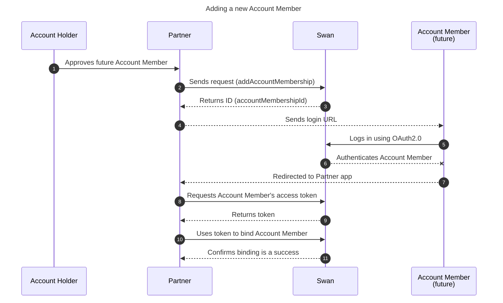

# Accounts

```mermaid
---
title: Adding a new Account Member
---
sequenceDiagram
    autonumber
    participant AH as Account Holder
    participant P as Partner
    participant S as Swan
    participant AM as Account Member<br>(future)
    AH->>P: Approves future Account Member
    P->>S: Sends request (addAccountMembership)
    S-->>P: Returns ID (accountMembershipId)
    P-->>AM: Sends login URL
    AM->>S: Logs in using OAuth2.0
    S--xAM: Authenticates Account Member
    AM-->>P: Redirected to Partner app
    P->>S: Requests Account Member's access token
    S-->>P: Returns token
    P->>S: Uses token to bind Account Member
    S-->>P: Confirms binding is a success
```