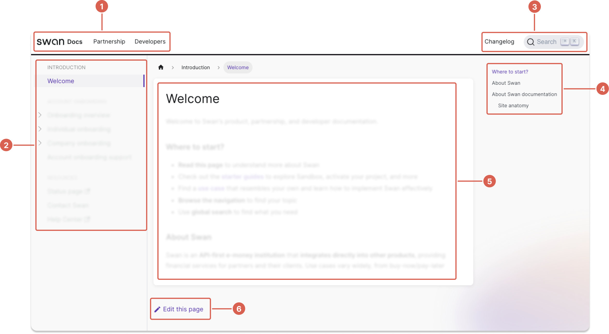

# Welcome

Welcome to Swan's product, partnership, and developer documentation.

## Where to start?

- **Read this page** to understand more about Swan
- Check out the [**starter guides**](./starter-guides/intro.mdx) to explore Sandbox, activate your project, and more
- Find a [**use case**](./use-cases/intro.mdx) that resembles your own and learn how to implement Swan effectively
- **Browse the navigation** to find your topic
- Use **global search** to find what you need

## Swan snapshot

Swan is an **API-first e-money institution** that **integrates directly into other products**, providing financial services for partners and their clients.
Use cases vary widely, from buy-now/pay-later setups to employee benefits cards to rental management.

## About Swan documentation

This section of Swan's documentation covers two main themes: **concepts**, or explanatory content, and **guides**, providing steps to complete a task.

### Site anatomy

The anatomy of the Swan documentation site has five main sections:

1. **Top navigation**: Swan's different types of partner documentation, including the main docs (where you are now), information about partnerships with Swan *(coming soon)*, and a section just for developers *(also coming soon)*
1. **Sidebar navigation**: links to all content for this top navigation section
1. **Changelog** & **Search**: link to Swan's product changelog, plus the invaluable global search that unifies all sections in the top navigation (powered by Algolia)
1. **Page navigation**: table of contents for this page only, generated using the page's headings
1. **Content**: the good stuff!
1. **Edit link**: if you find errors or would like to contribute something you've discovered, follow this link to the Swan documentation GitHub repository and start a discussion or create a pull request

