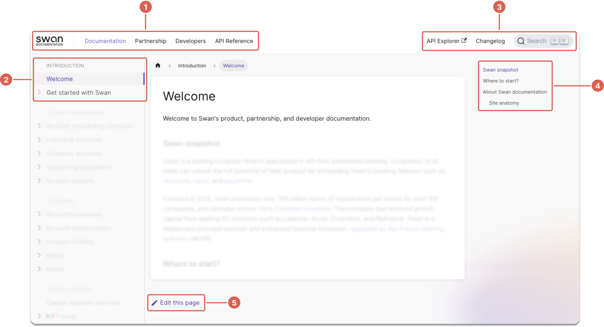

# Welcome there

Welcome to Swan's product, partnership, and developer documentation.

## Swan snapshot

Swan is a leading European fintech specialized in API-first embedded banking.
Companies of all kinds can unlock the full potential of their product by embedding Swan's banking features such as [accounts](./topics/accounts/index.mdx), [cards](./topics/cards/index.mdx), and [payments](./topics/payments/index.mdx).

Founded in 2019, Swan processes over 750 million euros of transactions per month for over 100 Partners, and operates across [30 European countries](./partnership/overview/country-coverage.mdx).
The company has received growth capital from leading VC investors such as Lakestar, Accel, Creandum, and Bpifrance.
Swan is a Mastercard principal member and a licensed financial institution, [regulated by the French banking authority](./partnership/index.mdx#license) (ACPR).

## Where to start?

- **Read this page** to understand more about Swan.
- **Browse the navigation** to find your topic.
- Use **global search** to find what you need.

## About Swan documentation

This primary section of Swan's documentation covers two main themes: **topics**, or explanatory content, and **guides**, providing steps to complete a task.
Click any topic in the side navigation to open the explanatory content.
All guides for that topic are in the expanded menu.

### Site anatomy

The anatomy of the Swan documentation site has five main sections:

1. **Top navigation**: Swan's different types of partner documentation, including the main docs (where you are now), information about partnerships with Swan, and a section just for developers.
1. **Sidebar navigation**: links to all content for this top navigation section.
1. **API Explorer**, **changelog** & **search**: links to Swan's API Explorer and product changelog, plus the invaluable global search that unifies the API Reference with all product, partnership, and developer documentation. Swan's search is powered by Algolia.
1. **Page navigation**: table of contents for this page only, generated using the page's headings.
1. **Edit link**: if you find errors or would like to contribute something you've discovered, follow this link to the Swan documentation GitHub repository and start a discussion or create a pull request.

