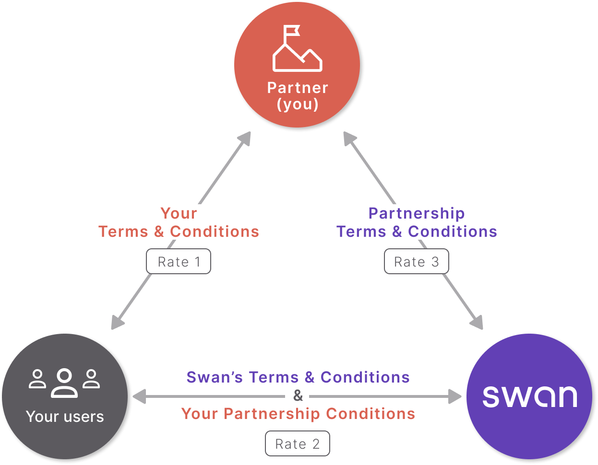

# Partnership with Swan

Your partnership with Swan provides you **access to banking services** without needing to become a **regulated financial agent**.

**Offering banking services is a complex business** with high potential for fraud, money laundering, and more, requiring a **highly supervised license**.
Obtaining a license to offer banking services, however, is tedious, time-consuming, and expensive.

## Swan's license {#license}

Swan holds an [e-money license](https://www.regafi.fr/spip.php?page=results&type=advanced&id_secteur=3&lang=en&denomination=Swan&siren=853827103&cib=17328&bic=&nom=&siren_agent=&num=&cat=0&retrait=0) valid across the [European Economic Area](./overview/country-coverage.mdx) (EEA) overseen by France's [Autorité de Contrôle Prudentiel et Résolution](https://acpr.banque-france.fr/en) (ACPR).
In English, ACPR translates to *Prudential Supervision and Resolution Authority*.

Because Swan holds the license, **Swan assumes responsibility for all sensitive and risky banking operations**.
While many operations can be delegated to you, some are always performed by Swan for regulatory purposes.
For example, consent is *always* required for [sensitive operations](../topics/users/consent/index.mdx#sensitive), and consent *always* involves Swan in a Live environment.

## Your legal status {#legal-status}

Your legal status while partnering with Swan depends on the country in which your company is based: in France, or anywhere else in the European Economic Area (EEA).

| Location | Status |
| --- | --- |
| 🇫🇷 France | You'll operate as a **Registered Swan Intermediary**.  Learn more in the [dedicated guide for France](./overview/guide-orias.mdx). |
| All other EEA countries | You'll operate as a **Commercial Agent of Swan**.  You don't have to complete a regulatory process to become a Commercial Agent. Swan handles it once you go Live. |

## Three-party partnership model {#model}

To ensure that Swan doesn't delegate any risk to you, Swan must have a direct relationship with your users, the end consumers of Swan's banking product.

### Rates {#model-rates}

- Rate 1: You charge your users fees for your services based on your Terms and Conditions.
- Rate 2: Swan charges your users for extraordinary expenses based on Swan's Terms and Conditions.
- Rate 3: You pay for Swan's services based on your contract with Swan.

### You and your users {#model-you-users}

Your users access their Swan accounts through the product you created based on Swan's APIs.
This could include [Swan's user interfaces or your own custom integration](https://docs.swan.io/guide/choose-integration).

You have your own Terms and Conditions for this relationship with your users.
Your rates (rate 1 in the diagram), or the fees you charge your users to use your product or access your services, should be defined in your Terms and Conditions.
Note that you can't charge your users fees for what is already included in Swan's offer.

Note that Swan can audit your behavior in your relationship with your users in regards to their Swan accounts in order to ensure rules and regulations are respected.
For example, Swan might check that you are [billing your users for compliant services](https://docs.swan.io/regulatory/build-a-compliant-billing-offer) only.

### Swan and your users {#model-swan-users}

This direct relationship, meaning direct contact between Swan and your users, is used primarily during the [identity verification](../topics/onboarding/account-holders/index.mdx#verifying-account-holders) and [Strong Customer Authentication](../topics/users/consent/index.mdx#sca) processes.

When your users open Swan accounts, they must accept Swan's Terms and Conditions, sent by email.
As defined in the Terms and Conditions, your user accepts that some you can perform certain operations:

1. Consult the account and the e-money account.
1. Transmit information to Swan to open an account or e-money account.
1. Prepare card orders.
1. Prepare transfer orders.
1. Prepare Internal Direct Debits for which the creditor is your user and for which the debtors are other Swan users.
1. Invalidate transfers, direct debits, or card payments.
1. Prepare electronic money loading by credit card.
1. Prepare the reimbursement of an e-money account balance.
1. Transmit requests to contest payment transactions.

For these operations, either [you or Swan can charge the user](https://docs.swan.io/concept/account/billing) depending on your marketing perspective.

:::note User interface
Swan Terms and Conditions mention the **Web Banking user interface**.
If you use a custom integration, please note that this is the **only time Swan mentions** the user interface.
If you use Swan's user interface, it's **your responsibility** to share your interface with your users.
:::

### Swan and you {#model-swan-you}

When you present Swan's payment services to your customers, Swan handles the most sensitive banking operations.
Swan **doesn't** delegate these operations to you.
Review the section on [Swan's e-money license](#license) for more information.

Note that you can perform operations listed in the [Swan and your users](#model-swan-users) section.

In the relationship between you and Swan, Swan charges you a flat monthly fee plus fees per account and card.
Swan's website has the most [up-to-date pricing](https://www.swan.io/pricing), but your Terms and Conditions with Swan are the best place to view your rates.

## Referring to Swan {#cite-swan}

If you are preparing another project or license application and wish to **cite Swan in communications** to partners, regulators, investors, and more, you must first submit materials that mention Swan to receive Swan's validation.

**Send an email** to compliance@swan.io that includes all **extracts of your presentation** that mention Swan, and only these extracts.