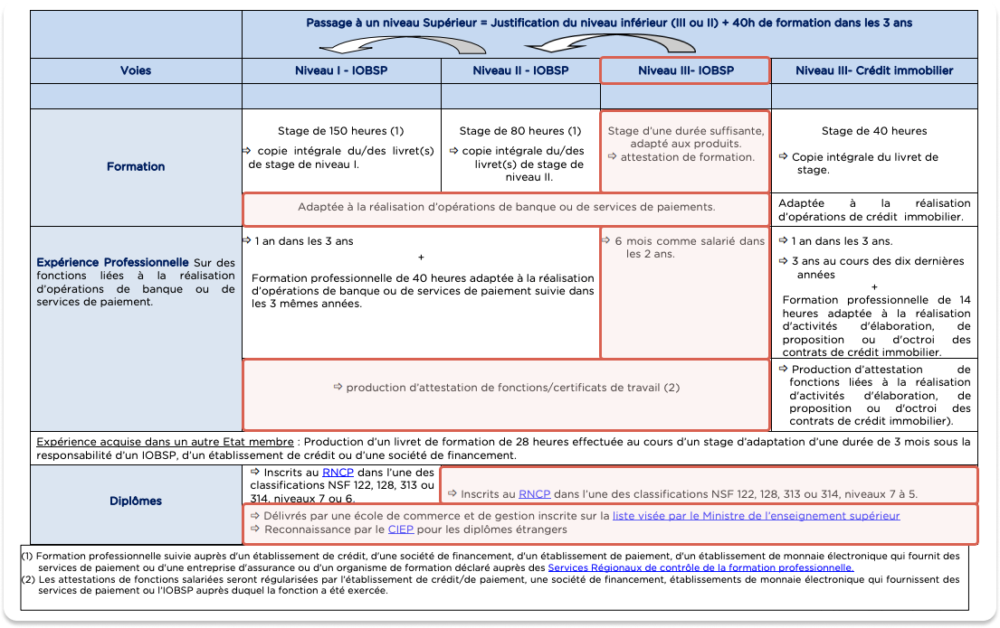
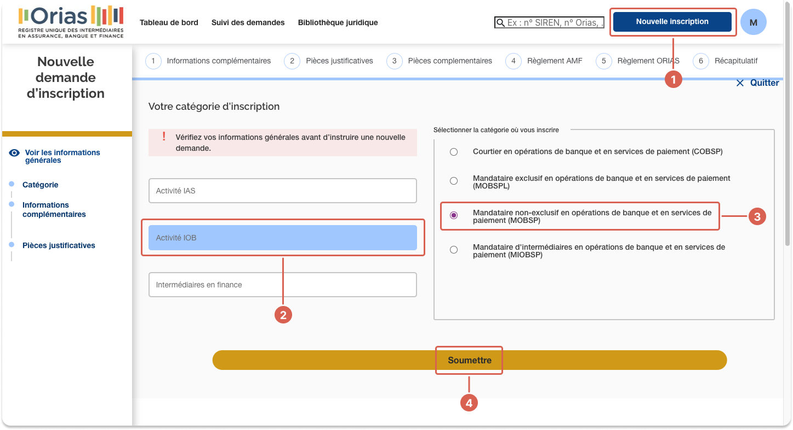
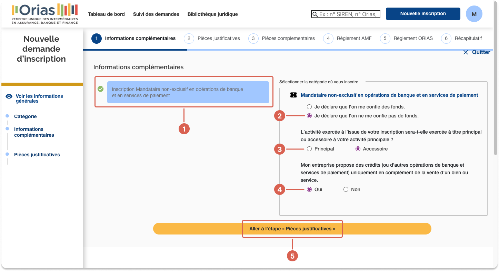
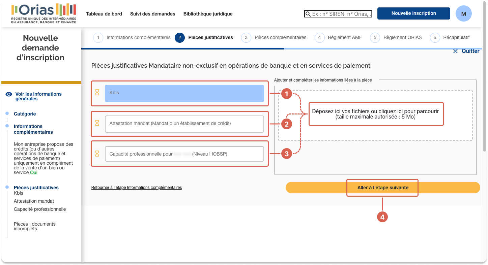
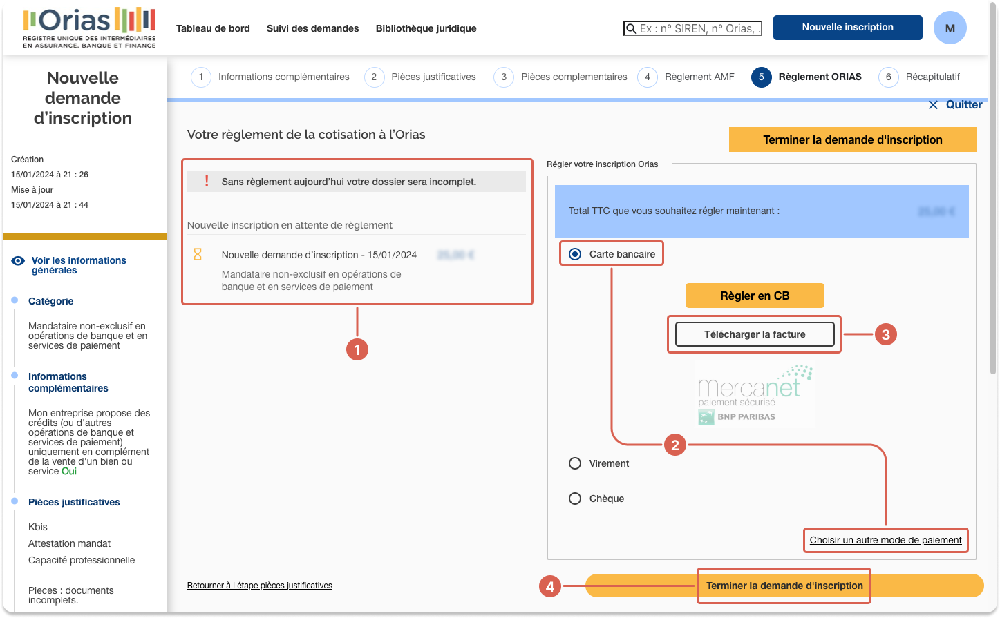

import Tabs from '@theme/Tabs';
import TabItem from '@theme/TabItem';

# 🇫🇷 Register with Orias

:::caution France-based only
Only companies legally **based in France** need to register with Orias.
:::

## Introduction {#introduction}

Companies based in France operate with the [legal status](../index.mdx#legal-status) **Registered Swan Intermediary**.

This means you'll become an **MOBSP**, or *Mandataire en Opération de Banque et en Service de Paiement*.
In English, this translates roughly to *Authorized Bank and Payment Services Intermediaries*.
As an MOBSP, you'll be regulated by **Orias**, an association that approves and monitors insurance, banking, and investment intermediaries in France.

In order to partner with Swan, **you must apply to Orias**.
Swan can't complete this process for you, nor can Swan, at any time, access your personal Orias profile or obtain privileged information about your application.
Note that your part can be done within a few hours, and Swan's within a few days.
After that, Orias can take up to two months to review your application.

Though the process is yours to complete, Swan can help if you need help along the way.
Send an email to support@swan.io if you have questions about the process.

## Step 1: Prepare your information {#info}

### 1.1 Get information from Swan {#info-1}

After signing your partnership contract with Swan, complete the following steps to obtain your *attestation de mandat*, or a mandate certificate.

1. Send an email to compliance@swan.io that includes your **legal name** and **SIREN** number.
1. Swan will reply with your *attestation de mandat* (mandate certificate). You'll need your certificate for step 3.3.

### 1.2 Get valid supporting documents {#info-2}

During the [registration process step 3.3](#registration-3), you're required to provide supporting documents.
More specifically, you must provide the following documents:

- Kbis or proof of business registration that's less than three months old
- Proof of professional aptitude (such as a diploma or a contract)

Review to the image attached, referring to the category **Niveau III - IOBSP** (level 3).
If the image is inaccessible for any reason, please send Swan an email for individual assistance.

:::caution professional aptitude
If you don't have proof of professional aptitude accepted by Orias, send an email to compliance@swan.io.
Swan can help set you up with the necessary training.
:::

## Step 2: Sign up for an Orias account {#signup}

### 2.1 Open registration form {#signup-1}

1. Go to the [Orias website](https://www.orias.fr/).
1. If you'd like, choose your language (French or English).
1. Scroll down until you see a section called **Comment ça marche ?** / **How does it work?**.
1. Click **S'inscrire** / **Register**.

You'll be redirected to the registration form.

<Tabs>
  <TabItem value="french" label="French" default>
    

        
    

  </TabItem>
  <TabItem value="english" label="English">
    

        
    

  </TabItem>
</Tabs>

### 2.2 Enter required information {#signup-2}

1. Enter your **SIREN number**.
    - SIREN stands for Système d'identification du répertoire des entreprises, and roughly translates to *Business Directory Identification System* in English.
1. Enter **information about your company**. Make sure to register as a **personne morale** / **legal entity**. 
1. Enter information about your [**legal representative**](../../glossary.mdx#legal-representative).
1. Enter your **legal representative's contact details**.
1. Enter your **company's contact details**, including a website if you have one.
1. Enter your **company's address**.
1. **Review** all the information you entered, then click **Valider** / **Validate**.

<Tabs>
  <TabItem value="french" label="French" default>
    

        
    

  </TabItem>
  <TabItem value="english" label="English">
    

        
    

  </TabItem>
</Tabs>

### 2.3 Connect to Orias {#signup-3}

Check your inbox for an email from Orias (no-reply-orias@orias.fr).
The email contains your **identifiant** / **identifier** and a **mot de passe provisoire** / **temporary password**.

1. Go back to the [Orias website](https://www.orias.fr/).
1. Click **Connexion** / **Login**.
1. Enter your **identifiant** / **identifier** and your **mot de passe provisoire** / **temporary password** from your email.
1. Follow the instructions on your screen to change your password, then save it.

After saving your new password, you'll be redirected to your Orias account area.

## Step 3: Complete a new Orias registration {#registration}

:::caution French only
From this point forward, the Orias website is only available in French.
:::

### 3.1 Register your company {#registration-1}

1. Click **Nouvelle inscription** (New registration) to start your registration. A form appears.
1. Choose **Activité IOB**.
1. Then, choose **Mandataire non-exclusif en opérations de banque et en services de paiement (MOBSP)**.
    - The menu with MOBSP changes based on the type of activity selected: IAS, IOB, or Intermédiaries en finance. If you don't see MOBSP, confirm you selected Activité IOB in #2.
1. Click **Soumettre** (Submit).

### 3.2 Provide additional information {#registration-2}

1. Notice the box specifying that you're completing registration as a **Mandataire non-exclusif en opérations de banque et en services de paiement**.
    - If any other type of registration is specified, use your browser's back button to return to the previous page and try again.
1. For the first question, choose the answer **Je déclare que l'on ne me confie pas de fonds**, meaning *I declare that no funds are entrusted to me*.
1. For the second question, choose the answer **Accessoire**, which means it's your *secondary activity*, letting Orias know that financial services aren't your company's primary activity.
1. For the third question, choose the answer **Oui**, which means *Yes*, letting Orias know that your company offers credit (or other banking and payment services) only as a secondary service.
1. Click **Aller à l'étape « Pièces justificatives »** (Go to the "Supporting documents" step).

### 3.3 Provide supporting documents {#registration-3}

1. Upload your **Kbis**.
1. Upload your **Attestation mandat**, which is the *mandate certificate* from [step 1.1](#info-1).
1. Upload your **Capacité professionnelle pour *vous* (Niveau I IOBSP)**, which is your proof of professional aptitude from [step 1.2](#info-2). Please refer back to step 1.2 if you need help obtaining a compliant professional aptitude document.
1. Click **Aller à l'étape suivante** (Go to the next step).

### 3.4 Pay for your registration {#registration-4}

The final step is to pay for your registration.

1. Notice that you're paying for **Mandataire non-exclusif en opérations de banque et en services de paiement** registration. Without paying the fee, your registration isn't complete.
1. Choose to pay with your **Carte bancaire** (bank card), or click **Choisir un autre mode de paiement** (Choose another payment method) to pay by Virement (credit transfer) or Chèque (check).
1. After paying, click **Télécharger la facture** to download your receipt.
1. Click **Terminer la demande d'inscription** (Finish your registration request) to finalize your registration.
1. You'll receive your Orias registration number by email, confirming your registration is complete. **Send this number to Swan** by email.

## Step 4: Swan registers you as an MOBSP {#swan-mobsp}

After you send Swan your Orias registration number by email, **Swan registers you** as a *Mandataire non-exclusif en opérations de banque et en services de paiement (MOBSP)*.

Refer to the [introduction](#introduction) to review what MOBSP entails.

## Step 5: Orias reviews your application {#orias-review}

Orias **reviews your documents** and **application** to make sure your file is **fully compliant**.
Orias will inform you of their final decision by email.
If approved, the email also contains the date your MOBSP status takes effect.

Don't hesitate to reach out to the Orias by phone (09.69.32.59.73) or email (contact@orias.fr) if you don't receive timely updates about your application.

## Step 6: Update your legal mentions {#update-legal}

After receiving approval from Orias and becoming an MOBSP, make sure to **update your legal mentions**.
Add something similar to the following example to your website footer, legal mention, and anywhere you distribute or sell payment services.

The example is in French, and you should include it in French as well.
English is optional.

> *MyBrand, société immatriculée au R.C.S de XXXX sous le numéro XXXXX, et inscrit au Registre unique des Intermédiaires en Assurance, Banque et Finance sous le numéro d’immatriculation XXXXX en qualité de Mandataire non exclusif en opérations de banque et en services de paiement.*