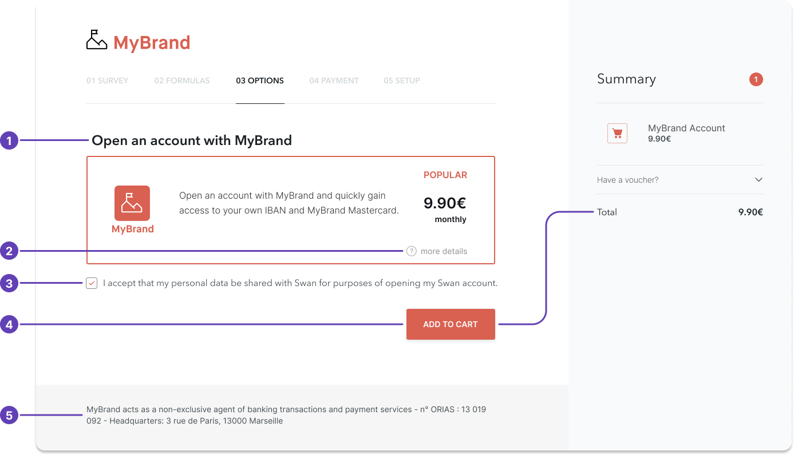

# Rules and regulations

In partnering with Swan, you agree to a set of requirements.
This means you must respect certain obligations and restrictions, and you also have plenty of capabilities.
In other words, there are certain things you must do and you can't do, and also plenty of things you can do.

## Must → Partner obligations {#obligations}

As a Swan Partner, you are allowed to sell and present Swan's commercial offer as your own, without any obligation to mention Swan.

You must, however, comply with data protection regulations.
Communicate the following information to your users:

1. Provide a company **privacy policy**.
1. Tell your users that their **data will be shared with Swan**.
1. Share your **company's legal status**. Provide the following information in your footer and legal notices:
    - Your company's [legal status](../index.mdx#legal-status)
    - If in France, your Orias registration number 
    - Legal name as provided on your official paperwork
    - Postal address

## Can't → Partner restrictions {#restrictions}

As a Swan Partner, you **can't** do the following:

1. You **can't manage sensitive operations** yourself (for example, [Strong Customer Authentication](../../topics/users/consent/index.mdx#sca)), although you may participate in collecting required documentation.
1. Regulations stipulate that companies with your legal status **can't call yourselves banks or neobanks**.
1. You **can't sell payment services**. Only Swan is allowed to sell payment services.
1. You **can't call your offer a “bank account”**. You may, however, use the wording "payment account". Please make sure not to choose wording that suggests you are the entity providing payment accounts because that's Swan's responsibility. Consider the following naming suggestions:
    - `MyBrand Account`
    - `MyBrand Premium`
    - `MyBrand Wallet`

## Can → Partner capabilities {#capabilities}

As a Swan Partner, you **can**:

1. **Present payment services** directly on your platform. You don't have to route your users to Swan.
1. **Provide access to your own platform**, app, or SaaS, where users can manage their Swan accounts, prepare payment orders, and more.
1. **White-label the branding**. You can brand Swan's payment services as your own. Make sure to mention Swan as a partner in your Terms and Conditions.
1. **Present Swan's Terms and Conditions** and commercial offer within your own Terms and Conditions, or directly on your website.
1. **Collect client information** and identification documents yourself (for example, proof of address, company registration), then forward them to Swan. Make sure to share this intention in your GDPR notice to your clients.

## How to present your offer {#offer}

1. You can brand banking services entirely as your own, without having to mention Swan as a partner. *(Note that if the product seems unclear about which entity is regulated, you might be asked to mention Swan.)*
1. You can provide details of banking services on your own website.
1. The example provides a correct mention of data protection policies.
1. You can offer banking services directly on your platform.
1. The example provides a correct way to declare that you are a Registered Swan Intermediary.

## Restricted businesses {#restricted-businesses}

Swan builds infrastructure for businesses to embed financial services.
Most types of companies can embed banking services with Swan, but some aren't allowed.
Additionally, Swan must respect all local laws as well as the requirements of the payment networks and institutions on which Swan relies to this infrastructure.

This decision has nothing to do with whether Swan likes or dislikes certain industries.
This is a risk-based decision: Swan won't work with industries that might pose a risk to the reputation or financial well-being of Swan or Swan Partners.

Swan restricts activities in the following industries:

| Category | Restricted activities |
| --- | --- |
| Substance-related activities | <ul><li>Tobacco culture and products</li><li>Manufacture of tobacco products</li><li>Marijuana culture and illicit marijuana products</li></ul> |
| Financial and regulatory risk activities | <ul><li>Shell banks</li><li>Trust & off-shore company service providers</li><li>Company domiciliation businesses</li><li>Non-licensed money service businesses and payment services providers</li><li>Crypto-assets trading, exchange and custody platforms</li><li>Crypto-currency mixing activity</li><li>Money remittance</li><li>Currency dealer & exchangers, FOREX</li></ul> |
| Industries with a high environmental impact | <ul><li>Extractive industries such as oil, gas, and coal, including the extraction, processing, commerce, and other related activities</li><li>Nuclear material and power generation</li><li>Palm oil production</li><li>Polluting or dangerous industry chemicals</li></ul> |
| Controversial or sensitive activities | <ul><li>Weapons and defense materials providers</li><li>Prostitution and escort services</li><li>Adult entertainment (pornography or similar activities)</li></ul> |
| Gaming and entertainment | <ul><li>Gambling industry, including video games classified as online gambling</li><li>Game publisher of online games that permit value transfer between gamers</li><li>Online bartering services</li></ul> |
| Other | <ul><li>Religious activities</li><li>Precious stones, gems, and jewels</li></ul> |

1. Substance-related activities:
    - Tobacco culture and products
    - Manufacture of tobacco products
    - Marijuana culture and illicit marijuana products
1. Financial and regulatory risk activities:
    - Shell banks
    - Trust & off-shore company service providers
    - Company domiciliation businesses
    - Non-licensed money service businesses and payment services providers
    - Crypto-assets trading, exchange and custody platforms
    - Crypto-currency mixing activity
    - Money remittance
    - Currency dealer & exchangers, FOREX
1. Industries with a high environmental impact:
    - Extractive industries such as oil, gas, and coal, including the extraction, processing, commerce, and other related activities
    - Nuclear material and power generation
    - Palm oil production
    - Polluting or dangerous industry chemicals
1. Controversial or sensitive activities:
    - Weapons and defense materials providers
    - Prostitution and escort services
    - Adult entertainment (pornography or similar activities)
1. Gaming and entertainment:
    - Gambling industry, including video games classified as online gambling
    - Game publisher of online games that permit value transfer between gamers
    - Online bartering services
1. Other
    - Religious activities
    - Precious stones, gems, and jewels

:::info Eligibility
Not participating in one of the listed industries doesn't mean your account will be validated.
All Swan Partners complete a rigorous review process before going Live.
Learn more in the [guide to activate a Swan project](../../topics/projects/guide-activate.mdx).
:::