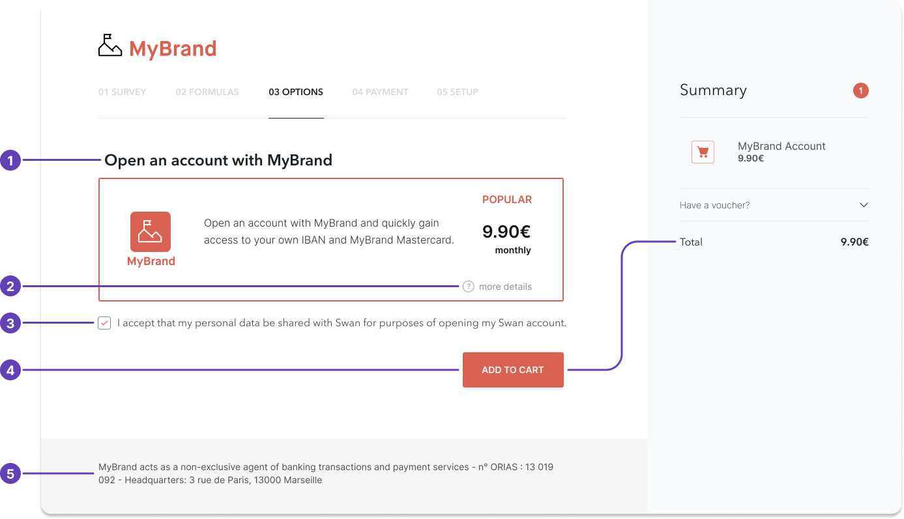

# Rules and regulations

In partnering with Swan, you agree to a set of requirements.
This means you must respect certain obligations and restrictions, and you also have plenty of capabilities.
In other words, there are certain things you must do and you can't do, and also plenty of things you can do.

## Must → Partner obligations {#obligations}

As a Swan Partner, you are allowed to sell and present Swan's commercial offer as your own, without any obligation to mention Swan.

You must, however, comply with data protection regulations.
Communicate the following information to your users:

1. Provide a company **privacy policy**.
1. Tell your users that their **data will be shared with Swan**.
1. Share your **company's legal status**. Provide the following information in your footer and legal notices:
    - Your company's [legal status](../index.mdx#legal-status)
    - If in France, your Orias registration number 
    - Legal name as provided on your official paperwork
    - Postal address

## Can't → Partner restrictions {#restrictions}

As a Swan Partner, you **can't** do the following:

1. You **can't manage sensitive operations** yourself (for example, [Strong Customer Authentication](../../topics/users/consent/index.mdx#sca)), although you may participate in collecting required documentation.
1. Regulations stipulate that companies with your legal status **can't call yourselves banks or neobanks**.
1. You **can't sell payment services**. Only Swan is allowed to sell payment services.
1. You **can't call your offer a “bank account”**. You may, however, use the wording "payment account". Please make sure not to choose wording that suggests you are the entity providing payment accounts because that's Swan's responsibility. Consider the following naming suggestions:
    - `MyBrand Account`
    - `MyBrand Premium`
    - `MyBrand Wallet`

## Can → Partner capabilities {#capabilities}

As a Swan Partner, you **can**:

1. **Present payment services** directly on your platform. You don't have to route your users to Swan.
1. **Provide access to your own platform**, app, or SaaS, where users can manage their Swan accounts, prepare payment orders, and more.
1. **White-label the branding**. You can brand Swan's payment services as your own. Make sure to mention Swan as a partner in your Terms and Conditions.
1. **Present Swan's Terms and Conditions** and commercial offer within your own Terms and Conditions, or directly on your website.
1. **Collect client information** and identification documents yourself (for example, proof of address, company registration), then forward them to Swan. Make sure to share this intention in your GDPR notice to your clients.

## How to present your offer {#offer}

1. You can brand banking services entirely as your own, without having to mention Swan as a partner. *(Note that if the product seems unclear about which entity is regulated, you might be asked to mention Swan.)*
1. You can provide details of banking services on your own website.
1. The example provides a correct mention of data protection policies.
1. You can offer banking services directly on your platform.
1. The example provides a correct way to declare that you are a Registered Swan Intermediary.

:::info Presenting your billing offer
To learn about how Swan handles fees and your options to charge your users, refer to the guide to [build a compliant billing offer](../../topics/accounts/billing/guide-compliant-billing.mdx).
:::

## Restricted businesses {#restricted-businesses}

Swan builds infrastructure for businesses to embed financial services. Most types of companies can embed banking services with Swan, but some aren't allowed. Swan must also follow all local laws and rules from banks, payment networks, and regulators.

This decision is risk-based, not preference-based. Swan won't work with industries that could harm the reputation or finances of Swan or its partners.

Restricted activities are categorized into two groups:

| Activity category | Description |
|---|---|
| **Activities Swan doesn't support** | This list applies to all Swan Partners. Your users can access the list in the dedicated [Swan Support Center article](https://support.swan.io/hc/en-150/articles/5767255782045-Restricted-businesses). |
| **Activities requiring additional review** | This category applies only to Partners with specific regulated services, such as Neobanks, Accounts Payable, and Capital deposits. Contact your Partner Integration Manager (PIM) to confirm whether these restrictions apply to your service. |

Businesses engaged in activities listed in either group will be ineligible to open an account.

:::info

Swan may update this list when regulations, provider requirements, or risk assessments change.

:::

### Activities Swan doesn't support

#### Adult entertainment and sexual services

- Adult entertainment
- Prostitution and escort services

#### Crypto-assets and digital value

- Crypto ATMs — Physical machines or kiosks that let users buy or sell cryptocurrency using cash or a payment card.
- Crypto Asset Service Providers (CASPs) — Businesses that professionally provide crypto-asset services, such as exchanging, transferring, storing, or managing crypto-assets.
- Cryptocurrency mixing — Services designed to obscure the transaction history of cryptocurrency.
- Non-fungible tokens (NFTs) — Blockchain-based tokens that represent or certify ownership or authenticity of a digital or physical asset.
- Video games with an in-app currency component, including metaverse activities

#### Financial and payment activities

- Check cashing providers
- Collection agencies
- Company domiciliation services
- Crowdfunding and crowd-lending
- Currency exchange providers
- Issuers and resellers of electronic money vouchers, prepaid cards, or gift cards
- Microfinance providers (MFIs)
- Non-licensed money service businesses
- Non-licensed payment service providers (PSPs)
- Online escrow payment services
- Online pots service providers
- Pawn shops
- Shell banks
- Trust and offshore company service providers
- Unlicensed financial advisory
- Foreign-exchange trading (FOREX)
- **Proprietary trading (prop trading)** — Trading programs that use evaluations, challenges, or payout models. Examples include FTMO.

#### High-value goods and trade

- Freeports — Secure facilities where businesses can store or trade high-value goods before the goods leave the facility. Freeports may also be called bonded warehouses or customs-free zones.
- Wholesale trade of uncut or unpolished gemstones or unrefined precious metals
- Counterfeit goods

#### Extractive, chemical, and high-impact industries

- Coal mining
- Commodity inspection
- Electricity generation from coal-fired power stations
- Illegal and unapproved drugs and pharmaceuticals
- Industry and polluting chemicals
- Marijuana and raw CBD culture, production, and distribution
- Mining and extraction industry
- Nuclear and radioactive material
- Oil and gas extraction, refinement, transport, and distribution
- Palm oil production
- Pulp and paper production
- Scrap metal dealing
- Tobacco production and wholesale

#### Gambling and other business models

- Gambling activities, including casinos, sports betting, and prediction markets
- Get-rich-quick schemes
- Multi-level marketing companies (MLMs)
- Organizations known as sects
- Psychic readings, hypnosis, clairvoyance, astrology, tarot, and esoteric activities

#### Sales channels

- Call shops, taxi phones, and internet cafes
- Door-to-door sales

#### Weapons, military, and defense activities

- Weapons production and sale
- Armament research, development, and procurement
- Defense contractors
- Military technology or equipment research, development, production, or sale
- Military activities

### Activities that need more review

#### Consumer, health, and regulated products

- Adult goods
- Alcohol sales
- Hemp textiles or body care products
- Hunting equipment, excluding weapons
- Retail sale of CBD
- Nutritional or sports supplements

#### High-value goods, trade, and resale

- Art and antique sales
- Auctioneers, auction houses, and online bidding-based sales
- Collectibles and memorabilia
- High-value goods
- Import-export businesses
- Wholesale, business-to-business (B2B), or retail sale of cut gemstones or refined precious metals

#### Agriculture, food, energy, and waste

- Commercial farming, forestry, or fishing operations
- Fast food restaurants
- Nuclear power generation
- Solar energy and building renovations under MaPrimeRénov/CEE
- Specialized waste management
- Waste collection, treatment, and disposal

#### Financial and professional services

- Financial advisors, insurance, and financial intermediaries
- Law firms and legal professionals
- Licensed payment institutions
- Online barter
- Professional real estate activities

#### Transport, security, and operational services

- Cargo, freight, and shipping operations
- Civilian aviation and drone activity
- Laundromats
- Private security
- Repair of motor vehicles and motorcycles
- Second-hand automobile wholesale and retail
- Second-hand mobile phone, computer, and electronic equipment
- Street trading

#### Public-interest and social organizations

- Charities and nonprofit organizations
- Embassies, consulates, and foreign diplomatic missions
- Political organizations and campaigning
- Professional sports clubs, federations, agents, and intermediaries
- Religious organizations

#### Technology and aerospace

- Aerospace research and development
- Dual-use technologies

#### Other business models

- Dropshipping

:::warning

Not appearing on this list doesn't guarantee that Swan will approve a project or open an account.

:::

:::info Eligibility

All Swan Partners complete a review process before going live.

Learn more in the [guide to activate a Swan project](../../topics/projects/guide-activate.mdx).

:::