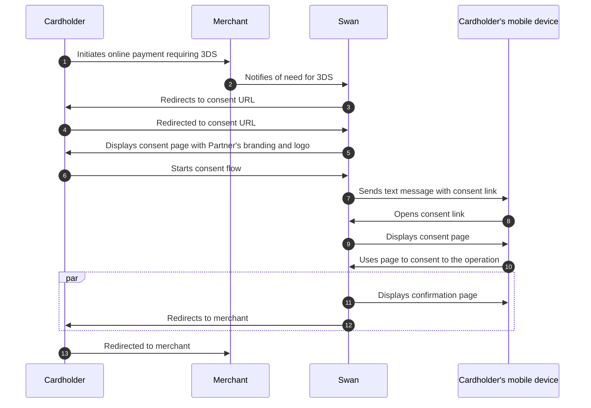

# 3-D Secure (3DS)

3-D Secure adds <Term id="sca">Strong Customer Authentication</Term> to online card payments: when Swan requires it, how it differs from regular <Term id="consent">consent</Term>, and the consent flow your cardholders go through.

## How 3DS works {#3ds}

3-D Secure (3DS) is an extra security layer for online card payments.
All Swan <Term id="cards">cards</Term>, including single-use virtual cards, are subject to 3DS compliance; however, because single-use virtual cards already require consent at creation, the cardholder sees fewer 3DS prompts.

With 3DS, cardholders are required to perform [Strong Customer Authentication](/users/concepts/consent/sca) before finalizing their <Term id="payments">payment</Term>.
As a card issuer, Swan must comply with the European Revised Directive on Payment Services (PSD2).
PSD2 governs all payments in Europe and mandates Strong Customer Authentication for some online payments.

**Most European <Term id="merchants">merchants</Term> use 3DS for all <Term id="transactions">transactions</Term>**, with a few exceptions.
If a payment should require 3DS and doesn't (which probably means the merchant doesn't have the correct configuration), Swan rejects the operation.

:::note 3DS exception
In the case of recurring payments, such as subscriptions and automatic top-up, the merchant is only required to use 3DS during setup and **not for subsequent recurring payments**.
:::

## 3DS consent flow {#3ds-consent}

Swan designed a PSD2-compliant two-factor authentication (2FA) solution based on [Mastercard's 3DS Smart Interface](https://developer.mastercard.com/product/3ds-smart-interface/).
Swan automatically detects card payments that require additional security and triggers the 3DS consent flow.
Your cardholders are instructed to validate their online payments and can do so directly from their mobile phone.

There are two notable differences between 3DS and regular consent:

1. Swan requires 3DS for online transactions (most transactions without it are refused), but it's up to the merchant to request 3DS, which initiates the consent flow.
2. 3DS consent respects your configured [notification preferences](/users/concepts/consent#notifications). If you've integrated consent notifications, you'll receive notifications for 3DS payments that you can forward to your users through your own channels.

