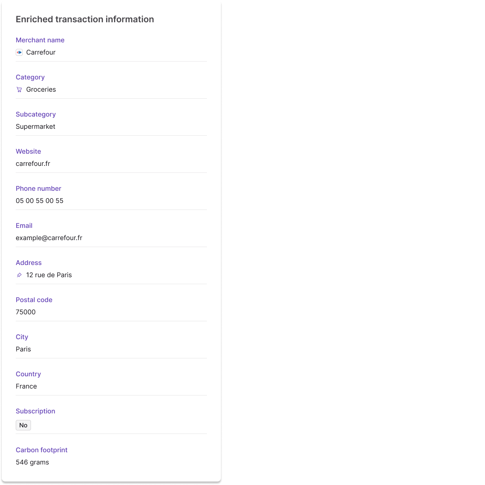

# Enriched transaction information

Swan enriches card <Term id="transactions">transactions</Term> with the merchant's brand name, logo, category, contact details, location, and carbon footprint, delivered asynchronously through the API, the Dashboard, and a <Term id="webhooks">webhook</Term>.

## Overview {#enriched}

When reviewing their transaction history, **cardholders** can see **enriched information** (more detailed data) about the merchant and the transaction.
Providing enriched transaction information **improves the user experience** for you and your users.
For example, enriched information can reduce chargebacks and decrease the need for customer support.

You can retrieve this information with the API and view it on your Dashboard by going to **Data** > **Transactions** > **Details**.
If you use Swan's Web Banking interface, enriched transaction information is available for your users automatically in their History list.

Enriched transaction information is **only available for card transactions** at this time.
It's available for all card transactions dating back to the beginning of Swan. 

Swan enriches card transactions with the following data (as availability allows):

| API | Description | Example |
| --- | --- | --- |
| `enrichedMerchantName` | Merchant brand name | Carrefour |
| `logoUrl` | Merchant logo | Small image of the merchant's logo, or, if no logo is available, the category icon |
| `category` | Merchant category | Groceries |
| `subcategory` | Merchant subcategory | Supermarket |
| `isSubscription` | Subscription indicator boolean | `Yes`, `No`, `null` |
| `contactEmail` `contactPhone` `contactWebsite` | Merchant contact details | example[@]carrefour.fr +330500550055 `https://www.carrefour.fr` |
| `city` `country` `postalCode` `latitude` `longitude` | Location details | Paris France (FRA) 75000 48.864716 2.349014 |
| `carbonFootprint` | Carbon footprint in grams of CO2 emitted | 0.00546 grams |

## Displaying enriched info {#enriched-display}

In the API and on your Dashboard, `enrichedTransactionInfo` doesn't override the existing merchant information received during the classic transaction flow. 

If `enrichedMerchantName` is empty in production, the standard `merchantName` from the card scheme should be displayed. Your own web banking interface should implement this same fallback logic.

If you use Swan's Web Banking interface, however, the enriched information overrides the merchant name when available.

The following image is sample enriched information as displayed on the Dashboard:

## Carbon footprint calculation {#carbon-footprint}

The `carbonFootprint` field represents the environmental impact of a transaction in grams of CO2 equivalent emitted.

Swan calculates a transaction's carbon footprint based on the amount spent and the merchant's business category. The calculation maps to official [Statistical Classification of Economic Activities (NACE)](https://ec.europa.eu/eurostat/web/nace) European Union categories, using published carbon footprint data from [Eurostat air emissions intensities by NACE Rev. 2 activity](https://ec.europa.eu/eurostat/databrowser/view/env_ac_aeint_r2/default/table?lang=en).

[Triple](https://www.jointriple.com/) provides this calculation service and incorporates all CO2 equivalents for a comprehensive environmental impact assessment. The calculation uses the latest available ratio data (2023 data as of April 2025) and currently doesn't account for merchant country variations.

For example, a €50 grocery transaction might be calculated as 0.00546 grams of CO2 equivalent based on the supermarket category's emission intensity factor.

## Webhooks and enriched info {#enriched-webhooks}

Swan obtains enriched transaction information **asynchronously** to avoid processing delays and technical timeouts.
The information is usually received within seconds after a card transaction is created.

Anytime enriched information is received, Swan triggers the `Transaction.Enriched` webhook.
In the `Transaction.Enriched` webhook notification, the resource ID is the transaction ID.

If enriched information is received when a transaction's status changes, the `Transaction.Enriched` webhook is triggered after the `Transaction.Pending` webhook.

Subscribe to both [webhooks](/build/using-api/webhooks) to stay updated on your transactions.
