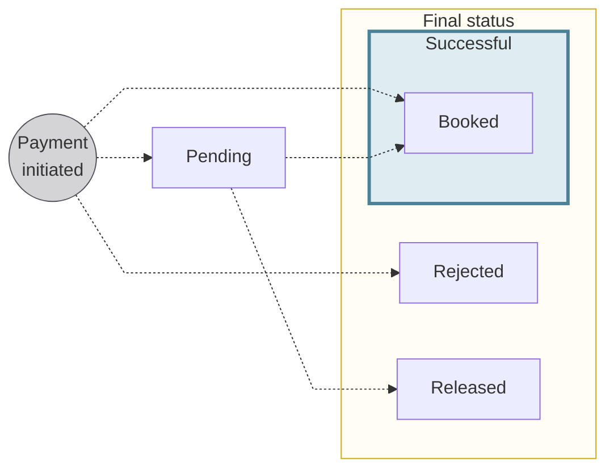

# Card transaction statuses

The status flow for card transactions.

## Status flow {#statuses}

:::info Account balances
There's a **close link** between **transaction statuses** and **account balances**.
Refer to explanations of types of account balances in the [accounts section](/accounts/concepts/account/balances).
:::

| Card transaction status | Explanation |
|:---:|---|
| `Pending` | Card payments initiated with an [authorization](/payments/concepts/cards#authorization) granted. The payments aren't debited from the account yet, but they impact the account's `Pending` balance.  **Next steps:**<ul><li>When funds are received, the status for the debit transaction changes to `Booked` and the status for the authorization transaction changes to `Released`.</li><li>`Pending` card transactions can also be `Rejected`.</li></ul> |
| `Booked` | Completed card payments that are displayed on the official account statement. These card payments have been debited from the account, and they impact the account's `Booked` balance. |
| `Released` | Card authorizations are released for specific reasons. Most of the time, the funds are captured when the merchant requests the actual debit. Authorizations might also be released by the merchant, and they can expire.  When an authorization is released without a debit (clearing), the account's available balance increases by the amount of the authorization. |
| `Rejected` | Declined or refused card payments. For example, you, Swan, Mastercard rejected authorization for the payment, or the account's `Available` balance isn't sufficient to complete the card payment without resulting in a negative balance. |
