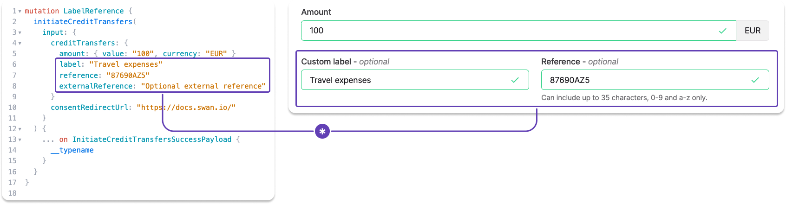

# Credit transfers

<p className="ia-lede">Move money between accounts around the world, whether in euros across the SEPA network or in multiple currencies over local rails and SWIFT.</p>

## Types of credit transfers {#types}

Swan offers **two main types** of credit transfers.
Each type has its own rules, capabilities, and APIs.

Refer to the dedicated sections to understand each type and how they work at Swan:

| Transfer type | Description |
| --- | --- |
| [**SEPA Credit Transfers**](/payments/concepts/credit-transfers/sepa) | Send and receive money using **euro**-based accounts and the [**SEPA network**](/payments/concepts/transactions#sepa)<br /><br />Includes:<br /><ul><li>**Instant** SEPA Credit Transfers</li><li>**Standing Orders** on the SEPA network</li><li>Swan **Internal** Credit Transfers</li></ul> |
| [**International Credit Transfers**](/payments/concepts/credit-transfers/international) | Send and receive money from around the world in over **40 currencies** using **local payment rails** and **SWIFT** |

## Beneficiaries {#beneficiaries}

Add **trusted beneficiaries** to accounts to facilitate credit transfers.
Adding trusted beneficiaries also reduces the risk of sending a transfer to an unintended beneficiary.

You can **add trusted beneficiaries with the API**, either with a dedicated mutation or when initiating a credit transfer.
If you use Swan's Web Banking interface, eligible account members can add trusted beneficiaries from the app.
Beneficiaries who **aren't added** as trusted are referred to as **unsaved** beneficiaries.

- [Add a trusted SEPA beneficiary](/payments/guides/credit-transfers/sepa/add-beneficiary)
- [Add a trusted international beneficiary](/payments/guides/credit-transfers/international/add-beneficiary)

### Beneficiaries and membership permissions {#beneficiaries-permissions}

How account members can interact with beneficiaries depends on their [account membership permissions](/accounts/reference/memberships/membership-permissions#permissions).

| Permission | Beneficiary interaction |
| --- | --- |
| `canViewAccount` | View the list of trusted beneficiaries. |
| `canManageBeneficiaries` | Add trusted beneficiaries. |
| `canInitiatePayments`<br />*with* `canManageBeneficiaries` | Initiate credit transfers to trusted **and** unsaved beneficiaries. |
| `canInitiatePayments`<br />*without* `canManageBeneficiaries` | Initiate credit transfers to trusted beneficiaries **only**. |

Trusted beneficiaries move through their own status flow.
Refer to [trusted beneficiary statuses](/payments/concepts/credit-transfers/statuses#beneficiaries-statuses).

## Label and reference {#label-reference}

Add custom labels and references numbers to your SEPA and International Credit Transfers with the API, or, if you're using it, Swan's Web Banking interface.

Whether your label and reference entries are visible on other financial institutions' platforms and statements depends on their design.



### Custom label {#label-custom}

- Optional field where you can name your transaction.
- According to SEPA, this label is for remittance information (`RemittanceInfo`), or payment details.
- If left empty, the default value for Web Banking is `Transfer to {beneficiary}`. However, nothing is sent to the beneficiary's bank.
- This value is displayed in your Swan transaction history.
- Your **beneficiary probably sees** this reference, though it's impossible to know because every app is different.
- Called `label` in the API `transaction` object.

### Reference {#reference}

- Optional field intended to provide a way for you to include a reference number or code.
- According to SEPA, this reference should be used for the end-to-end identification reference (`EndToEndId`) used to uniquely identify a transaction from start to finish.
- Only characters 0-9 and a-z are allowed in this field. The total number of characters allowed can change, so refer to your transfer form for the character maximum.
- If left empty, there is no default value. Note that the reference field is mandatory for SEPA inter-bank exchanges, so Swan populates an empty field with something similar to your transaction ID.
- This value will be included in the details of a transaction in your transaction history, but not displayed in the main list.
- Your **beneficiary probably sees** this reference, though it's impossible to know because every app is different.
- Called `reference` in the API `transaction` object.

### External reference {#reference-external}

- With the API, you can also add an external reference.
- Share additional information about a transaction only visible to you.
- Called `externalReference` in the API `transaction` object.

## In this section

```flowmap
{
  "mode": "pathway",
  "items": [
    { "title": "SEPA Credit Transfers", "to": "/payments/concepts/credit-transfers/sepa", "desc": "Euro transfers across SEPA: regular, instant, internal, and Standing Orders." },
    { "title": "International Credit Transfers", "to": "/payments/concepts/credit-transfers/international", "desc": "Multi-currency transfers over local rails and SWIFT." },
    { "title": "Credit transfer statuses", "to": "/payments/concepts/credit-transfers/statuses", "desc": "The transfer, trusted beneficiary, and Standing Order status flows." }
  ]
}
```
