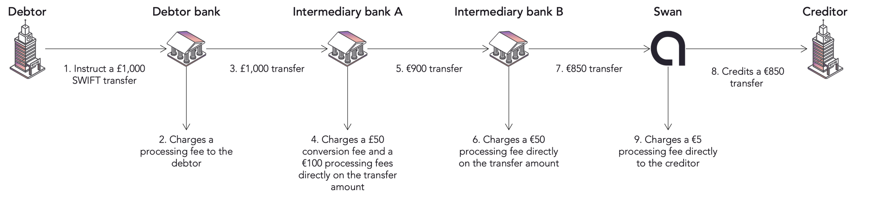

# Incoming International Credit Transfers

Any debtor can send money to a Swan account through SWIFT using Swan's existing BICs. Intermediary banks convert the amount to euros and deduct their fees along the way, and Swan books whatever remains immediately.

Debtors can send <Term id="credit-transfer">credit transfers</Term> to Swan accounts, regardless of the debtor's account currency.
Swan's existing [Bank Identifier Codes (BICs)](/accounts/concepts/ibans/local) are connected to SWIFT, so Swan users don't need an additional <Term id="ibans">IBAN</Term> to receive SWIFT transfers.

  
Swan and intermediary bank details for incoming transfers

  

<ul><li>Swan address<ul><li>Name: Swan SAS</li><li>Address: 95 Avenue du Président Wilson</li><li>Postal code: 93100</li><li>City: Montreuil</li><li>Country: France</li></ul></li><li>Swan BIC and SWIFT code: `SWNBFR22`</li><li>Intermediary bank: the BIC depends on the incoming currency. Refer to [intermediary BIC by incoming currency](#incoming-intermediary-bic).</li></ul>
  

## Intermediary BIC by incoming currency {#incoming-intermediary-bic}

The intermediary BIC to use depends on the incoming currency.
Use the 11-character BIC (with `XXX`) when the sending bank requires it.

| Intermediary BIC | Incoming currencies |
| --- | --- |
| `TRWIGB2BXXX` | `AUD`, `CAD`, `CHF`, `CZK`, `DKK`, `GBP`, `HKD`, `HUF`, `JPY`, `NOK`, `NZD`, `PLN`, `SEK`, `SGD`, `USD` |
| `TRWIBEB3XXX` | `AED`, `BHD`, `BWP`, `CNY`, `EUR`, `ILS`, `KWD`, `MAD`, `MXN`, `OMR`, `QAR`, `RON`, `RSD`, `SAR`, `THB`, `TND`, `TRY`, `UGX`, `ZAR` |

`TRWIBEB3XXX` is the BIC of Wise Europe SA, Belgium.

If the incoming currency isn't listed, contact Swan support before sharing account details with the debtor.

## Standard flow {#incoming-flow}

Consider the following image:

1. Debtor initiates a transfer of £1,000 (GBP) to a Swan account.
1. Debtor's bank charges them a processing fee.
1. Debtor's bank then passes the £1,000 to a first intermediary bank.
1. Swan only has euro-based accounts, so intermediary bank A converts the transfer from GBP to EUR.
    - They charge a £50 fee to convert the currency.
    - They charge an additional €100 (EUR) processing fee.
    - Since the transfer was initiated with shared fees, intermediary bank A deducts their fees directly from the transfer amount.
1. Intermediary bank A then passes the transfer on to a second intermediary bank.
    - After the conversion and the fee deduction, €900 remains.
1. Intermediary bank B charges a €50 processing fee and deducts it from the transfer amount.
1. Intermediary bank B passes the transfer on to Swan.
    - After the conversion and the fee deduction, €850 remains.
1. Swan books the incoming SWIFT transfer's remaining amount (€850) immediately to the Swan user's account.
1. Swan charges a €5 processing fee separately from the transfer.

## Limited account restrictions {#incoming-limited-account-restrictions}

Limited accounts have restrictions on incoming International Credit Transfers to ensure regulatory compliance.

- Any incoming International Credit Transfer, regardless of its amount, on a limited account is automatically rejected.

These restrictions apply while the <Term id="account-holder">account holder</Term> is completing verification and the account remains in `Limited` status.
They are removed when the account holder verification status changes to `Verified` and the payment level changes to `Unlimited`.

Learn more about [limited account transfer restrictions](/accounts/concepts/account/type-and-level#limited-account-restrictions).

## SWIFT details {#incoming-swift}

Incoming International Credit Transfers sent on SWIFT can be sent with one of the following specifications:

1. **`SHA`**: Splits fees between the debtor and their beneficiary. For instance, the payer might pay the fees charged by their bank and the beneficiary might pay the intermediary banks fees. The standard flow example uses `SHA`.
1. **`BEN`**: All fees paid by the beneficiary by deducting them from the transaction amount.
1. **`OUR`**: All fees paid by the debtor. Some banks might not respect this, though, so it's possible to receive an intermediary bank fee as a beneficiary anyway.

## Booked transfers {#incoming-booked}

When Swan receives an incoming International Credit Transfer, Swan books it immediately and creates an `InternationalCreditTransferTransaction` type (step 8 in the [standard flow](#incoming-flow)).

Use the `transactions` query with the ID for your International Credit Transfer to [get information](/payments/guides/credit-transfers/international/get-info).

## Notifications {#incoming-notifications}

Subscribe to the `Transaction.Booked` [webhook](/build/using-api/webhooks#events-transactions) to be notified any time a transaction is created.
The notification's `resourceId` is the incoming transaction's ID.
The [notification content](/build/using-api/webhooks#event-handling-info) section of the webhooks reference shows the payload.

## Currency exchange {#incoming-currency-exchange}

Transferring money internationally requires **currency exchange**.
Think of currency exchange as the cost of selling one currency to purchase another.

For incoming transfers, you can view the `exchangeRate` in the `InternationalCreditTransferTransaction` type, created when the [transaction is booked](#incoming-booked).

Other currency exchange information isn't available for incoming transfers.

Typically, incoming transfers arrive in euros.
If Swan performs the currency exchange, the additional fees in parentheses listed in the [fees table for incoming transfers](/payments/concepts/credit-transfers/international#fees) are charged.
For example, if Swan receives a transfer in United States Dollars, 0.6% of the received amount is charged along with the standard €5 fee.
