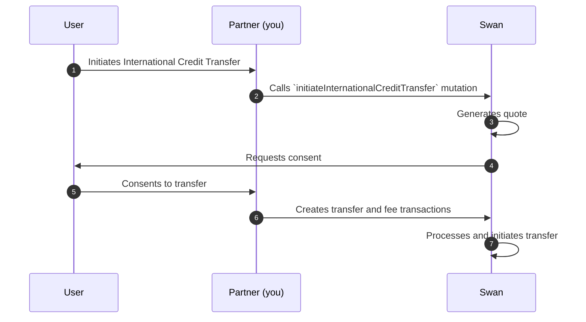

# Outgoing International Credit Transfers

Send money out of a Swan account over local rails or SWIFT. Swan exchanges euros at a mid-market rate locked for one business day, caps each transfer at €100,000, and collects beneficiary and transaction details through dynamic forms.

## Payment rails {#outgoing-rails}

Initiate transfers using one of two payment rails: **local** or **SWIFT**.
Choose your rail when declaring your beneficiary.

| Payment rail | Description | Benefit |
| --- | --- | --- |
| **Local bank transfers** | <ul><li>Pay beneficiaries out of a local bank account</li><li>Example: a transfer to the UK would be paid out of an account based in GBP already in the UK</li></ul> | Faster, less expensive |
| **SWIFT network** | <ul><li>SWIFT: Society for Worldwide Interbank Financial Telecommunication</li><li>Messaging network used by banks worldwide to send and receive financial information</li><li>Takes a bit longer and might involve intermediary banks</li></ul> | Wider availability |

## Currency exchange {#outgoing-currency-exchange}

Transferring money internationally requires **currency exchange**.
Think of currency exchange as the cost of selling one currency to purchase another.

Currency exchange is **always charged for outgoing transfers**.
Swan uses a **mid-market rate**, or the midpoint between the buy and sell prices for the two currencies involved in a transfer, with **no added spread**.
For outgoing International Credit Transfers, the `exchangeRate` is determined when a transfer is initiated.

After initiating the transfer, the **exchange rate is locked for one business day**, even if the market rate changes.
During this time, users must provide <Term id="consent">consent</Term> to execute the transfer.
If the day passes without consent, Swan no longer guarantees the exchange rate.
Therefore, the transfer will be rejected and the user would need to initiate a new transfer.

Find the exchange rate, as well as [fees](/payments/concepts/credit-transfers/international#fees), in the success payload of the `initiateInternationalCreditTransfer` mutation, as well as when consenting to the transfer.

## Transfer limits {#transfer-limits}

A maximum transaction limit of **€100,000.00** (one hundred thousand euros) applies to all outgoing International Credit Transfers. The payment rail used or currency exchange doesn't impact the maximum transaction limit.

:::caution Transfer limit and rejection
All outgoing International Credit Transfers exceeding **€100,000.00** will be rejected.
:::

## Outgoing transaction statuses {#outgoing-statuses}

Outgoing International Credit Transfers cycle through their own [outgoing transfer statuses](/payments/concepts/credit-transfers/statuses#international-outgoing).

## Rejected transactions {#outgoing-r-transactions}

An outgoing International Credit Transfer might be **rejected** for several reasons, including:
- The transfer exceeds the [maximum transaction amount limit](#transfer-limits). 
- Some of the account or bank details are incorrect.
- The account is closed.
- A required mandate was never provided.

However, a common reason for all rejections is **insufficient funds**.

For all outgoing International Credit Transfers, Swan checks the account balance to make sure there is enough money to cover both the transfer amount and the fees.
If there isn't enough money in the account to **cover both the transfer amount and the fees**, the transfer will be **rejected** for insufficient funds.

If a transfer is **rejected**, fees aren't charged.
If a transfer is **returned**, fees are also refunded.

## Outgoing sequence diagram {#outgoing-diagram}

## API dynamic forms {#dynamic-forms}

Swan's outgoing International Credit Transfer API uses dynamic forms.

Dynamic forms mean that the **information requested changes** based on the information you submit in each query.
For example, the required information will be different for a beneficiary in India than for a beneficiary in the UK.

### Integrating dynamic forms {#dynamic-forms-integrate}

Dynamic forms make this feature **more challenging to integrate** for your custom integrations.

In your integration, you should only request the most basic information per query, as shown in the API Explorer.
Specific logic is then required to retrieve the correct key/value pairs according to the information submitted in the dynamic fields.

The concept of **refreshable dynamic fields** is illustrated in the [guide to get beneficiary information](/payments/guides/credit-transfers/international/get-beneficiary-forms). 

:::caution If they're more complex, why use dynamic forms?

Dynamic forms allow Swan to **collect only required information** from your end users, collected in the format of key/value pairs.
Some locations require a few key/value pairs while others might require 10 or more.

Since the required information changes frequently and is outside of Swan's control, **dynamic forms provide the best way** to only collect the correct information, which also minimizes risk and ensures secure transactions.
:::

### Query and mutation order {#dynamic-forms-order}

Due to these dynamic forms, it's critical to **run the queries in order** *before* running the mutation.

1. Optionally, [**get a quote**](/payments/guides/credit-transfers/international/quote).
    - This query provides a quote for the exchange rate and fees.
    - The quote isn't guaranteed.
1. Next, get the list of required key/value pairs for your [**beneficiary**](/payments/guides/credit-transfers/international/get-beneficiary-forms).
    - They're based on the target currency and the beneficiary's country of residence.
1. Then, get the list of required key/value pairs for your [**transaction**](/payments/guides/credit-transfers/international/get-transaction-forms).
    - They're based on the transfer's destination.
1. Finally, [**initiate your transfer**](/payments/guides/credit-transfers/international/initiate).
