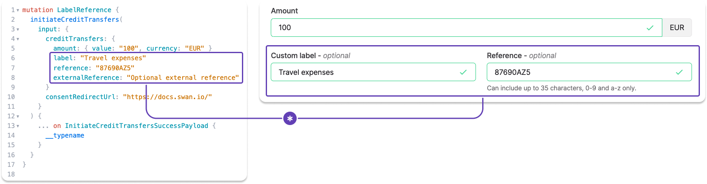

# Label and reference

Every <Term id="credit-transfer">credit transfer</Term> can carry a custom label, a reference, and an external reference. What each field is for, who sees it, and where it lands on the <Term id="transactions">transaction</Term>.

Add custom labels and reference numbers to your SEPA and International Credit Transfers with the API, or, if you're using it, Swan's Web Banking interface.

Whether your label and reference entries are visible on other financial institutions' platforms and statements depends on their design.

## Custom label {#label-custom}

- Optional field where you can name your transaction.
- According to SEPA, this label is for remittance information (`RemittanceInfo`), or payment details.
- If left empty, the default value for Web Banking is `Transfer to {beneficiary}`. However, nothing is sent to the beneficiary's bank.
- This value is displayed in your Swan transaction history.
- Your **beneficiary probably sees** this reference, though it's impossible to know because every app is different.
- Called `label` in the API `transaction` object.

## Reference {#reference}

- Optional field intended to provide a way for you to include a reference number or code.
- According to SEPA, this reference should be used for the end-to-end identification reference (`EndToEndId`) used to uniquely identify a transaction from start to finish.
- Only characters 0-9 and a-z are allowed in this field. The total number of characters allowed can change, so refer to your transfer form for the character maximum.
- If left empty, there is no default value. The reference field is mandatory for SEPA inter-bank exchanges, so Swan populates an empty field with something similar to your transaction ID.
- This value will be included in the details of a transaction in your transaction history, but not displayed in the main list.
- Your **beneficiary probably sees** this reference, though it's impossible to know because every app is different.
- Called `reference` in the API `transaction` object.

## External reference {#reference-external}

- With the API, you can also add an external reference.
- Share additional information about a transaction only visible to you.
- Called `externalReference` in the API `transaction` object.

## Invoice references {#invoice-references}

You can include an **optional** [invoice reference](/payments/guides/credit-transfers/sepa/initiate-ct#invoice-reference) when you initiate a SEPA Credit Transfer using the `labelType` and `label` fields.
Use `labelType` to specify the format of the invoice reference, and provide the specific value of the reference in the `label` field.

The `labelType` can be one of the following:

| `labelType` | Description | Example `label` |
| :---: | --- | :---: |
| `Unstructured` | Free text with no specific format.  | `Invoice April 2025` |
| `Structured`| Structured reference without a specific standard. | `1234567890AB` |
| `OgmVcs`| [Belgian OGM VCS standard](https://www.europeanpaymentscouncil.eu/sites/default/files/inline-files/Febelfin%20-%20AOS-OGMVCS_0.pdf), a 12-digit reference number used for payment reconciliation. | `010806817183`       |
| `Iso` | [ISO 11649](https://www.iso.org/standard/50649.html), the Structured Creditor Reference standard, widely used in Europe.  | `RF18539007547034` |

You'll find the invoice reference in the `transaction.label` field after retrieving your transaction data.
