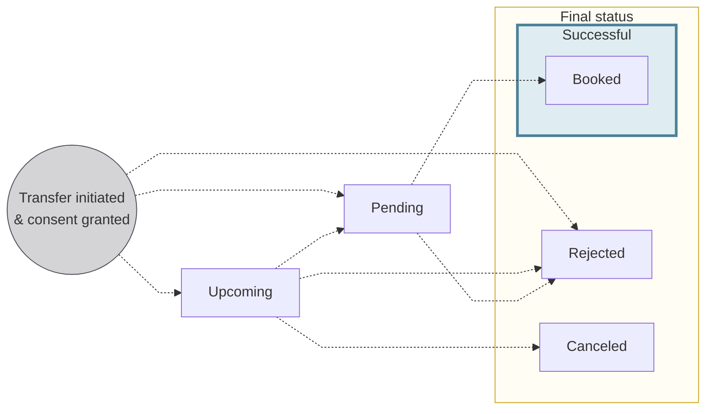
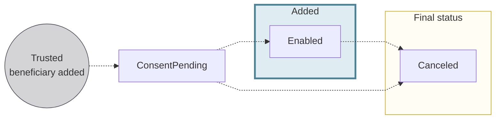
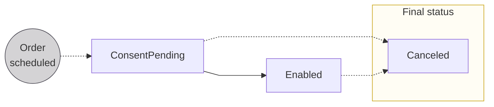
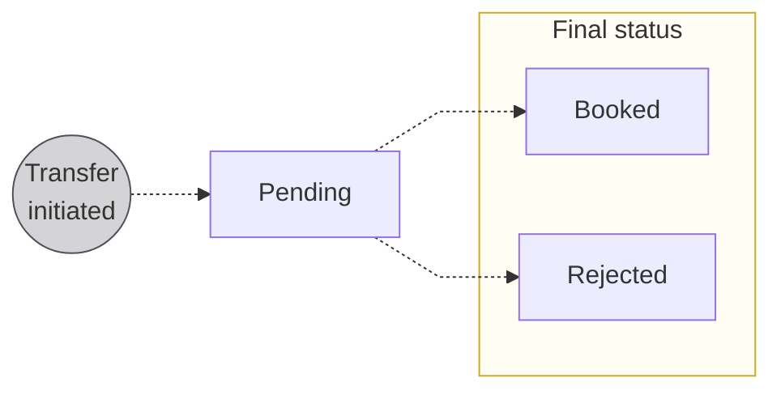

# Credit transfer statuses

The status flows for credit transfer transactions, trusted beneficiaries, and Standing Orders.

## Credit transfer statuses {#statuses}

:::info Account balances
There's a **close link** between **transaction statuses** and **account balances**.
Refer to explanations of types of account balances in the [accounts section](/accounts/concepts/account/balances).
:::

| Transfer transaction status | Explanation |
|---|---|
| `Upcoming` | Transfers are initiated and consent was granted, but the transfers aren't executed yet. Often, this is because the transfer was planned for a future date using the `requestedExecutionAt` input. `Upcoming` transfers don't impact the account balance.  *International Credit Transfers can't be `Upcoming`* |
| `Pending` | Transfers are initiated, consent was granted, and the transfer is set to happen within a few days. The transfers aren't debited from the account yet, but they impact the account's `Pending` balance.  Sometimes, transfers might stay `Pending` for longer than expected. This could be for a few reasons, including the possibility that the transaction required a manual review from Swan, or a SEPA Credit Transfer was initiated on a [TARGET closing day](/payments/concepts/transactions#sepa-availability). |
| `Booked` | Completed credit transfers that are displayed on the official account statement. These transfers have been debited from the account, and they impact the account's `Booked` balance. |
| `Canceled` | An `Upcoming` transaction is canceled by someone with the right to do so, such as the [account holder](/accounts/concepts/account-holders) or an [account member](/accounts/concepts/memberships). Only transfers with the status `Upcoming` can be `Canceled`, and `Canceled` transfers don't impact the account balance. |
| `Rejected` | Declined or refused transfers. For example, the beneficiary account might be closed, or the account's `Available` balance isn't sufficient to complete the transfer without resulting in a negative balance. |

:::caution Standing Orders
[Statuses for Standing Orders](#statuses-standing-orders) differ from other credit transfers.
:::

## Trusted beneficiary statuses {#beneficiaries-statuses}

| Trusted beneficiary status | Explanation |
|---|---|
| `ConsentPending` | An eligible account member added a trusted beneficiary, either directly (with the dedicated mutation or through Web Banking) or when initiating a transfer.  To finish adding the trusted beneficiary, an account member with the `canManageBeneficiaries` permission must consent with [Strong Customer Authentication (SCA)](/topics/users/consent#sca). |
| `Enabled` | Consent was received to add the trusted beneficiary. Eligible account members can now initiate transfers to this trusted beneficiary.  |
| `Canceled` | Consent wasn't received to add the trusted beneficiary, or the trusted beneficiary was removed from the list by an eligible account member. |

## Standing Order statuses {#statuses-standing-orders}

Unlike other credit transfer status flows, Standing Orders only cycle through three statuses.

| Status | Explanation |
| --- | --- |
| `ConsentPending` | Standing Order was scheduled but consent hasn't been received. |
| `Enabled` | Consent for the Standing Order was received, the order is executed as scheduled indefinitely according to its configuration. |
| `Canceled` | Either the Standing Order was canceled or consent was refused. |

## International outgoing transfer statuses {#international-outgoing}

Outgoing International Credit Transfers cycle through three possible transaction statuses.

| Status | Explanation |
| --- | --- |
| `Pending` | Status assigned when the transfer is initiated; the transfer retains the status `Pending` while the transactions associated with the transfer follow the standard transaction status flow |
| `Booked` | Funds arrived in the beneficiary's account |
| `Rejected` | Transfer isn't executed for any of several reasons, including insufficient funds, lack of consent, and more |
