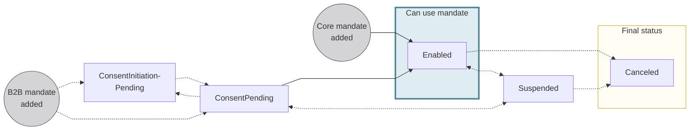
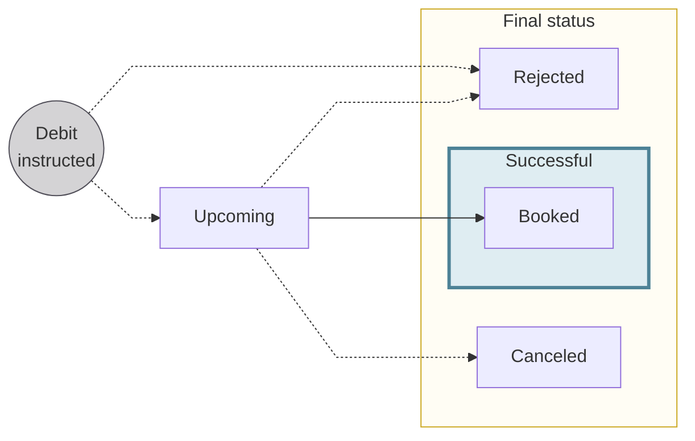

# Direct debit statuses

The status flows for received payment mandates and direct debit transactions.

## Received mandate statuses {#mandates-statuses}

| Payment mandate status | Explanation |
| --- |---|
| `ConsentInitiationPending` | B2B received payment mandate is awaiting consent initiation. This status applies when:<ul><li>A direct debit instruction is received without an existing mandate, and the mandate is added automatically.</li><li>A mandate is updated and requires user approval before the updated mandate can be activated.</li></ul>**Next steps**: <ul><li>Call the [`enableReceivedDirectDebitMandate`](/payments/guides/direct-debit/enable-mandate) mutation to initiate consent.</li><li>After the debtor provides consent, the status moves to `Enabled`.</li><li>If consent is refused or expires, the status remains `ConsentInitiationPending` and consent can be re-initiated.</li></ul>*Core received mandates never have the status `ConsentInitiationPending`.* |
| `ConsentPending` | B2B received payment mandate has an active consent request pending debtor action.  **Next steps**: <ul><li>If the debtor consents to the mandate, the status moves to `Enabled`.</li><li>If the debtor refuses consent or the consent expires, the status returns to `ConsentInitiationPending`.</li></ul>*Core received mandates never have the status `ConsentPending`.* |
| `Enabled` | Received payment mandate is valid and direct debit instructions can be fulfilled. |
| `Suspended` | Debtor requested the received payment mandate be suspended, using the [`suspendReceivedDirectDebitMandate`](/payments/guides/direct-debit/suspend-mandate) mutation.  For example, you want to stop a creditor from taking money from the account temporarily, and you'll inform Swan when to change the status back to `Enabled`.  Learn more: [Suspend a payment mandate](/payments/guides/direct-debit/suspend-mandate). |
| `Canceled` | Received payment mandate is canceled and no longer available for use. Note that Swan cancels `OneOff` mandates **automatically** after they're used. |

## Direct debit statuses {#statuses}

:::info Account balances
There's a **close link** between **transaction statuses** and **account balances**.
Refer to explanations of types of account balances in the [accounts section](/accounts/concepts/account/balances).
:::

| Direct debit transaction status | Explanation |
|---|---|
| `Upcoming` | Transaction is created after passing Swan's preliminary checks (for example, if the mandate already exists, it's valid; the account isn't closed). `Upcoming` debits don't impact the account balance. |
| `Booked` | Completed debits that are displayed on the official account statement. These debits have been debited from the account, and they impact the account's `Booked` balance. |
| `Canceled` | An `Upcoming` transaction is canceled by someone with the right to do so, such as the [account holder](/accounts/concepts/account-holders) or an [account member](/accounts/concepts/memberships). Only debits with the status `Upcoming` can be `Canceled`, and `Canceled` debits don't impact the account balance. |
| `Rejected` | Declined or refused debits. For example, the beneficiary account might be closed, or the account's `Available` balance isn't sufficient to complete the debit without resulting in a negative balance.  A transaction can also be `Rejected` without being assigned any other status if the transaction didn't pass the initial checks (examples in `Upcoming`). |
