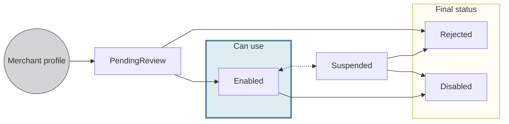
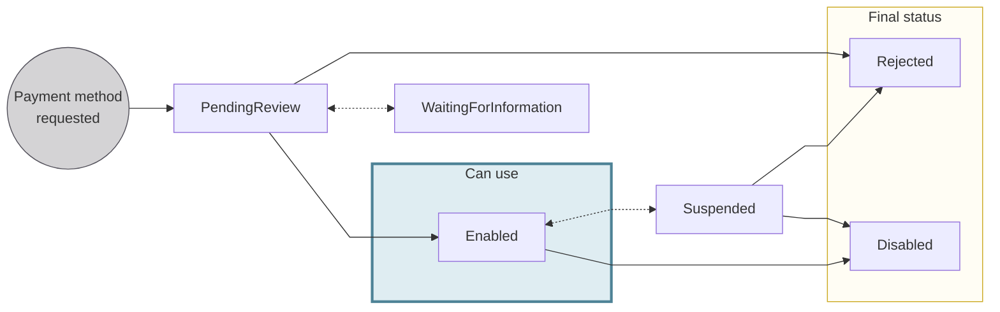
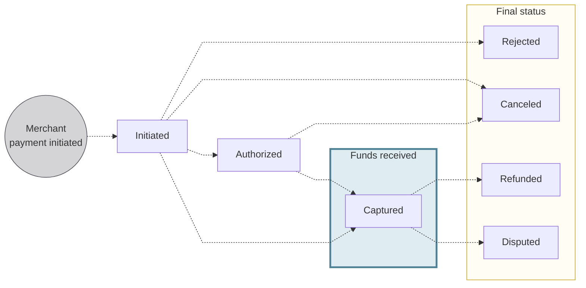

# Merchant statuses

The status machines for <Term id="merchant-profile">merchant profiles</Term>, <Term id="merchant-payment-method">merchant payment methods</Term>, and merchant payments.

## Merchant profile statuses {#profile-statuses}

| Profile status | Explanation |
|:---:|---|
| `PendingReview` | The profile is under review by Swan. You can request payment methods while a profile is `PendingReview`.  **Next steps**: If the profile doesn't meet Swan's requirements or is considered a risk, the status moves to `Rejected`. Otherwise, it moves to `Enabled`. |
| `Enabled` | The profile is active. Request payment methods, accept <Term id="payments">payments</Term>, and update the profile's information.  **Next steps**: Swan can move the profile to `Suspended` for review. You can move it to `Disabled` with the `disableMerchantProfile` mutation. |
| `Suspended` | **Swan** assigns this status when the merchant's profile needs a review. The profile can't be `Enabled` again until the review is complete.  **Next steps**: After the review, the status returns to `Enabled` or moves to `Rejected`. You can also move it to `Disabled`. |
| `Rejected` | **Swan** assigns this **final status** when a profile's risk is too high, or for other risk-related reasons. The decision can't be reversed: submit a new request for the <Term id="account-holder">account holder</Term>, which Swan reviews separately. |
| `Disabled` | **You** set this final status using the `disableMerchantProfile` mutation. |

### Merchant profile rejection reasons {#profile-rejected}

A merchant profile can be rejected for the following reasons, available in the `MerchantProfileRejectionReason` enum:

| Rejection reason | Explanation |
| --- | --- |
| `DuplicateProfile` | The profile is the same as an existing one. |
| `InconsistentOrMissingInformation` | Key information is missing or highly inconsistent, for example, an unrelated website. |
| `UnsupportedActivity` | The activity is prohibited or the NACE code isn't supported. |
| `ContractualCriteriaNotFulfilled` | The profile doesn't meet specific criteria agreed upon with Partners. |
| `GenericRejection` | The profile was rejected for a general reason not covered by other categories. |
| `SuspiciousBehavior` | The profile was rejected due to alerts related to suspicious processing behavior. |
| `AccountClosed` | The corresponding account is `Closed`. |

:::info For Partners only
These rejection reasons are intended for Partners and shouldn't be displayed to end users.
If you need more details about a specific rejection, contact Swan.
:::

## Payment method statuses {#method-statuses}

| Payment method status | Explanation |
|---|---|
| `PendingReview` | The payment method is under review by Swan. While a profile is `PendingReview`, you can still request payment methods.  **Next steps**: If the request doesn't meet Swan's requirements or is considered a risk, the status moves to `Rejected`. If Swan needs more information, it moves to `WaitingForInformation`. Otherwise, it moves to `Enabled`. |
| `WaitingForInformation` | More information is needed before Swan can review the payment method. The `verificationRequirements` list shows what the Partner must provide to trigger a new review. [Provide the missing information](/payments/guides/merchants/missing-information), then request a new review with the `requestSupportingDocumentCollectionReview` mutation.  **Next steps**: After all required information is submitted, the status returns to `PendingReview` for a new review. |
| `Enabled` | The payment method is active. Use `Enabled` payment methods to accept payments. Updates to payment methods can only occur when they're `Enabled`.  **Next steps**: Swan can move the payment method to `Suspended` for review. You can move it to `Disabled` with the `disableMerchantPaymentMethod` mutation. |
| `Suspended` | **Swan** assigns this status when the merchant's use of the payment method needs a review. The payment method can't be `Enabled` again until the review is complete.  **Next steps**: After the review, the status returns to `Enabled` or moves to `Rejected`. You can also move it to `Disabled`. |
| `Rejected` | **Swan** assigns this **final status** when a payment method's risk is too high, or for other risk-related reasons. |
| `Disabled` | **You** set this final status using the `disableMerchantPaymentMethod` mutation. |

### Payment method rejection reasons {#payment-method-rejected}

A merchant payment method can be rejected for the following reasons, available in the `MerchantPaymentMethodRejectionReason` enum:

| Rejection reason | Explanation |
|------------------|-------------|
| `InvalidUseCase` | The requested payment method is incompatible with the merchant's business model. |
| `InconsistentOrMissingInformation` | The merchant didn't provide, or refused to provide, requested information. |
| `UnsupportedPaymentMethod` | The Partner isn't allowed to request this payment method. |
| `UnsupportedMerchantProfile` | The merchant profile isn't supported for this payment method. |
| `UnsupportedActivity` | The activity is prohibited or the NACE code isn't supported. |
| `ContractualCriteriaNotFulfilled` | The request doesn't meet the contractual criterion agreed upon with the Partner. |
| `SuspiciousBehavior` | The request was rejected due to alerts related to suspicious processing behavior. |
| `GenericRejection` | The request was rejected for a reason not covered by other categories. |
| `SwanTechnicalErrorOccurred` | An error occurred on Swan's side. |
| `AccountClosed` | The corresponding account is `Closed`. |

:::info For Partners only
These rejection reasons are intended for Partners and shouldn't be displayed to end users.
If you need more details about a specific rejection, contact Swan.
:::

## Merchant payment statuses {#payments-statuses}

The [merchant payment object](/payments/concepts/merchants/payments) has distinct statuses to follow a payment's lifecycle.
All payments begin in the `Initiated` status.
From `Initiated`, a payment may be directly `Captured`, `Canceled` by the merchant, or `Rejected` by Swan or another participant in the payment scheme, such as the customer's payment service provider.
**For card payments**, the flow may proceed from `Initiated` to `Authorized` before being either `Captured` or `Canceled`.
**After capture**, a payment may still be `Refunded` by the merchant or `Disputed` by the customer, depending on the payment method.

| Payment object status | Explanation |
|---|---|
| `Initiated` | The payment object has been created, but the payment is not yet authorized or guaranteed.  **Next steps**: The payment moves to `Authorized` (card payments only), `Captured`, `Rejected`, or `Canceled`. |
| `Authorized` | Applies only to card payments. The payment has been authorized by the customer's bank. The funds are guaranteed but not yet captured.  **Next steps**: The payment moves to `Captured`, or to `Canceled` if the authorization is voided. |
| `Canceled` | The payment was canceled. Funds can no longer be captured. This is a final status. |
| `Rejected` | The payment was rejected by Swan or another participant in the payment scheme before the funds were captured. This is a final status. |
| `Captured` | The payment is successfully authorized (for card payments) or processed (for all other payment methods), and the funds are debited from the customer's account. This can be the final status of a successful payment flow.  **Next steps**: The customer can dispute the payment (`Disputed`) or the merchant can refund it (`Refunded`), depending on the payment method. |
| `Refunded` | The payment was reversed by the merchant either for the full amount or partially depending on the payment method. This is a final status. |
| `Disputed` | The customer disputed the payment with their bank either for the full amount or partially depending on the payment method. This is a final status. |

The `MerchantPaymentStatus` enum also includes `PartiallyDisputed`, returned when a customer disputes only part of a payment.

### Statuses by payment method {#payments-statuses-by-method}

| Payment method | `Authorized` | `Refunded` | `Disputed` | Notes |
| --- | :---: | :---: | :---: | --- |
| [Online cards](/payments/concepts/merchants/online-cards) | <Yes /> | <Yes /> | <Yes /> | Refunds and disputes can cover some or all of the amount. |
| [In-person cards](/payments/concepts/merchants/in-person-cards) | <Yes /> | <Yes /> | <Yes /> | Refunds aren't self-service: merchants request them from Swan Support. |
| [SEPA Direct Debit](/payments/concepts/merchants/sepa-direct-debit) | <No /> | <Yes /> | <Yes /> | Refunds and disputes cover the full amount. |
| [Internal Direct Debit](/payments/concepts/merchants/internal-direct-debit) | <No /> | <Yes /> | <Yes /> | Refunds and returns apply to the Standard scheme only. |
| [French checks](/payments/concepts/merchants/french-checks) | <No /> | <No /> | <Yes /> | `Disputed` also covers checks returned by the payer's bank after capture. |
