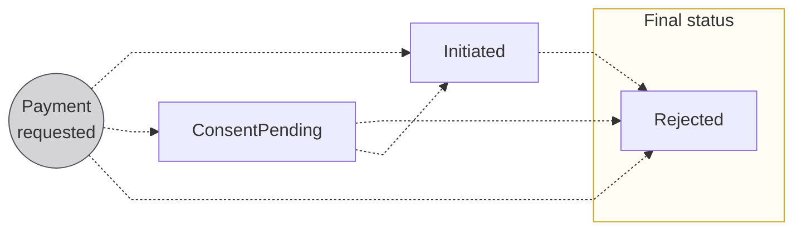

# Payment statuses

The status flow for <a href="/payments/concepts/payments">payments</a>. A requested payment waits for <Term id="consent">consent</Term> when consent is required, then either enters the transaction flow or is rejected.

## Statuses {#payments-statuses}

| Payment status | Explanation |
|---|---|
| `ConsentPending` | Status only occurs when consent is required for the payment  **Next step**: Transaction flow blocked while waiting for <Term id="consent">consent</Term>; when consent is received, transaction flow resumes and payment status changes to `Initiated` |
| `Initiated` | Payment successfully requested; enters the [transaction flow](/payments/concepts/transactions/statuses#transactions-statuses) |
| `Rejected` | Payment rejected, either directly after payment initiation or from the `Initiated` status |
