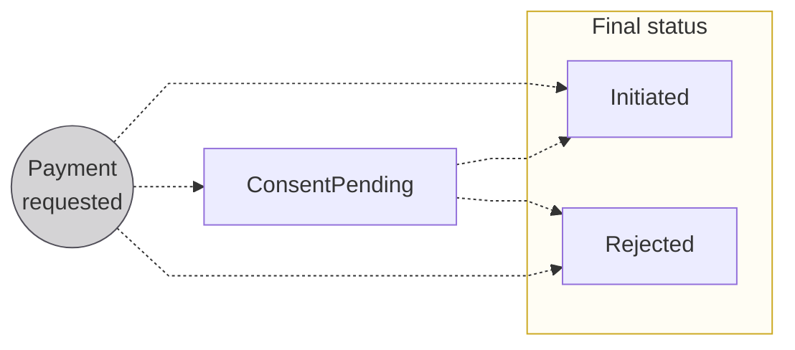
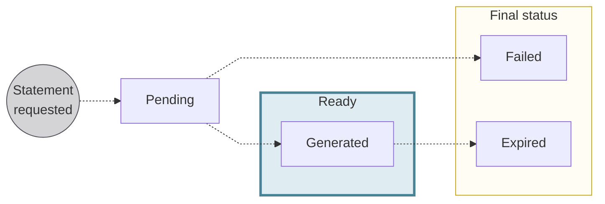

import TransactionStatuses from '../../../_shared/partials/_transaction-statuses.mdx';

# Transaction statuses

The status flows for payments, transactions, and transaction statements.

## Payment statuses {#payments-statuses}

| Payment status | Explanation |
|---|---|
| `ConsentPending` | Status only occurs when consent is required for the payment  **Next step**: Transaction flow blocked while waiting for consent; when consent is received, transaction flow resumes and payment status changes to `Initiated` |
| `Initiated` | Payment successfully requested; enters the [transaction flow](#transactions-statuses) |
| `Rejected` | Payment rejected, either directly after payment initiation or from the `Initiated` status |

## Transaction statuses {#transactions-statuses}

There are six possible statuses for Swan transactions: `Upcoming`, `Pending`, `Booked`, `Released`, `Canceled`, and `Rejected`.
Transactions directly impact [account balances](/accounts/concepts/account/balances).

**Each payment method** uses a **different combination of these statuses** with specific flows.
Refer to the schemas for [credit transfers](/payments/concepts/credit-transfers/statuses), [direct debits](/payments/concepts/direct-debit/statuses), and [cards](/payments/concepts/cards/statuses) for more information about statuses for that payment method.
Not all statuses are used for all transaction types.

<TransactionStatuses />

## Transaction statement statuses {#transactions-statements-statuses}

| Transaction statement status | Explanation |
|---|---|
| `Pending` | Transaction statement is being generated. |
| `Generated` | Transaction statement was generated successfully, triggering a `TransactionStatement.Generated` webhook notification. |
| `Failed` | The statement couldn't be generated. You can try again. |
| `Expired` | Transaction statement was generated successfully. However, it wasn't downloaded within seven days and therefore expired. |
