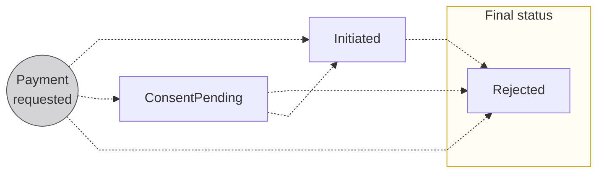
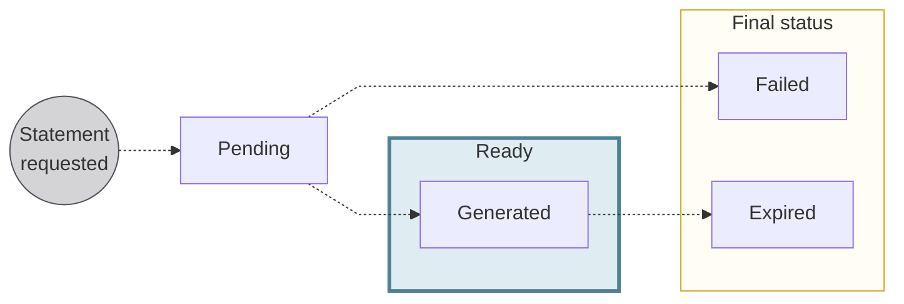

# Transaction statuses

The status flows for <Term id="payments">payments</Term>, <Term id="transactions">transactions</Term>, and transaction statements.

## Payment statuses {#payments-statuses}

```mermaid
%%{ init: { 'flowchart': { 'curve': 'linear' } } }%%
flowchart LR
    P((Payment<br/>requested)) -.-> I[Initiated]
    P -.-> CP[ConsentPending]
    CP -.-> RJ[Rejected]
    P -.-> RJ
    CP -.-> I
    I -.-> RJ
    subgraph F[Final status]
        RJ
    end
    style P fill:#D4D3D5,stroke:#514F59
    style F fill:#fffdf4,stroke:#cca922
```

| Payment status | Explanation |
|---|---|
| `ConsentPending` | Status only occurs when consent is required for the payment  **Next step**: Transaction flow blocked while waiting for <Term id="consent">consent</Term>; when consent is received, transaction flow resumes and payment status changes to `Initiated` |
| `Initiated` | Payment successfully requested; enters the [transaction flow](#transactions-statuses) |
| `Rejected` | Payment rejected, either directly after payment initiation or from the `Initiated` status |

## Transaction statuses {#transactions-statuses}

The `TransactionStatus` enum has eight values. Six apply to every payment method: `Upcoming`, `Pending`, `Booked`, `Released`, `Canceled`, and `Rejected`. `Settled` applies only to in-person merchant card transactions, and `Deferred` to transactions made with a deferred debit card.
Transactions directly impact [account balances](/accounts/concepts/account/balances).

**Each payment method** uses a **different combination of these statuses** with specific flows.
Refer to the schemas for [credit transfers](/payments/concepts/credit-transfers/statuses), [direct debits](/payments/concepts/direct-debit/statuses), and [cards](/payments/concepts/cards/statuses) for more information about statuses for that payment method.
Not all statuses are used for all transaction types.

| Transaction status | Explanation |
| --- | --- |
| `Upcoming` | Transaction was initiated and consent was granted, but the transaction isn't executed yet. `Upcoming` transactions don't impact the account balance.  **Next steps**: The transaction moves to `Pending` or `Booked` when execution starts, or to `Canceled` or `Rejected`. |
| `Pending` | Transaction was initiated, consent was granted, and the transaction is set to happen within a few days. The transactions aren't debited from the account yet, but they impact the account's `Pending` balance.  **Next steps**: The transaction moves to `Booked` when executed, or to `Rejected`. Card authorizations can also be `Released`. |
| `Booked` | Completed transactions that are displayed on the official account statement. These transactions have been debited from the account, and they impact the account's `Booked` balance. |
| `Released` | Unique to card transactions, card authorizations might be released for specific reasons. `Released` transactions can impact the account balance. Refer to the [card payments section](/payments/concepts/cards/statuses) for more information. |
| `Canceled` | An `Upcoming` transaction is canceled by someone with the right to do so, such as the [account holder](/accounts/concepts/account-holders), an [account member](/accounts/concepts/memberships), or a [merchant](/payments/concepts/merchants). Only transactions with the status `Upcoming` can be `Canceled`, and `Canceled` transactions don't impact the account balance. |
| `Rejected` | Declined or refused transactions. For example, the beneficiary account might be closed, or the account's `Available` balance isn't sufficient to complete the transaction without resulting in a negative balance. |
| `Settled` | Unique to [in-person merchant card transactions](/payments/concepts/merchants/in-person-cards#settled-status): the transaction was posted to the account through a separate `Booked` settlement credit transfer, identified by `settlementTransactionId`. `Settled` transactions don't impact the account balance themselves. |
| `Deferred` | Transactions made with a deferred debit card, posted to the account at the end of the deferral period. |

## Transaction statement statuses {#transactions-statements-statuses}

```mermaid
%%{ init: { 'flowchart': { 'curve': 'linear' } } }%%
flowchart LR
    SR((Statement<br/>requested)) -.-> P[Pending]
    P -.-> G[Generated]
    P -.-> FA[Failed]
    G -.-> E[Expired]
    subgraph R[Ready]
        G
    end
    subgraph F[Final status]
        FA
        E
    end
    style SR fill:#D4D3D5,stroke:#514F59
    style F fill:#fffdf4,stroke:#cca922
    style R fill:#dfedf2,stroke:#4d8296,stroke-width:3px
```

| Transaction statement status | Explanation |
|---|---|
| `Pending` | Transaction statement is being generated.  **Next steps**: The statement moves to `Generated`, or to `Failed`. |
| `Generated` | Transaction statement was generated successfully, triggering a `TransactionStatement.Generated` <Term id="webhooks">webhook</Term> notification.  **Next steps**: The statement moves to `Expired` if it isn't downloaded within seven days. |
| `Failed` | The statement couldn't be generated. You can try again. |
| `Expired` | Transaction statement was generated successfully. However, it wasn't downloaded within seven days and therefore expired. |
