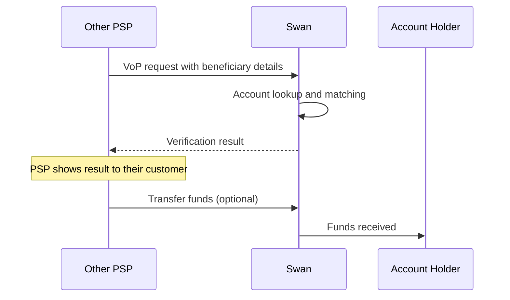

# Incoming Verification of Payee requests

When another bank verifies a beneficiary before sending money to a Swan account, Swan answers automatically by matching the received name or identifier against the <Term id="account-holder">account holder</Term>'s registered details. Nothing to implement, but the matching rules decide what senders see.

:::info Regulatory requirement
Under the [European Instant Payments Regulation (IPR)](https://eur-lex.europa.eu/legal-content/EN/TXT/HTML/?uri=OJ:L_202400886), all PSPs in the SEPA zone must offer VoP services for incoming transfers.
:::

## How incoming VoP works {#how-it-works}

Swan operates as a responding PSP registered with the [EPC Directory Service (EDS)](https://www.europeanpaymentscouncil.eu/what-we-do/other-epc-activities/epc-directory-service).
When another PSP prepares a transfer to a Swan account, it first sends a VoP request with the beneficiary details.
Swan looks up the account, runs the [matching algorithm](#matching-algorithm), and returns a [verification result](#verification-outcomes).
The requesting PSP shows the result to its customer, who decides whether to proceed.

Because verification happens before the transfer, Swan can't link an incoming transfer to the VoP request that preceded it.
Transfers can still arrive after a No match result.

## Supported identification types {#identification-types}

Swan supports the following payee identification types with a Swan [Bank Identifier Code (BIC)](/accounts/concepts/ibans/local).

| Identification type | Definition | Company <Term id="ibans">IBAN</Term> | Individual IBAN |
| --- | --- | --- | --- |
| **Name** | Name of the legal entity or individual | `AccountHolderInfo.name` | `AccountHolderInfo.name` |
| **Tax number** | Number assigned by a tax authority to identify an organization | `AccountHolder.registration.taxIdentificationNumber` | Not applicable |
| **Company identification** | Identification assigned to an organization by a national authority, such as a corporate registration number | `AccountHolder.registration` | Not applicable |
| **SIREN** | 9-digit code assigned by INSEE, the French National Institute for Statistics and Economic Studies, to identify an organization in France | `AccountHolder.registration` (same as company identification) | Not applicable |

## Matching algorithm {#matching-algorithm}

Swan checks the received name against several variations of the account holder's registered names, then returns the best result to the requesting PSP.
Checking variations raises the share of requests that match.

| Account type | Variations checked |
| --- | --- |
| **Company** | Legal name (`AccountHolderInfo.name`), trade name (`CompanyInfo.tradeName`), each of these + "Swan", and each of these + the project name (`ProjectInfo.name`) |
| **Individual** | Name (`AccountHolderInfo.name`), name + "Swan", and name + the project name (`ProjectInfo.name`) |

ID numbers (tax number, company identification, SIREN) must match exactly.
For example, a stored `DE136695976` doesn't match a received `136695976`, and a stored `9234.56.788` doesn't match `923456788`.

### Verification outcomes {#verification-outcomes}

Swan returns one of four possible results.
Name similarity is measured with the Levenshtein distance.

| Result type | When it occurs |
| --- | --- |
| **Match** | Exact name (100% similarity) or exact ID number |
| **Close match** | Similar but not identical name (70-99% similarity) |
| **No match** | Significantly different name (under 70% similarity) or different ID number |
| **Impossible to match** | Account not found, unsupported ID type, or account with `Closed` or `Suspended` status |

Requests for accounts in `Closing` status go through standard matching and return Match, Close match, or No match, in line with incoming <Term id="credit-transfer">credit transfers</Term>, which `Closing` accounts accept to settle outstanding debts. Only `Closed` and `Suspended` accounts return Impossible to match.

**Example**: Swan receives "Awesome Company" for a company IBAN.

| Received name | Swan checks against | Result type |
| --- | --- | --- |
| Awesome Company | Legal name: "AWESOME COMPANY SAS" | Close match (79%) |
| Awesome Company | Trade name: "Awesome Company" | Match (100%) |
| Awesome Company | Legal name + Swan: "AWESOME COMPANY SAS Swan" | No match (62%) |
| Awesome Company | Trade name + Swan: "Awesome Company Swan" | Close match (75%) |
| Awesome Company | Legal name + Project: "AWESOME COMPANY SAS FinanceApp" | No match (50%) |
| Awesome Company | Trade name + Project: "Awesome Company FinanceApp" | No match (58%) |

Swan returns the best result: Match.
Had the trade name not been registered, the best result would have been the Close match on the legal name.

## Help senders match {#correct-information}

Senders get the best result when they use the account holder's name exactly as registered with Swan.
Ask your users to:

- Use the complete legal name, including all registered middle names, spelled correctly.
- For business accounts, use the full legal company name or the registered trade name, not an unregistered merchant name.

Share [Swan's end-user support article](https://support.swan.io/hc/en-150/articles/30680956306333-Verification-of-Payee-VoP) to help train users.

### Trade names {#updating-trade-names}

Requests that use a trade name only match if that trade name is registered on the account holder.
To add or update a trade name, [contact Swan Support](https://support.swan.io/hc/en-150/requests/new) with the account holder ID and the trade name.
For several account holders, submit one consolidated ticket.

:::info KYC review required
Trade name updates require a KYC review by Swan's compliance team. Allow time for processing when planning updates.
:::

## Monitoring and logging {#monitoring}

Starting Q4 2025, Swan will log VoP requests and results to compile statistics and improve the matching algorithm configuration if necessary.
