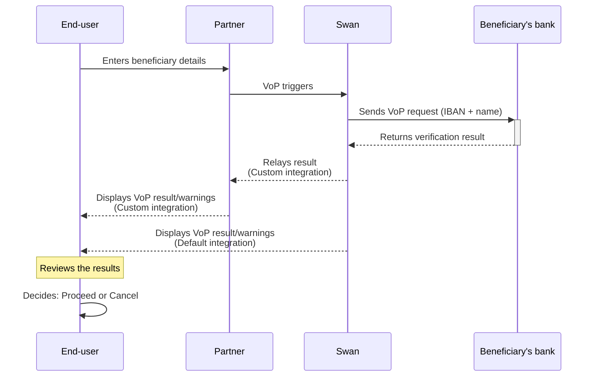
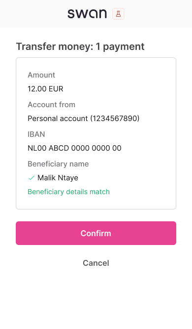
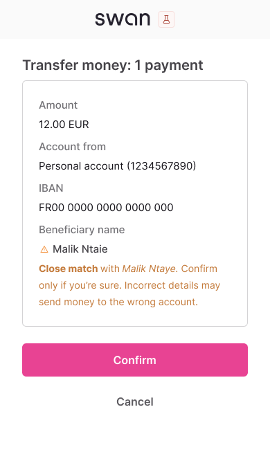
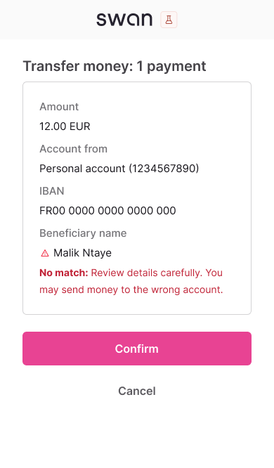
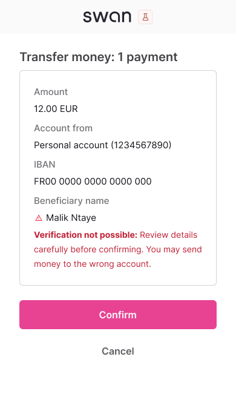

# Verification of Payee

<p className="ia-lede"><Term id="verification-of-payee">Verification of Payee</Term> (VoP) checks beneficiary details against the <Term id="account-holder">account holder</Term> registered at the beneficiary's bank before a <Term id="credit-transfer">SEPA Credit Transfer</Term> is sent, to reduce fraud and payment errors.</p>

import VerificationOfPayeeDefinition from '../../../_shared/definitions/_verification-of-payee.mdx';

> <VerificationOfPayeeDefinition />

:::info Mandatory compliance
Required for all SEPA Credit Transfers and Instant SEPA Credit Transfers under the [European Instant Payments Regulation (IPR)](https://www.ecb.europa.eu/paym/integration/retail/instant_payments/html/instant_payments_regulation.en.html) published in March 2024, for all Payment Service Providers (PSPs) in the Eurozone offering SEPA Credit Transfers.
:::

## Overview {#overview}

**Verification of Payee (VoP)** is a European service that checks beneficiary details against account holder information before initiating SEPA Credit Transfers and Instant SEPA Credit Transfers. This service aims to reduce payment fraud and errors by confirming that the beneficiary details match the account holder registered with the beneficiary's bank.

### Key benefits {#benefits}

For your integration:
- **Reduced disputes**: Prevent misdirected payments and end-user support tickets.
- **Better user experience**: Build trust through transparent payment verification.
- **Operational efficiency**: Fewer payment failures and reversals to handle.

For your end-users:
- **Fraud protection**: Ensure the funds go to the intended recipient.
- **Error prevention**: Catch typos and formatting issues early.
- **Payment confidence**: Know transfers will reach the intended recipient.

### Geographic scope and timeline {#coverage}

VoP applies to all countries in the SEPA region. Payment Service Providers (PSPs) have varying implementation timelines based on their location:

| Payment Services Provider location | VoP mandatory date |
| --- | --- |
| [Eurozone](https://economy-finance.ec.europa.eu/euro/what-euro-area_en) | October 9, 2025 |
| Non-Eurozone | January 9, 2027 |

The service is **free of charge** for Swan account holders as mandated by the regulation.

## Swan's VoP capabilities {#swan-vop-capabilities}

Swan acts as both a requesting and a responding PSP:

- **Outgoing VoP requests**: When your users send transfers to external accounts, Swan verifies beneficiary details with the receiving bank before processing the payment.
- **Incoming VoP requests**: When other PSPs send transfers to Swan accounts, Swan automatically responds to their verification requests using account holder information.

Swan handles **incoming VoP requests** automatically, without any implementation from partners. Refer to [incoming VoP requests](/payments/concepts/verification-of-payee/incoming-requests) for how Swan matches the received details against the account holder.
For **outgoing VoP requests**, you choose an [integration option](/payments/concepts/verification-of-payee/integration-options).

## How VoP works {#how-vop-works}

### High-level flow {#high-level-flow}

VoP happens before sending money to a beneficiary, through this process:

1. **VoP required**: All SEPA Credit Transfers and Instant SEPA Credit Transfers must be verified before authorization.
2. **Verification request**: Swan sends a VoP request to the beneficiary's bank with the <Term id="ibans">IBAN</Term> and beneficiary name.
3. **Verification response**: The beneficiary's bank responds with the verification result.
4. **Result displayed**: VoP result and associated warnings are shown to the end-user.



:::caution Swan relays results: it doesn't determine them
For outgoing VoP requests, results are determined solely by the **beneficiary's bank** (the creditor's PSP). Swan sends the verification request and displays the result exactly as received. Swan has no influence over the outcome and can't modify or override it.

If a result seems unexpected, the beneficiary's bank made that determination based on their own matching logic.
:::

Following the [European Payments Council (EPC)'s recommended matching rules](https://www.europeanpaymentscouncil.eu/sites/default/files/kb/file/2024-10/EPC288-23%20v1.0%20EPC%20Recommendations%20for%20the%20Matching%20Processes%20under%20the%20VOP%20Scheme%20Rulebook_0.pdf), the name is the first and last name of a natural person (individual), or the legal or commercial name of a legal person (company).

### VoP results {#vop-results}

The beneficiary's bank can return one of four verification results. **All results must be displayed to the end-user**. Swan will systematically display the VoP result and warning on the SCA <Term id="consent">consent</Term> screen.

<Tabs>
  <TabItem value="match" label="Match" id="vop-match" default>
    #### Match result

    **Result**: Exact match found between provided details and account holder information
    
    **End-user action**: Safe to proceed with transfer
    
    **Mobile consent screen**:
    <div style={{width: 'fit-content', margin: 'auto', border: '1px solid #e5e7eb', borderRadius: '8px', overflow: 'hidden'}}>
      
    </div>
  </TabItem>
  
  <TabItem value="close" label="Close match" id="vop-close">
    #### Close match result

    **Result**: Close match with suggested correction from beneficiary's bank
    
    **End-user action**: Review suggested name correction before proceeding
    
    **Mobile consent screen**:
    <div style={{width: 'fit-content', margin: 'auto', border: '1px solid #e5e7eb', borderRadius: '8px', overflow: 'hidden'}}>
      
    </div>
  </TabItem>
  
  <TabItem value="no-match" label="No match" id="vop-no-match">
    #### No match result

    **Result**: No match found between provided details and account holder information
    
    **End-user action**: Verify beneficiary details carefully before proceeding
    
    **Mobile consent screen**:
    <div style={{width: 'fit-content', margin: 'auto', border: '1px solid #e5e7eb', borderRadius: '8px', overflow: 'hidden'}}>
      
    </div>
  </TabItem>
  
  <TabItem value="not-possible" label="Verification not possible" id="vop-not-possible">
    #### Verification not possible result

    **Result**: IBAN verification failed. Check the IBAN format, try again, or contact the recipient's bank if the issue persists.
    
    **End-user action**: Verify beneficiary details carefully before proceeding
    
    **Mobile consent screen**:
    <div style={{width: 'fit-content', margin: 'auto', border: '1px solid #e5e7eb', borderRadius: '8px', overflow: 'hidden'}}>
      
    </div>
  </TabItem>
</Tabs>

:::tip VoP enables informed decisions
Verification of Payee provides verification results so end-users can make informed decisions, but doesn't block payments from proceeding.
:::

### User liability with Verification of Payee {#user-liability}

Users who authorize a transfer after receiving a Close match, No match, or Verification not possible warning accept the associated risks:

- The user bears responsibility if funds reach the wrong account.
- Refunds are not available for misdirected transfers.

Users can find complete VoP liability information in their Swan account's Terms and Conditions.

### Standing Orders {#standing-orders}

VoP applies to <Term id="standing-order">Standing Orders</Term> with two key differences:

1. **Initial verification only**: VoP happens at the scheduling stage when creating the Standing Order.
2. **Existing Standing Orders**: Standing Orders authorized before October 9, 2025 aren't verified. Every Standing Order created since then is.

## Integration options {#integration-flows}

Swan offers two compliant ways to meet the VoP requirement.
Refer to [VoP integration options](/payments/concepts/verification-of-payee/integration-options) for the comparison, the supported payment types, and both flows.

### Option 1: Default verification {#option-1}

Swan runs the check when `initiateCreditTransfers` is called and shows the result on the consent screen. No development needed for single transfers.
Refer to [Option 1: Default verification](/payments/concepts/verification-of-payee/integration-options#option-1).

### Option 2: Custom verification {#option-2}

You call `verifyBeneficiary` before initiating, show the result in your own interface, and pass the token to the transfer. Required for bulk transfers.
Refer to [Option 2: Custom verification](/payments/concepts/verification-of-payee/integration-options#option-2).

## Bulk credit transfers {#bulk-credit-transfers}

Bulk credit transfers require [Option 2](/payments/concepts/verification-of-payee/integration-options#option-2). Whether a verification token is mandatory depends on the account type and an account-level setting: individual accounts always require it, and company accounts can opt in or out.

### Default requirements by account type {#bulk-requirements-summary}

The defaults, the setting, and who can change it are on [bulk credit transfers with VoP](/payments/concepts/verification-of-payee/bulk-transfers#bulk-requirements).

## In this section

```flowmap
{
  "mode": "pathway",
  "items": [
    { "title": "Integration options", "to": "/payments/concepts/verification-of-payee/integration-options", "desc": "Default verification by Swan, or custom verification with the mutation." },
    { "title": "Bulk credit transfers", "to": "/payments/concepts/verification-of-payee/bulk-transfers", "desc": "Token requirements by account type and the account-level setting." },
    { "title": "Incoming VoP requests", "to": "/payments/concepts/verification-of-payee/incoming-requests", "desc": "How Swan answers other banks' verification requests." }
  ]
}
```
