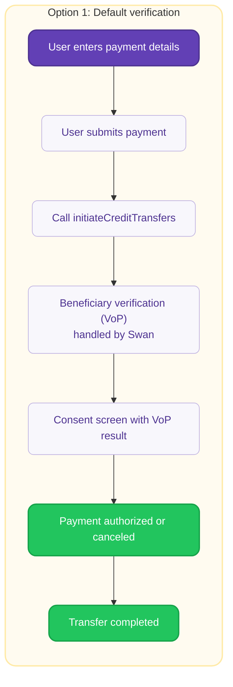
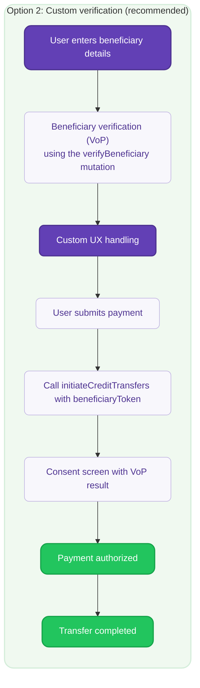

# VoP integration options

Two compliant ways to meet the <Term id="verification-of-payee">Verification of Payee</Term> requirement. With the default option Swan runs the check and shows the result on its <Term id="consent">consent</Term> screen. With the custom option you call the mutation yourself and control what the user sees.

Swan offers two ways to meet the VoP requirement.
Both are compliant. The difference is who runs the verification step and how much control you have over what the user sees.

| | Option 1: Default verification | Option 2: Custom verification |
| --- | --- | --- |
| **Who runs the check** | Swan, when `initiateCreditTransfers` is called | You, by calling `verifyBeneficiary` before initiating |
| **Where the result appears** | Swan's consent screen | Your interface first, then Swan's consent screen |
| **Development needed** | None for single transfers | Implement the mutation and handle the four results |
| **Best for** | Quick compliance and existing integrations | Custom user experience, bulk transfers, and high volumes |

## Supported payment types {#payment-support}

<SupportStatusLegend />

| Payment type | Option 1: Default | Option 2: Custom | VoP requirements |
| --- | :---: | :---: | --- |
| **Single Credit Transfers** | <Supported /> | <Supported /> | Required |
| **Bulk Credit Transfers** | <Unsupported /> | <Supported /> | [Depends on the account](/payments/concepts/verification-of-payee/bulk-transfers) |
| **Standing Orders** | <Supported /> | <Unsupported /> | Required at initiation stage |

## Option 1: Default verification {#option-1}

For single credit transfers, you don't have to do anything - Swan will run the VoP check at the initiation of the credit transfer and display the VoP result in the consent screen.

Option 1 is [not available for Bulk Credit Transfers](#payment-support). Instead, **Option 2** is designed to handle high-volume payments efficiently and aligns with standard market practices.

## Option 2: Custom verification {#option-2}

Call the `verifyBeneficiary` mutation before initiating SEPA Credit Transfers to get full control over the verification user experience. You decide the level of friction, but Swan recommends clear warnings and calls to action to verify or edit beneficiary details based on the verification result.

The [guide to verify a beneficiary](/payments/guides/credit-transfers/sepa/verify-beneficiary) walks through the mutation, the four results, and the verification token, with interface examples for each result.
